# Linux笔记

## 一、Linux介绍

#### 1. Linux的应用领域

1. **个人桌面领域的应用**
   此领域是传统linux应用薄弱的环节，近些年来随着ubuntu、fedora [fi'do:re]等优秀桌面环境的兴起，linux 在个人桌面领域的占有率在逐渐的提高。
2. **服务器领域**
   linux在服务器领域的应用是最强的。
   linux免费、稳定、高效等特点在这里得到了很好的体现，尤其在一-些高端领域尤为广泛(c / c++ / php / java / python / go)。
3.  **嵌入式领域**
   linux运行稳定、对网络的良好支持性、低成本，且可以根据需要进行软件裁剪，内核最小可以达到几百KB等特点，使其近些年来在嵌入式领域的应用得到非常大的提高。
   主要应用:机顶盒、数字电视、网络电话、程控交换机、手机、PDA、智能家居、智能硬件等都是其应用领域。以后在物联网中应用会更加广泛。

#### 2. Linux介绍

1. Linux吉祥物 —— **Tux**

    

2. linux是一个开源、免费的操作系统，其稳定性、安全性、处理多并发已经得到业界的认可，目前很多企业级的项目 **(如：c /c ++ /php /python /java /go) **都会部署到Linux/unix系统上。
3. Linux主要的发行版:
   Ubuntu(乌班图)、RedHat(红帽)、CentOS、Debain[ 蝶变]、Fedora、 SuSE、OpenSUSE

4. 主机、VM、Linux示意图：

   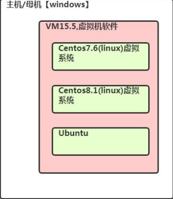 

#### 3. 虚拟机操作

**1.虚拟机克隆**

​	如果在安装过一台Linux操作系统的基础上还想要更多系统，可以使用克隆而无需重新下载安装

1. 直接拷贝一份安装好的虚拟机文件
2. 使用vmware的克隆操作，注意，克隆时，需要先**关闭linux系统**

**2. 虚拟机快照**

​	如果在使用虚拟机系统的时候(比如linux)想回到原先的某一个状态，也就是说担心可能有些误操作造成系统异常，需要回到原先某个正常运行的状态，vmware也提供了这样的功能，就叫快照管理。

​	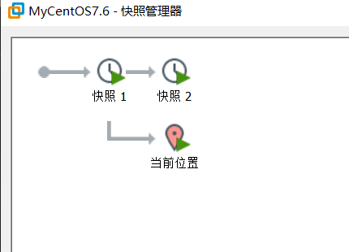 

**3. 虚拟机迁移和删除**

1.  虚拟系统安装好了，它的本质就是文件(放在文件夹的)。因此虚拟系统的迁移很方便，可以把安装好的虚拟系统这个文件夹整体拷贝或者剪切到另外位置使用。
2.  删除也很简单，用vmware进行移除，再点击菜单 -> 从磁盘删除即可，或者直接手动删除虚拟系统对应的文件夹即可。

**4. 设置共享文件夹**

1. **右击虚拟机 -> 设置 -> 选项**，将文件夹共享设置为**总是启用**即可读写

   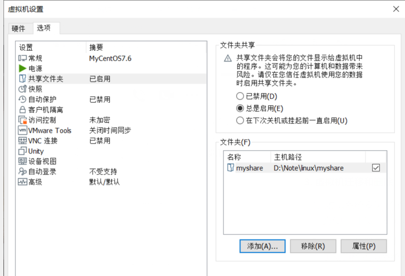 

2. 共享的文件夹在centos的 **/mnt/hgfs/** 下
 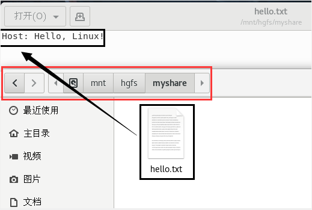  
3. 当在Linux系统下对共享文件夹进行修改时，windows系统也将读取到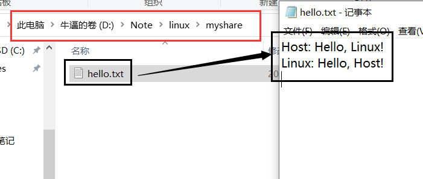
4. 此时windows和Linux就可以共享文件了，但在实际开发中，文件的上传和下载是需要使用 **远程方式** 完成的。

___


## 二、Linux目录结构

#### 1. Linux的树状结构	

​	Linux的文件系统是采用级层式的树状目录结构，在此结构中的最上层是根目录 **“/”**，然后在此目录下再创建其他的目录，记住一句经典的话: **在Linux世界里，一切皆文件**。

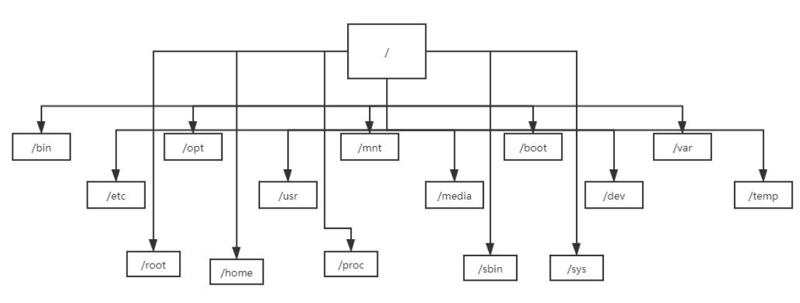

#### 2. 具体的目录结构

 - **用于存放命令文件**

   **/bin** 用于存放二进制的可执行程序，目录中存放的命令不会对系统造成质的修改，所有用户都可以使用，它是Binary的缩写，这个目录存放着最经常使用的命令

   **/sbin** 类似于**/bin** 目录，也存放二进制可执行文件，目录中存放的命令会对系统造成修改，大多数命令**只能由root使用**，s就是Super User的意思，这里存放的是系统管理员使用的系统管理程序
   
     

* **/boot**

  用于存放系统启动的引导文件，以及linux内核文件，包括一些连接文件以及镜像文件

   

​		**/dev** 用于存放硬件设备文件，类似于windows的设备管理器，把所有的硬件用文件的形式存储，

​				用户可以通过这些文件访问外部设备

​		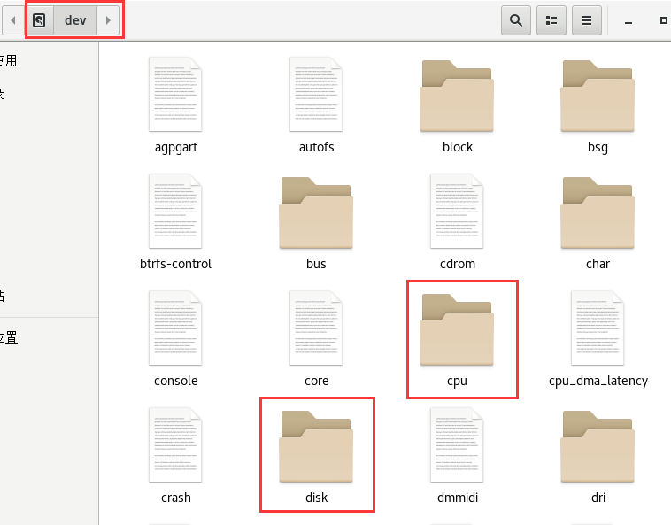  

​		其中 **/cpu** 文件内容：每一个文件夹代表一个处理器

​        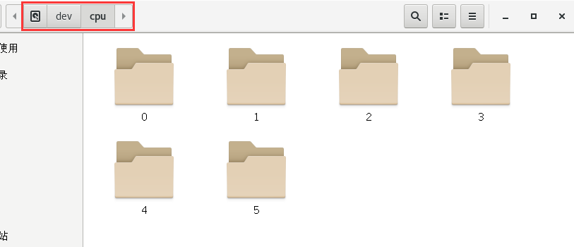  

​		

​	**/etc** 用于存放所有的系统管理和软件所需要的**配置文件**和子目录，比如安装mysql数据库：mysql.conf

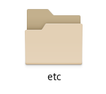  

* **用户的家目录，类似于windows xp中的‘我的文档’**

  **/home** 普通用户的**根目录**的集合，普通用户的默认家目录是home目录中与用户名同名的子目录，只存放普通用户的用户数据。在Linux中每个用户都有一个自己的目录，一般该目录名是以用户的账号命名，当用户登录的时候就进入其用户名对应的子目录。

  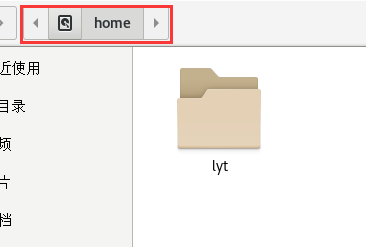  

  **/root** 超级管理员root用户的家目录，只存放root用户的用户数据
  
  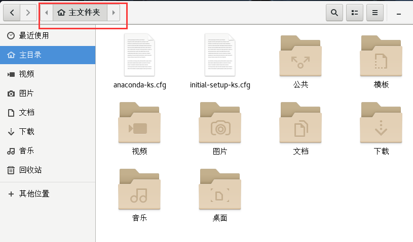  
  
* **/lib和/lib64**

  ​	用于存放根文件系统中的程序运行所需要的共享库及内核模型，如系统开机所需要最基本的动态连接共享库，其作用类似于Windows里的DLL文件。（函数库文件，比如玩游戏时缺的运行库文件，xxx.dll丢失。）

  ​	几乎所有的应用程序都需要用到这些共享库，开发软件的要用到。

  ​		>  **/lib** 32位

    

  ​		> **/lib64** 64位

  ​     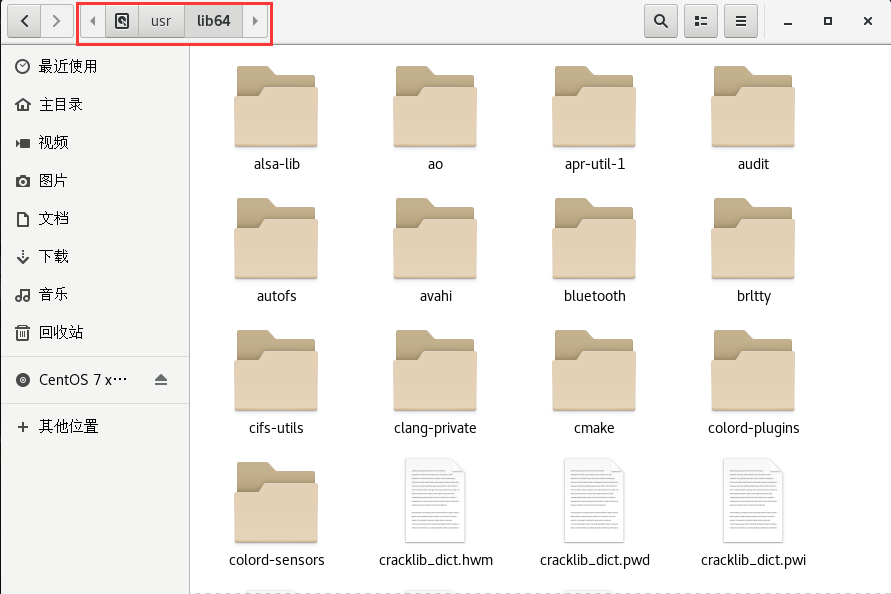  

* **/media和/mnt**

  用于加载存储设备

  **/media** 用于自动加载各类外接存储设备，**即插即用型存储设备**的挂载点自动在这个目录下创建，例如：U盘、光盘等（rhel7中改用/run/media，加速U盘访问）,当识别后，Linux就会把识别的设备挂载到这个目录下

    

  **/mnt** 系统预设的用于手动加载各类内置存储设备，各类网络存储设备，可以让用户**临时**挂载别的文件系统

  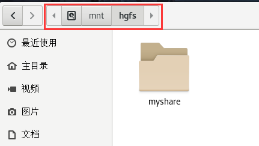   

* **用于软件的默认安装路径**

  **/usr** 用于存放系统应用程序，还有软件的帮助手册Read me （即linuxredhat 厂商授权软件）。

  ​	这是一个非常重要的目录，用户的很多应用程序和文件都放在这个目录下，类似与windows下的program files目录。

  ​	根下的 bin 和 sbin 都是**快捷方式**，其实都放在 **/usr** 下，但为了用户的使用，都放在根下。

  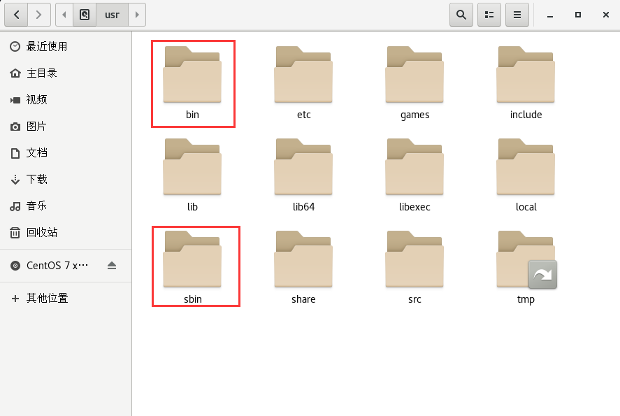  

  **/user/local** 这是另一个给主机额外安装软件所安装的目录，一般是通过编译源码方式安装的程序

  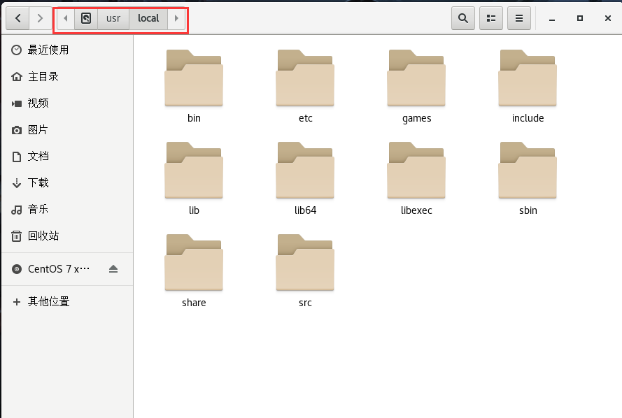 

  **/opt** 给主机额外安装软件所存放的目录，用于存放第三方软件（如vmtools），不是原厂授权软件（ wps 和 office 对比）

  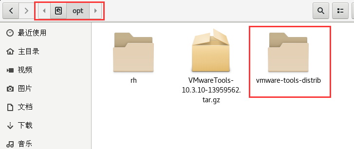  

* **/proc、 /sys、 /run 不占用硬盘空间，占用内存空间**  **[不能动！]**

  **/proc** 这个目录是一个虚拟的目录，它是系统内存的映射，访问这个目录来获取系统信息 

    

  **/sys** 存放系统数据，这是linux2.6内核的一个很大的变化。该目录下安装了2.6内核中新出现的一个文件系统sysfs

  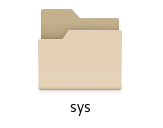  

  **/run** 存放系统正在运行时的程序数据

  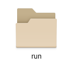  

* **/tmp 存放临时目录 用于存放系统运行时产生的临时文件**

  问：什么是临时文件？

  缓存文件属于临时文件，有些软件会自动删除缓存文件

* **var和srv**

  **/var** 用于存放需要随时改变的文件，这个目录中存放着在不断扩充着的东西，习惯将经常被修改的目录放在这个目录下，包括各种日志文件，如系统日志，脱机工作文件等。

  **/srv** service缩写，该目录存放一些服务启动之后需要提取的数据，是系统对外提供服务的目录，如Web虚拟主机等 **[不能动！]**

     
  
* **lost+found**

  存放一些系统检查结果，发现不合法的文件或数据都存放在这里，通常此目录是空的，除非硬盘遭受不明的破坏，是隐藏文件夹，一般看不见

  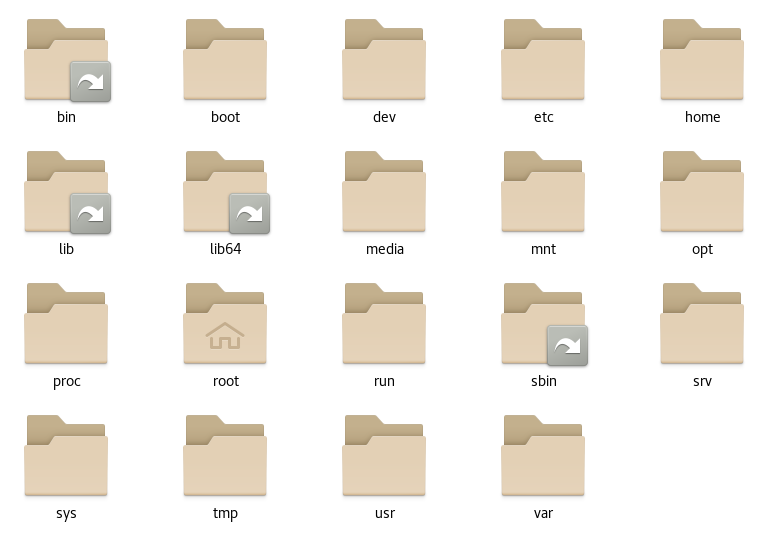

  可以通过 **[ll]** 指令查看

  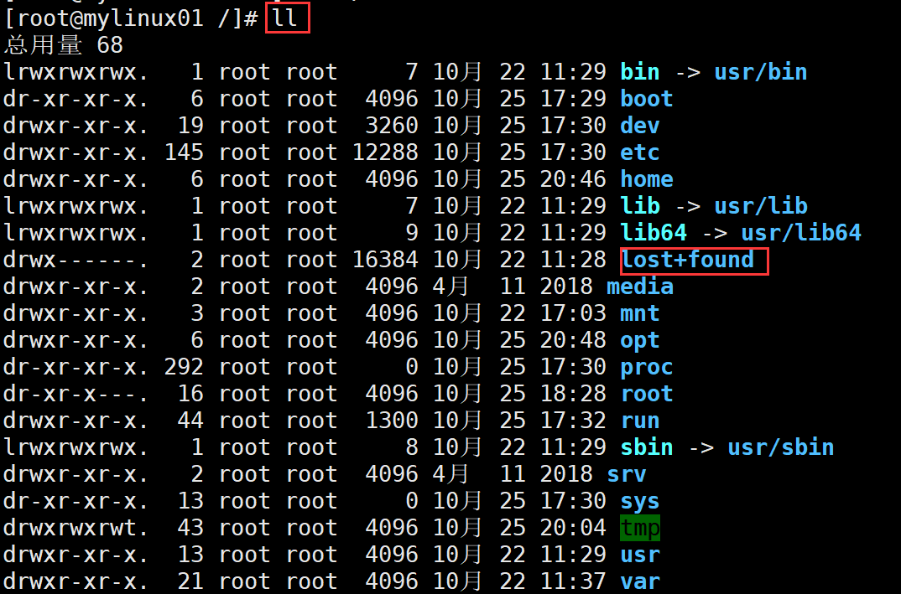

  里面一般是空的

  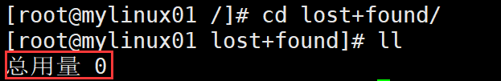

* 用户可以使用 **[man hier]** 获得Linux文件层次结构的说明

  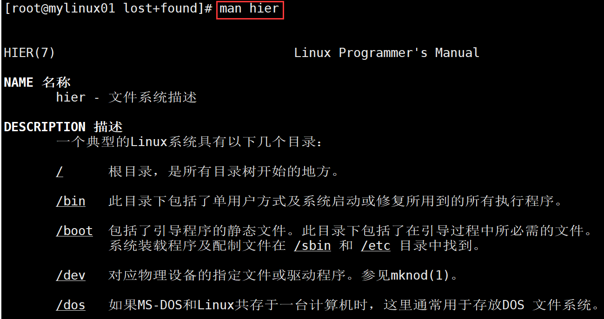

***

## 三、远程登录到Linux服务器

#### 	1. 为什么需要远程登录Linux

​	公司开发时候，具体的应用场景是这样的

1. Linux服务器是开发小组共享
2. 正式上线的项目是运行在公网
3. 因此程序员需要远程登录到Linux进行项目管理或者开发

#### 2. 检测机器是否可以进行远程登录操作

1. 在终端输入命令 **[ifconfig]**，获得ip地址
​      

2. 通过在主机上通过ping指令测试两个ip或两个机器是不是网络通畅，如果没有Ping通，则无法远程登录
​        

#### 3. Xshell介绍

1. Xshell是目前最好的远程登录到Linux操作的软件，流畅的速度并且完美解决了中文乱码的问题
2. Xshell 是一个强大的安全终端模拟软件，它支持SSH1, SSH2，以及Microsoft Windows平台的TELNET协议
3. Xshell可以在Windows界面下用来访问远端不同系统下的服务器，从而比较好的达到远程控制终端的目的

#### 4. Xshell的使用

1. 进入软件，选择新建

 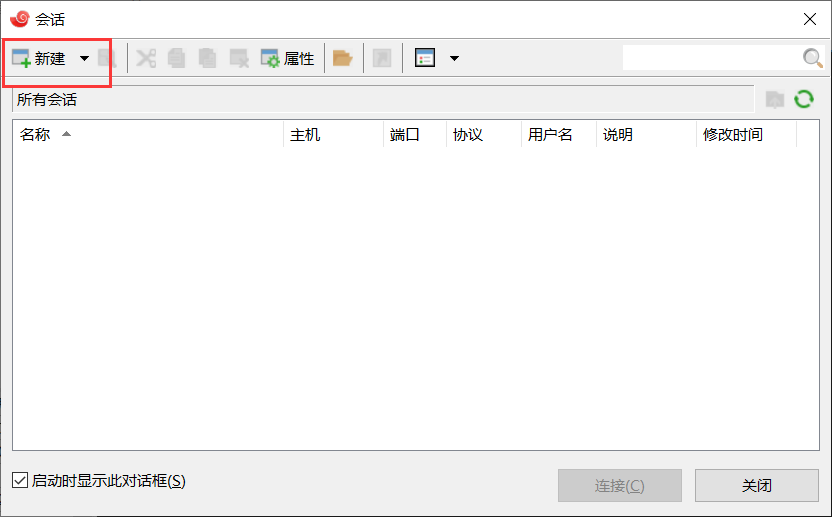 

2. 填写信息（地址不能乱写 名字随意）

  

3. 进入界面之后双击链接

​      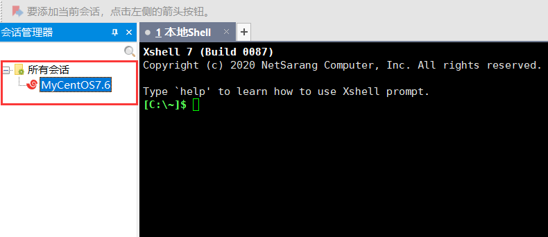  

4. 在跳出的窗口栏中选择**[接受并保存(s)]**，其中，一次性接受是指下次还要输入账号和密码，而接收并保存则会在下一次双击自动连接

​     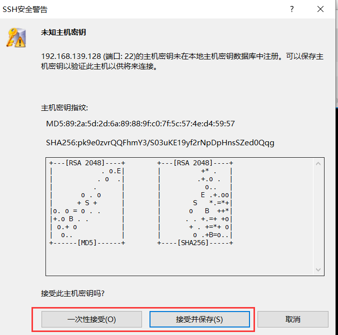  

5. 使用命令测试远程登录对Linux系统进行操作，还可以用**[reboot]**命令重启虚拟机，但只能进行命令操作，无法对文件进行上传和下载

​    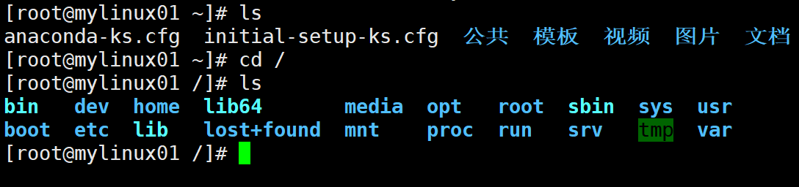  

#### 5. Xftp的介绍与使用

​	是一个基于windows平台的功能强大的SFTP、FTP 文件传输软件。使用了Xftp 以后，windows 用户能安全地在**UNIX / Linux**和**Windows PC**之间传输文件。使用方法如下：

​	1. 大部分操作方法和Xshell相似，但是有几点需要注意，在填写信息的时候要将协议设置为SFTP，端口号为22

​	   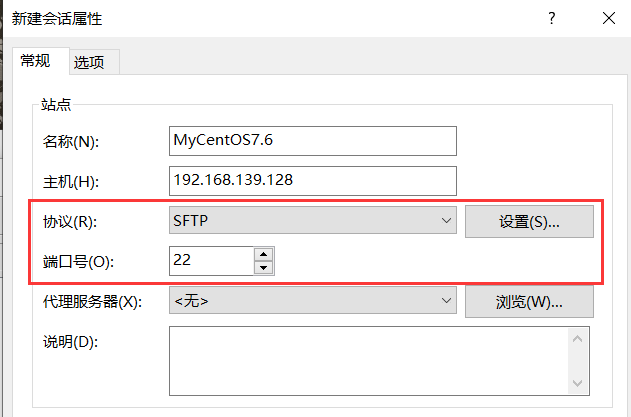  

2. 进入主界面后，右击想要进行传输的文件选择传输即可
 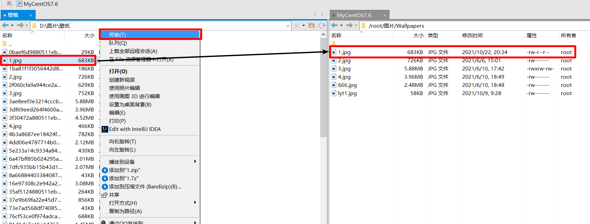

3. 如果出现乱码问题，可以通过以下两种方式解决

​       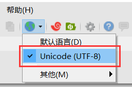 

​       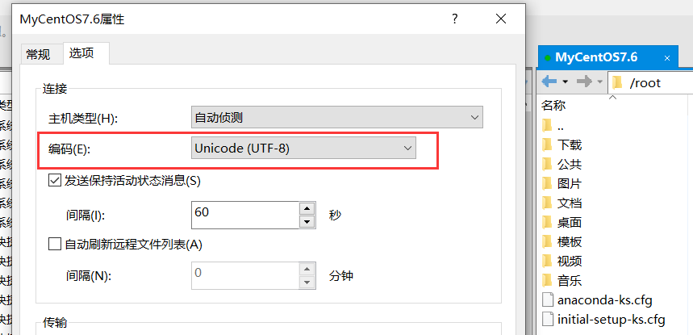  

___

## 四、Vi和Vim编辑器

#### 1. Vi和Vim的基本介绍

​	Linux系统会内置vi文本编辑器。
​	Vim具有程序编辑的能力，可以看做是**Vi的增强版本**，可以主动的以字体颜色辨别语法的正确性，方便程序设计，代码补完、编译及错误跳转等方便编程的功能特别丰富，在程序员中被广泛使用。

#### 2. Vi和Vim常用的三种模式

1. **正常模式**
   以 **vim** 打开一个档案就直接进入一般模式了(这是**默认**的模式)。在这个模式中可以使用  **[上下左右]** 按键来
   移动光标，也可以使用 **[删除字符]** 或 **[删除整行]** 来处理档案内容，或使用 **[复制、粘贴]** 来处理文件数据。
   
2. **插入模式**
   按下 **i , I , o , O , a , A , r , R** 等任何一个字母之后才会进入编辑模式，一般来说按 **i** 即可。
   
   | 命 令 |                            说 明                             |
   | :---: | :----------------------------------------------------------: |
   |   i   |                 从光标所在位置前开始插入文本                 |
   |   I   |          将光标移到当前行的行首，然后在其前插入文本          |
   |   a   |             用于在光标当前所在位置之后追加新文本             |
   |   A   |         将光标挪到所在行的行尾，从那里开始插入新文本         |
   |   o   | 将光标所在行的下面**新开一行**，并将光标置于该行的行首，等待输入文本 |
   |   O   | 在光标所在行的上面**插入一行**，并将光标置于该行的行首，等待输入文本 |
   
3. **命令行模式**
   输入 **esc** 再输入 **:** 即可进入命令行模式。在这个模式当中，可以提供相关指令，如完成读取、存盘、替换、离开vim、显示行号等的动作。

4. **模式切换图** (**:** 和 **/** 要严格区分开来)

#### 3. Vi和Vim的基本使用与快捷键

1. 使用**vim**开发一个Hello.java文件

​     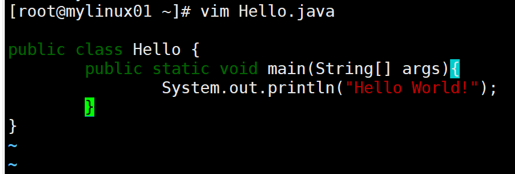  

2. 在命令行模式下，设置文件的行号**[:set nu]**，取消文件的行号**[:set nonu]**

​      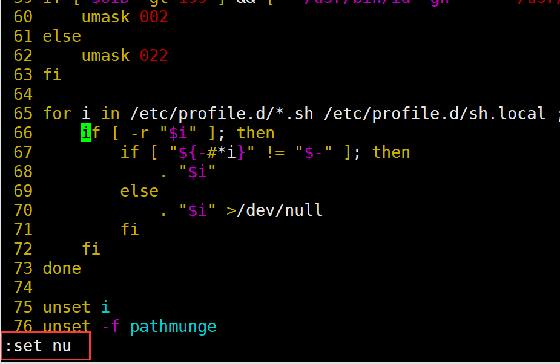  

3. 在命令行模式下，通过**[ /关键字 ]**查找某个想要的单词，通过**[n]**查看下一个

​      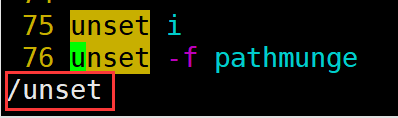  

4. 在一般模式下，定位到文档的首行**[gg]**和末行**[G]**

​      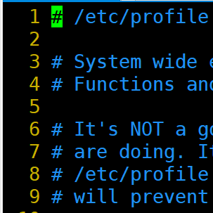  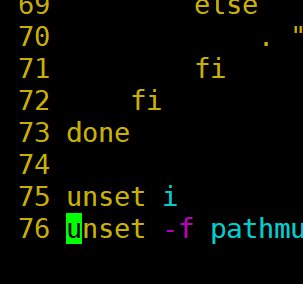

5. 在一般模式下，拷贝当前行**[yy]**或拷贝当前行向下4行**[4yy]**并粘贴**[p]**

​    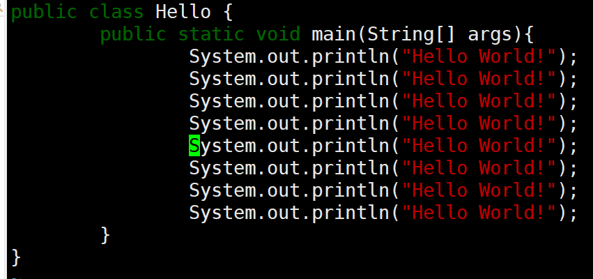  

6. 在一般模式下，删除当前行**[dd]**或删除当前行向下4行**[4dd]**

​     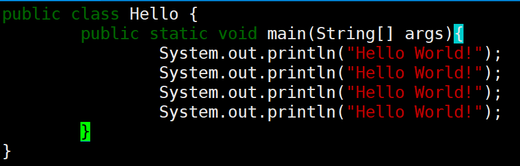  

7. 在一般模式下，输入**[u]** 可以撤销动作
8. 在一般模式下，通过**[20+Shift+g]**命令可以将光标定位到20行

​     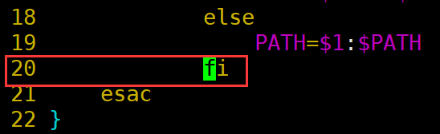 

9. Vim编辑器键盘

     

***

## 五、开机&重启

#### 1. 关机&重启命令

1. 基本介绍

   ```shell
   shutdown -h now		立该进行关机
   shutdown -h  1		"hello, 1分钟后会关机了'
   shutdown -r  now	现在重新启动计算机.
   halt				关机，作用和上面一样.
   reboot				现在重新启动计算机
   sync				把内存的数据同步到磁盘.
   ```

2. 注意事项

   (1) 不管是重启系统还是关闭系统，首先要运行sync命令，把内存中的数据写到磁盘中
   (2) 目前的 **shutdown/reboot/halt** 等命令均已经在关机前进行了sync ，但最好自己再操作一次

   (3) 若只输入**shutdown**，则默认一分钟后关机

   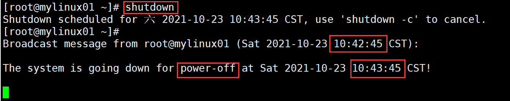  

***

## 六、用户的操作与管理

#### 1. 基本介绍

​	Linux系统是一个多用户多任务的操作系统，任何一个要使用系统资源的用户，都必须首先向系统管理员申请一个账号，然后以这个账号的身份进入系统

#### 2. 添加用户

1. 基本语法 **[useradd 用户名]**

   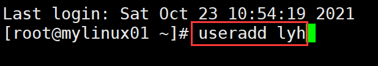  

2. 当创建用户成功后，会自动创建和用户同名的 **/home** 目录

   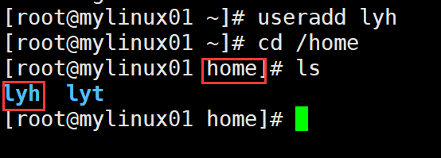 

3. 可以通过 **[useradd -d 指定目录 用户名]** 给新创建的用户指定 **/home** 目录

   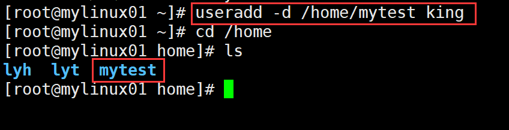  
   
4. 选项

   ```shell
   -c comment 指定一段注释性描述。
   -d 目录 指定用户主目录，如果此目录不存在，则同时使用-m选项，可以创建主目录。
   -g 用户组 指定用户所属的用户组。
   -G 用户组，用户组 指定用户所属的附加组。
   -s Shell文件 指定用户的登录Shell。
   -u 用户号 指定用户的用户号，如果同时有-o选项，则可以重复使用其他用户的标识号。
   ```

#### 3. 设置/修改用户密码

1. 基本语法 **[passwd 用户名]**

   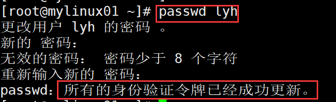 

2. **[passwd]** 不加用户名,则修改当前用户的密码

3. 可使用的选项：

   ```shell
   -l 锁定口令，即禁用账号。
   -u 口令解锁。
   -d 使账号无口令。
   -f 强迫用户下次登录时修改口令。
   ```

#### 4.删除用户

 1. 基本语法 **[userdel 用户名]**

    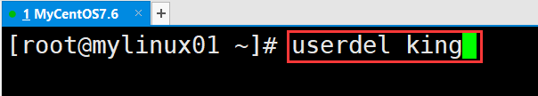  

 2. 应用案例

    (1) 删除用户但保留 **/home** 目录：**[userdel 用户名]**

    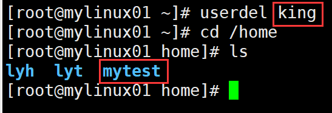 

    (2) 删除用户的同时删除用户的主目录：**[userdel - r 用户名]**，一般情况下建议保留主目录

    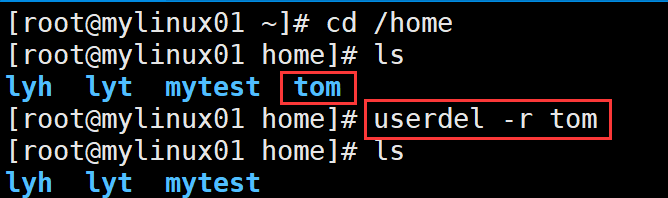 

#### 5.查询用户信息指令

1. 基本语法 **[id 用户名]**

   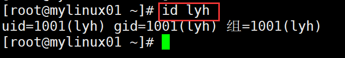 

2. 当用户不存在时，返回 **no such user**

    

#### 6.切换用户

 1. 介绍

    在操作Linux中，如果当前用户的权限不够，可以通过su-指令，切换到高权限用户，比如root

    基本语法 **[su 要切换的用户名]**

      

 3. 细节说明

    (1) 从权限高的用户切换到权限低的用户，不需要输入密码，反之需要。

    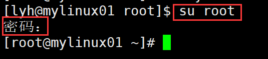 

    (2) 当需要返回到原来用户时，使用exit/logout指令

    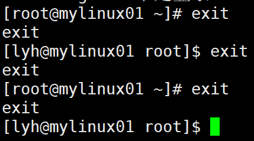 

#### 7. 查看当前登录用户

​	1. 基本语法 **[whoami / who am i]**

​	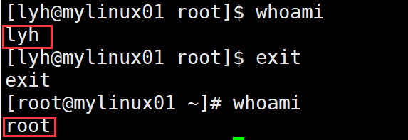 

#### 8. 用户组

 1. 介绍

    系统可以对有共性/权限的多个用户进行统一的管理。

    每个用户都有一个用户组，系统可以对一个用户组中的所有用户进行集中管理。不同Linux 系统对用户组的规定有所不同，如Linux下的用户属于与它同名的用户组，这个用户组在创建用户时同时创建。

    用户组的管理涉及用户组的添加、删除和修改。组的增加、删除和修改实际上就是对 **/etc/group** 文件的更新

2. **增加一个新的用户组** 

   ​	(1) 基本语法 **[groupadd 选项 用户组]**

   ​		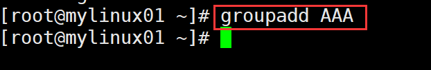 

   ​	(2) 可以在添加用户的时候直接加上组。若创建用户的时候没有指定组，则会在创建用户的同时创建一个与用户**同名**的组，并将用户放进去

   ​		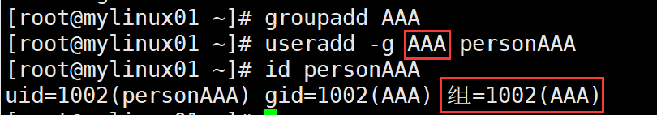 

   ​	(3) 选项

   ```shell
   -g GID 指定新用户组的组标识号（GID）。
   -o 一般与-g选项同时使用，表示新用户组的GID可以与系统已有用户组的GID相同。
   ```

 3. **修改用户组(或修改用户账号) **

    1. 基本语法 **[usermod -g 用户组 用户名]**

       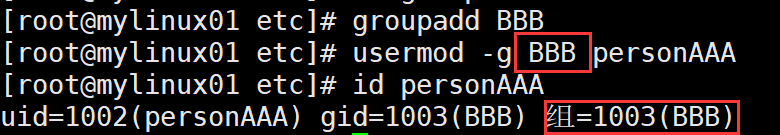 

    2. 修改用户账号就是根据实际情况更改用户的有关属性，如用户号、主目录、用户组、登录Shell等。

    3. 常用的选项包括 **-c,  -d,  -m,  -g,  -G,  -s, -u 以及 -o等** ，这些选项的意义与 **useradd** 命令中的选项一样，可以为用户指定新的资源值。例如 **usermod -d 目录名 用户名**  可以改变该用户登陆的初始目录。(**特别说明**：用户需要有进入到新目录的权限)

4. **删除用户组**

   1. 基本语法 **[groupdel 用户组]**

      

5. **用户和组相关文件**

   1. **/etc/passwd文件**

      ​	**用户的配置文件**，Linux系统中的每个用户都在 **/etc/passwd** 文件中有一个对应的记录行，它记录了这个用户的一些基本属性。

      ​	这个文件对所有用户都是可读的，**/etc/passwd**中一行记录对应着一个用户，每行记录又被冒号**(:)**分隔为7个字段，其格式和具体含义为：**用户名:口令:用户标识号:组标识号:注释性描述:主目录:登录Shell**

      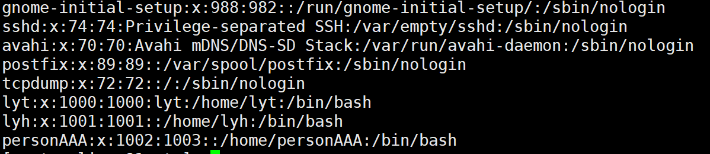

   2. **/etc/shadow文件**

      (1) **口令的配置文件**。

      ​	虽然这个字段存放的只是用户口令的加密串，不是明文，但是由于 **/etc/passwd** 文件对所有用户都可读，所以这仍是一个安全隐患。如果用户的密码太简单或规律比较明显的话，一台普通的计算机就能够很容易地将它破解，因此对安全性要求较高的Linux系统都把加密后的口令字分离出来，单独存放在一个文件中，这个文件是 **/etc/shadow** 文件。只有**超级用户**才拥有该文件读权限，这就保证了用户密码的安全性。

      ​	因此，现在许多Linux 系统（如SVR4）都使用了 **shadow** 技术，把真正的加密后的用户口令字存放到 **/etc/shadow** 文件中，而在 **/etc/passwd** 文件的口令字段中只存放一个特殊的字符，例如 **“x”** 或者 **“*”**。

      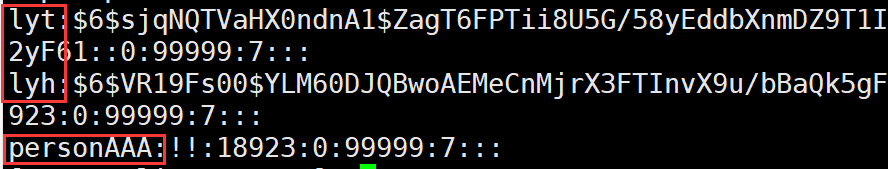

      (2) 其中，用户lyt和用户lyh均设置了密码，而personAAA没有密码，**/etc/shadow** 的文件格式与 **/etc/passwd** 类似，由若干个字段组成，字段之间用 **":"** 隔开。这些字段是：

      ​	**登录名:加密口令:最后一次修改时间:最小时间间隔:最大时间间隔:警告时间:不活动时间:失效时间:标志**
      
      (3) 各个字段的意思
      
      * **"登录名"** 是与/etc/passwd文件中的登录名相一致的用户账号
      * **"口令"** 字段存放的是加密后的用户口令字，长度为13个字符。如果为空，则对应用户没有口令，登录时不需要口令；如果含有不属于集合 { ./0-9A-Za-z }中的字符，则对应的用户不能登录。
      * **"最后一次修改时间"** 表示的是从某个时刻起，到用户最后一次修改口令时的天数。时间起点对不同的系统可能不一样。例如在SCO Linux 中，这个时间起点是1970年1月1日。
      * **"最小时间间隔"** 指的是两次修改口令之间所需的最小天数。
      * **"最大时间间隔"** 指的是口令保持有效的最大天数。
      * **"警告时间"** 字段表示的是从系统开始警告用户到用户密码正式失效之间的天数。
      * **"不活动时间"** 表示的是用户没有登录活动但账号仍能保持有效的最大天数。
      * **"失效时间"** 字段给出的是一个绝对的天数，如果使用了这个字段，那么就给出相应账号的生存期。期满后，该账号就不再是一个合法的账号，也就不能再用来登录了。
      
      3. **/etc/group文件**

         (1) **组的配置文件**，记录了Linux包含的组信息，将用户分组是Linux 系统中对用户进行管理及**控制访问权限**的一种手段。

         ​	每个用户都属于某个用户组；一个组中可以有多个用户，一个用户也可以属于不同的组。当一个用户同时是多个组中的成员时，在 **/etc/passwd** 文件中记录的是用户所属的主组，也就是登录时所属的默认组，而其他组称为附加组。

         ​	用户要访问属于附加组的文件时，必须首先使用 **[newgrp]** 命令使自己成为所要访问的组中的成员。

         (2) 用户组的所有信息都存放在 **/etc/group** 文件中。

         ​	此文件的格式也类似于 **/etc/passwd** 文件，由冒号 **(:)** 隔开若干个字段。

         ​	这些字段有：**组名:口令:组标识号:组内用户列表**

         ​	

         (3) 各个字段的意思

         + **"组名"** 是用户组的名称，由字母或数字构成。与 **/etc/passwd** 中的登录名一样，组名不应重复。
         + **"口令"** 字段存放的是用户组加密后的口令字。一般Linux 系统的用户组都没有口令，即这个字段一般为**空**，或者是 *****。
         + **"组标识号"** 与用户标识号类似，也是一个整数，被系统内部用来标识组。
         + **"组内用户列表"** 是属于这个组的所有用户的列表，不同用户之间用逗号 **(,)** 分隔。这个用户组可能是用户的主组，也可能是附加组。

***

## 七、实用指令

####   1. 运行级别

​	1. **运行级别的原理**

  * 在目录 **/etc/rc.d/init.d** 下有许多服务器脚本程序，一般称为**服务(service)**

    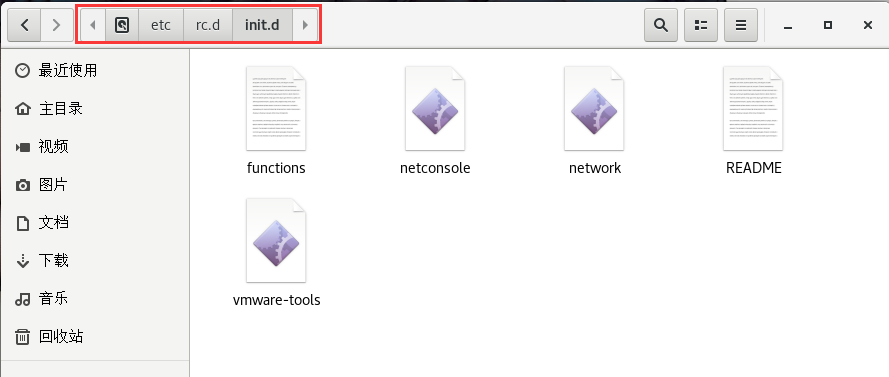

  * 在 **/etc/rc.d** 下有7个名为 **rcN.d** 的目录，对应系统的7个运行级别

    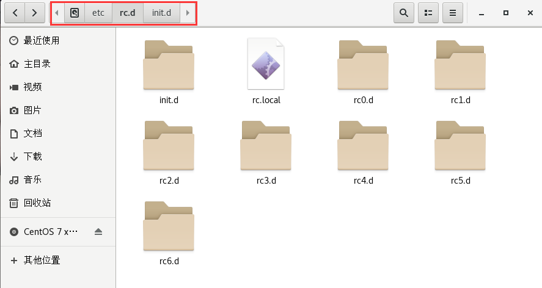

  * **rcN.d**目录下都是一些符号链接文件，这些链接文件都指向 **init.d** 目录下的service脚本文件，命名规则为 **K+nn+服务名或S+nn+服务名**，其中 **nn** 为两位数字。

    + 对于以 **K** 开头的文件，系统将终止对应的服务
    + 对于以 **S** 开头的文件，系统将启动对应的服务
    
    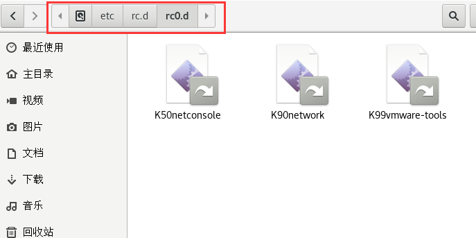
    
  * 系统会根据指定的运行级别进入对应的 **rcN.d** 目录，并按照文件名顺序检索目录下的链接文件

2. **Linux的运行级别**

   + **运行级别0**：系统停机状态，系统默认运行级别不能设为0，否则不能正常启动 
   + **运行级别1**：单用户工作状态，root权限，用于系统维护，禁止远程登陆 ，**可以找回丢失密码**
   + **运行级别2**：多用户状态(没有NFS，即没有网络服务，不常用) 
   + **运行级别3**：完全的多用户状态(**有NFS**)，登陆后进入控制台命令行模式 ，**常用**
   + **运行级别4**：系统未使用，保留给用户，不常用
   + **运行级别5**：X11控制台，登陆后进入图形GUI模式，即图形界面，**常用**
   + **运行级别6**：系统正常关闭并重启，默认运行级别不能设为6，否则不能正常启动
   
   可以通过指令 **[init number]** 来指定运行级别，此时运行级别变为3，即界面变为命令行模式，但当下次启动时，系统还是会以默认的图形化界面启动
   
   
   
   另外，当使用 **[runlevel]** 查看运行级别时，结果会显示前一次的运行级别和现在的运行级别，如果前次的运行级别为 **N**，那么说明前次没有运行级别（可能刚刚power on）
   
   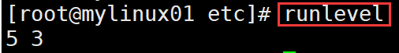

3. **CentOS7后运行级别说明**
   + **运行级别0**:            	**poweroff.target**
   + **运行级别1**:            	**rescue.target**
   + **运行级别2、3、4**:    **multi-user.target**
   + **运行级别5**:                **graphical.target**
   + **运行级别6**:                **reboot.target**
   
   查看系统默认的运行级别或者模式 **[systemctl get-default]**
   
   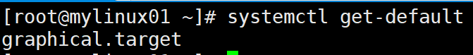
   
   修改默认的级别为命令行界面 **[systemctl set-default multi-user.target]**，之后启动时，则以设置后的运行级别启动
   
   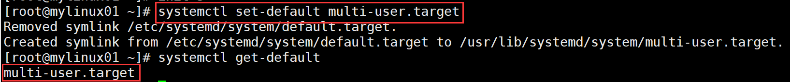

#### 2. 找回root密码

1. 首先，启动系统，进入开机界面，在界面中按 **“e”** 进入如下编辑界面。

   

2. 进入编辑界面，使用键盘上的上下键把光标往下移动，找到以**“linux16”**开头内容所在的行数”，在行的最后面输入：**init=/bin/sh**，代表进入到**单用户模式**。

   

3. 接着，输入完成后，直接按快捷键：**Ctrl+X** 进入**单用户模式**。

   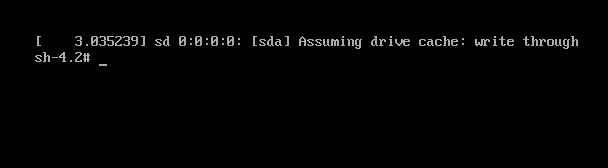

4. 接着，在光标闪烁的位置中输入：**mount -o remount,rw /（注意：各个单词间有空格）**，完成后按键盘的回车键。

   

5. 在新的一行最后面输入：**passwd**， 完成后按键盘的回车键。输入密码，然后**再次确认密码**即可(密码长度最好8位以上,但不是必须的)，密码修改成功后，会显示 **passwd.....** 的样式，说明密码修改成功

   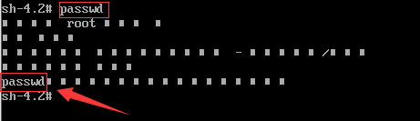

6.  接着，在鼠标闪烁的位置中（最后一行中）输入：**touch /.autorelabel（注意：touch与 /后面有一个空格）**，完成后按键盘的回车键

   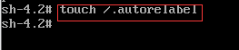

7. 继续在光标闪烁的位置中，输入：**exec /sbin/init（注意：exec与 /后面有一个空格）**，完成后按键盘的回车键，等待系统自动修改密码**(这个过程时间可能有点长，耐心等待)**。完成后，系统会自动重启， 新的密码生效了

   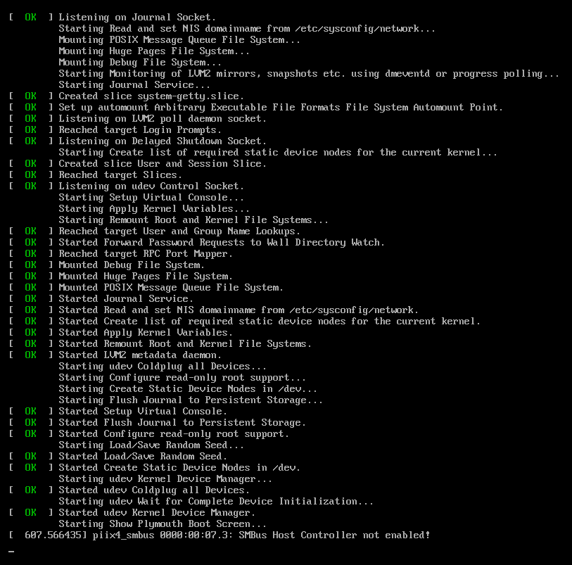

8. 找回密码之后则可以使用 **[passwd]** 直接修改密码，较为方便

#### 3. 文件目录类

 1. **pwd指令**

    (1) 基本语法 **[pwd]** (**Print working directory**)

    ```shell
    pwd
    ```

    (2) 作用：显示当前工作目录的绝对路径

    ​	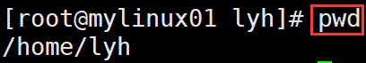

 2.  **ls指令**

    (1) 基本语法 **[ls 选项 目录名]** (**List files**)

    ```shell
    ls -a  目录名  ：表示显示指定目录下所有文件和目录，包括隐藏的。(Linux中的隐藏文件以 . 开头)
    ls -l  目录名  ：表示以列表的方式来显示，可直接简写成 ll（小写L），两者也可以组合使用
    ls -R  目录名  ：表示递归显示指定目录及其子目录下的文件和目录
    ```
    (2) 作用：显示目录下的文件
    
    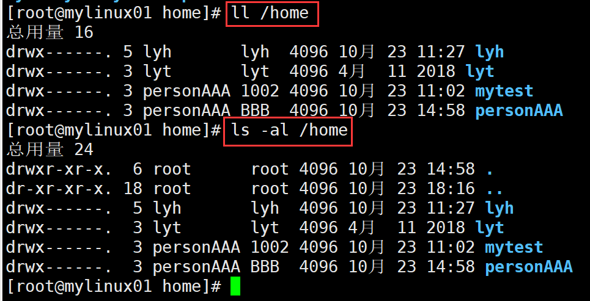
    
    递归显示目录
    
    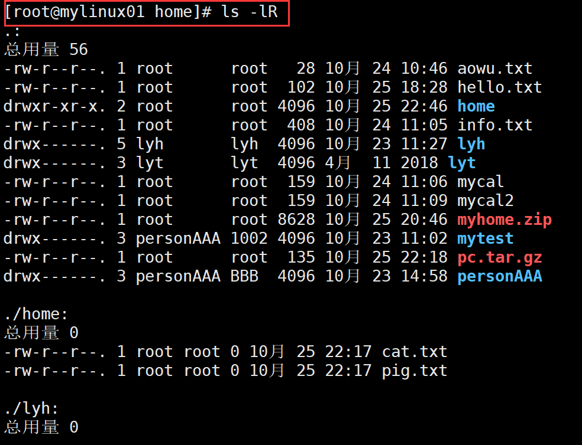
    
 3.  **cd指令**

    (1) 基本语法 **[cd 选项]** (**Change directory**)

    ```shell
    cd 目录      	    ：进入指定的目录。
    cd ~ / cd (空格)  ：回到自己的家目录。
    cd ..       	 ：回到上级目录。
	```

    (2) 作用：切换到指定目录
    
    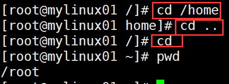

 4. **mkdir、rmdir指令**

    (1) 基本语法 **[mkdir  选项]** (**Make directory**)

    ```shell
    mkdir 目录名：创建一个新的目录。
    mkdir -p /目录名/目录名/目录名 ：一次创建多级目录。
    ```

    (2) 作用：用于创建目录

    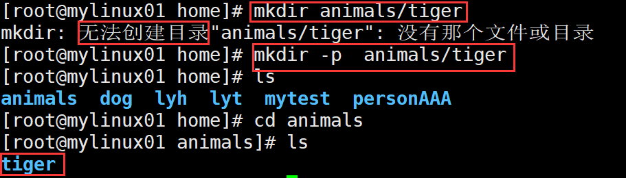

    (3) 基本语法 **[rmdir 选项 目录名] ** (**Remove directory**)

    (4) 作用：删除指定的空目录，这个只能删除空目录，若要删除非空目录，得使用命令  **[rm -rf 目录名]**

    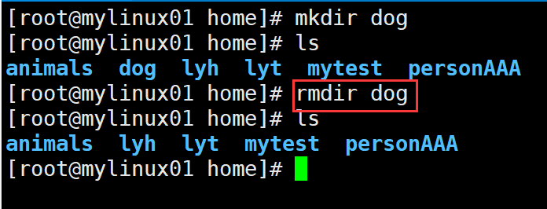

5. **touch指令**

   (1) 基本语法 **[touch 文件名]** 

   (2) 作用：创建一个空文件（**在当前目录下**)

   **注意：**touch命令的根本作用是修改文件的时间戳，只是在文件不存在的情况下会自动创建文件！

   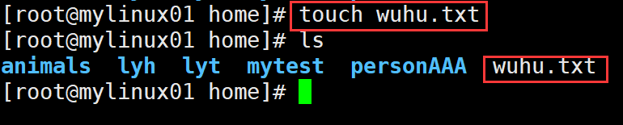

6. **cp指令**

   (1) 基本语法 **[cp 选项 文件名 目录名]** (**Copy file**)

   ```shell
   cp -r source dest 递归复制整个文件夹
   ```
   
   (2) 作用：
   
   复制文件到某个目录下
   
   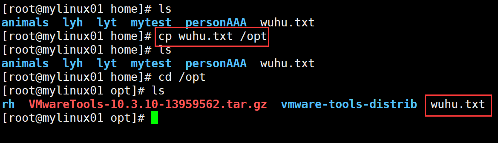
   
   递归复制整个文件夹
   
   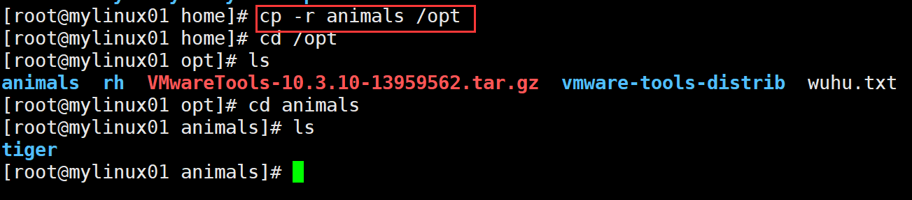
   
   复制中难免出现文件重复得情况，出现此中情况会出现提示，每次都需要输入 **y** 来确定覆盖文件
   
   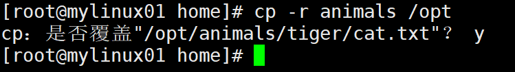
   
   此时可以使用 **[\cp -r]** 命令进行强制覆盖所有需要复制得文件
   
   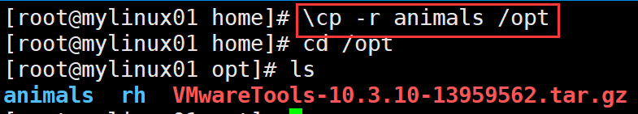
   
 7. **rm指令**

    (1) 基本语法 **[rm 选项 要删除的文件名或目录名]** (**Remove file**)

    ```shell
    rm   文件名：  删除文件。
    rm -rf 目录：  删除目录且不提示。
    ```

    ```shell
    -r 递归删除整个文件夹，
    -f 强制不进行提示进行删除文件。
    ```

    (2) 作用：移除文件或目录

    删除文件

    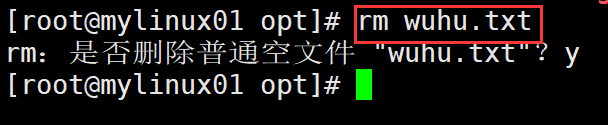

    递归删除整个文件夹，不提示

    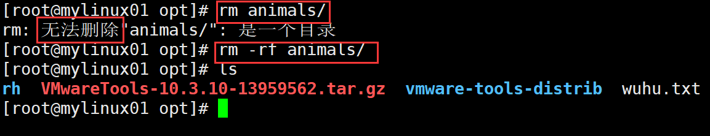

8. **mv指令**

   (1) 基本语法 **[mv oldName newName]** (**Move file**)

   (2) 作用：

   重命名

   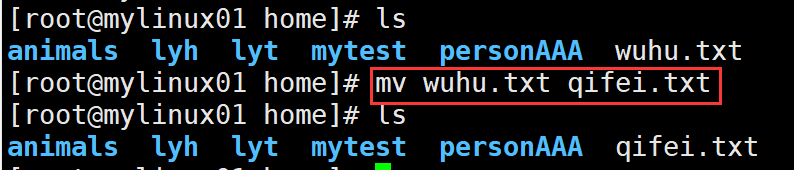

   移动文件与目录

   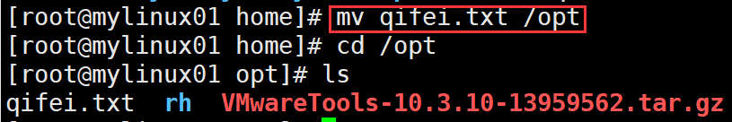

   移动文件并重命名

   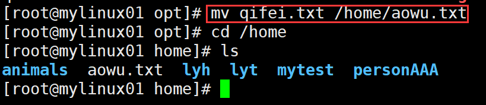

   移动目录并重命名

   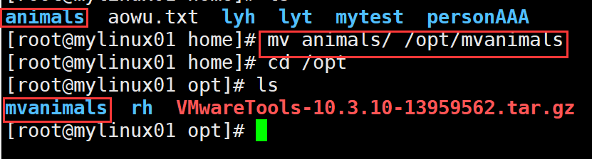

9. **cat指令**

   (1) 基本语法 **[cat 选项 文件名]** (**Concatenate**)

   ```shell
   cat -n 可显示行号
   ```

   (2) 作用：用只读得方式读取文件内容，**此命令通常与管道命令一起使用 (| more)**

   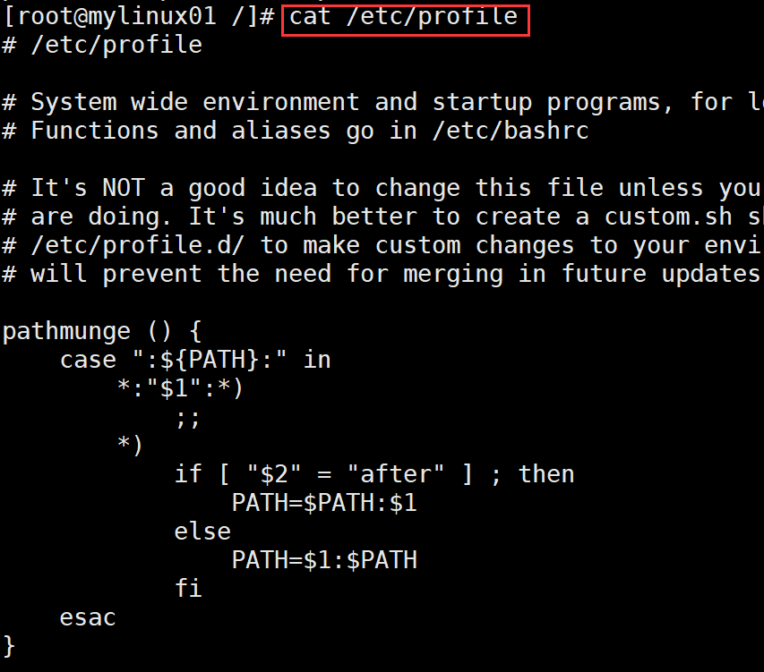

   显示行号

   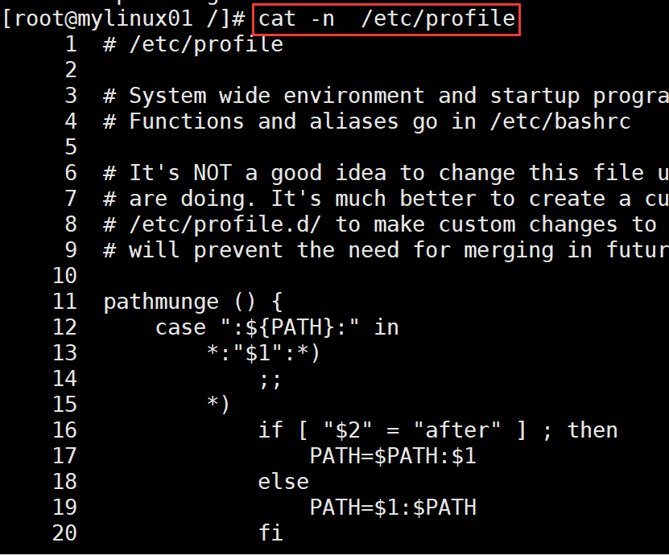

   配合管道命令 **[cat -n  /etc/profile | more]**

   

10. **more指令**

    (1) 基本语法 **[more 要查看的文件]** 

    more指令中内置了若干快捷键(交互的指令)：

    ```shell
    空白键    ：  向下翻页。
    Enter    ：	向下翻一行。
    q        ：	立即离开more，不再显示文件内容。
    Ctrl + F ：	向下滚动一个屏幕
    Ctrl + B ：	返回上一个屏幕
    =        ：	输出当前行号
    :f       ：	输出文件名和当前行号
    ```

    (2) 作用：按页显示文件的内容。**一次性直接加载文件所有内容**，适合查看**小文件内容**。more指令是一个基于VI编辑器的文本过滤器，它以全屏幕的方式按页显示文本文件的内容。

    **[more /etc/profile]**

    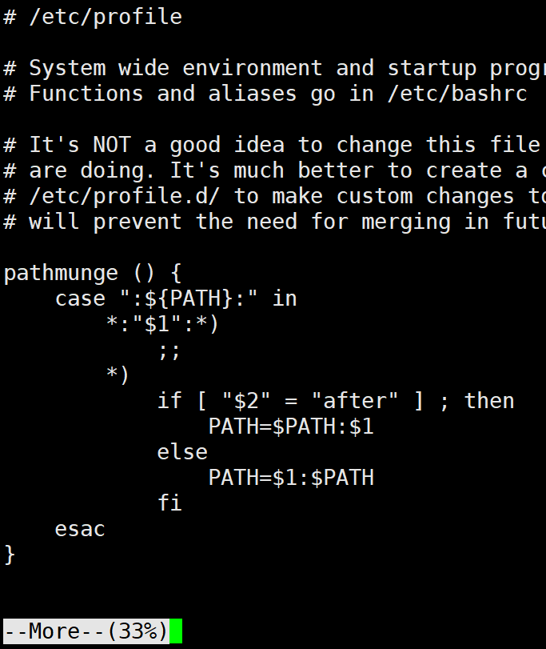

    使用**[ :f ]**指令输出文件名和当前行号

    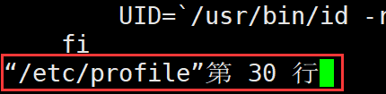

 11. **less指令**

     (1) 基本语法 **[less 要查看的文件]** 

     less指令中内置了若干快捷键(交互的指令)：

     ```shell
     空白键		  ：向下翻一页。
     pagedown  	：向下翻一页。
     pageup		：向上翻一页。
     / 字符串	  ：向下搜索"字符串"功能（n：向下查找下一个，N：向上查找）
     ? 字符串	  ：向上搜索"字符串"功能（n：向上查找下一个，N：向下查找）
     q           ：离开less显示页面。
     ```

     (2) 作用：less指令用来分屏查看文件内容，它的功能与more指令类似，但是**比more指令更加强大**，支持各种显示终端。less指令在显示文件内容时，并不是一次将整个文件加载之后才显示，而是**按需加载**，对于**显示大型文件**具有较高的效率。

     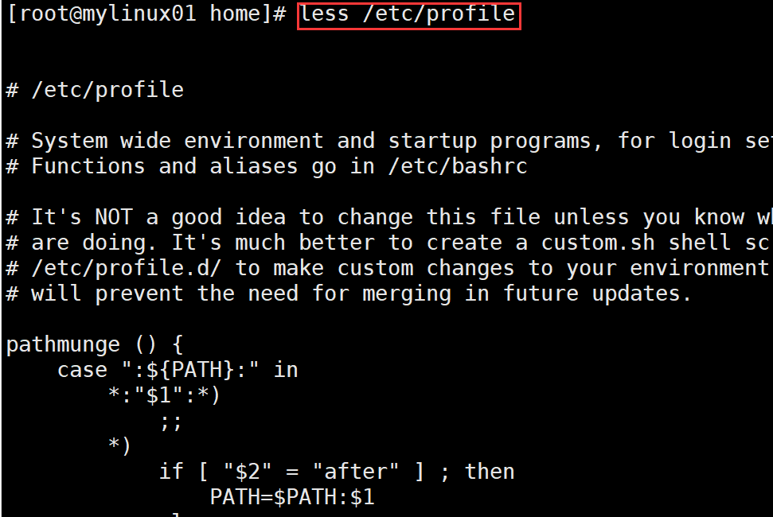

     使用 **[/a]** 指令搜索字符串a

     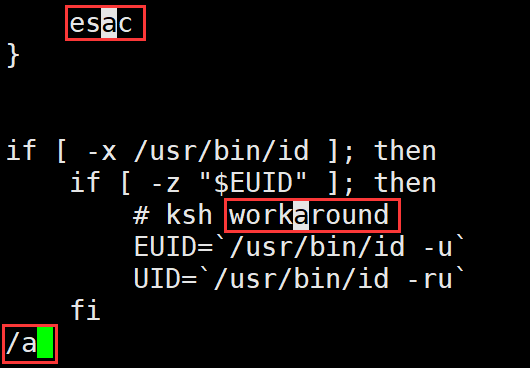

12. **echo指令**

    (1) 基本语法 **[echo 输出内容]** 

    ```shell
    -e 开启转义
    ```

    (2) 作用：将echo后面的内容输出到控制台或指定的文件中

    输出**Hello! World!**到屏幕，因为字符中带有 **!** 所以要使用**单引号**输出字符串，或在感叹号后面**添加一个空格**，或者**不加引号**

    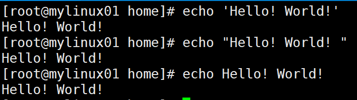

    转义，换行输出

    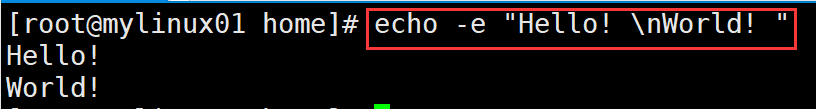

    输出指定的环境变量，如$PATH，$HOSTNAME

    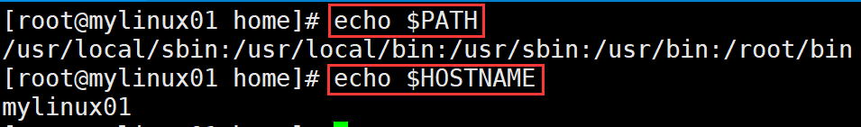

    输出重定向至其他文件

    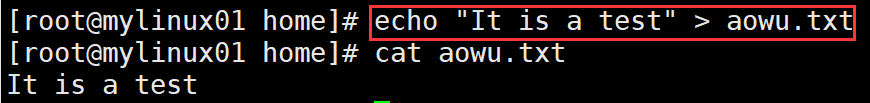

    显示命令执行结果

    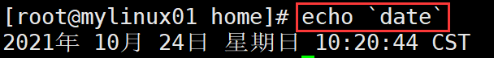

13. **head指令**

    (1) 基本语法 **[head 输出内容]** 

    ```shell
    -n 查看文件头n行内容
    ```

    (2) 作用：用于显示文件的开头部分内容，默认情况下head指令显示文件的前10行内容

    查看文件的前10行内容，包含空格

    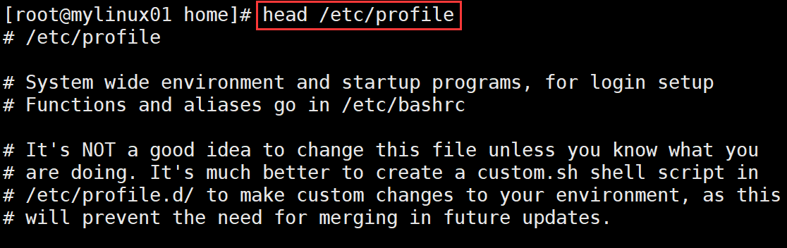

    查看文件头4行内容，依旧包含空格

    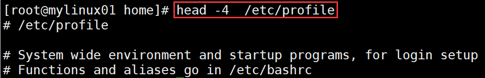

14. **tail指令**

    (1) 基本语法 **[tail 选项 输出内容]** 

    ```shell
    -n ：查看文件后 n 行内容，可以是任意行数。
    -f ：实时监控此文件的所有更新，有变化则会显示再屏幕上
    ```

    (2) 作用：用于输出文件中尾部的内容，默认情况下tail 指令显示文件的**后10行**内容。

    显示文件后10行，包含空格

    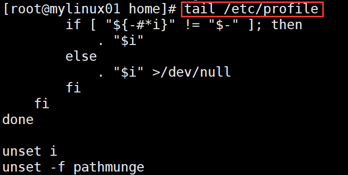

    显示文件后6行，同样包含空格

    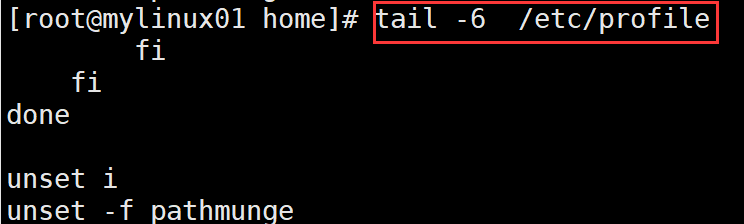

    实时监控文件的所有更新，会占领屏幕

    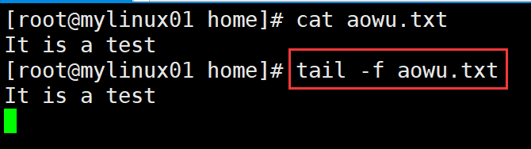

    当文件内容发生改变时，可以监控到，若想退出可以使用 **Ctrl+C** 的方式退出监控状态

    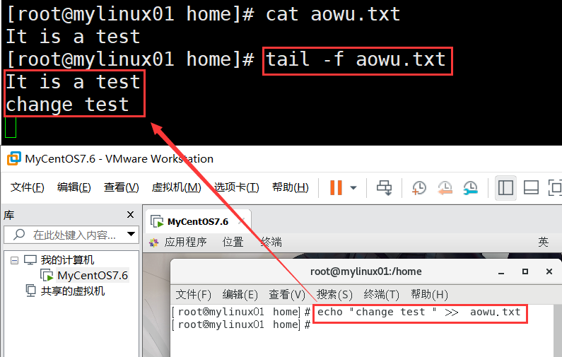

    当文件内容是被**覆盖**而不是追加的时候，会**报错：文件已截断**，所以 **tail -f** 是**动态输出**文件的末尾，当某个文件执行该命令时，文件只能被追加而不能动前面的内容，不然就报错了。

    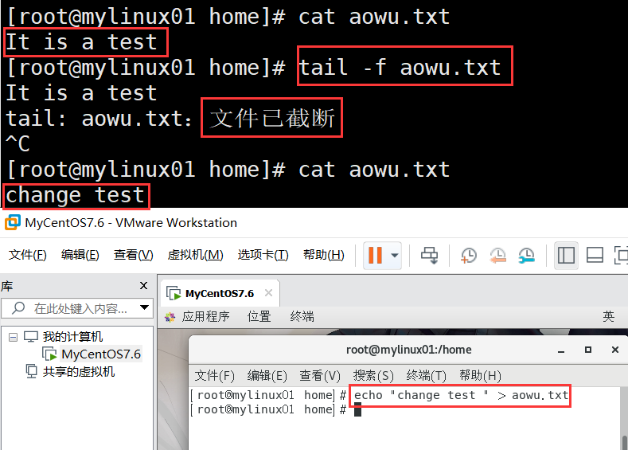

15. **> 指令和 >>指令**

    (1) 基本语法，例如：

     + **ls -l  > 文件**	              功能描述：列表的内容**覆盖**写入文件中 (**或直接 ll > 文件**)
     + **ls -al >> 文件 **              功能描述：列表的内容**追加**到文件的末尾
     + **cat 文件1 > 文件2**       功能描述：将文件1的内容**覆盖**到文件2
     + **echo "内容" >> 文件 ** 功能描述：将自定义的内容**追加**到文件末尾

    ```shell
    >  ：会将原来的内容删去后再写入。
    >> ：不会删除原来的内容，而是往后追加。
    ```

    (2) 作用：能将打印的内容写入到相应的文件，其中 **>** 为输出重定向，**>>** 为追加	

    将/home 目录下的文件列表**覆盖**写入到/home/info.txt 中，**没有该文件会自动创建**

    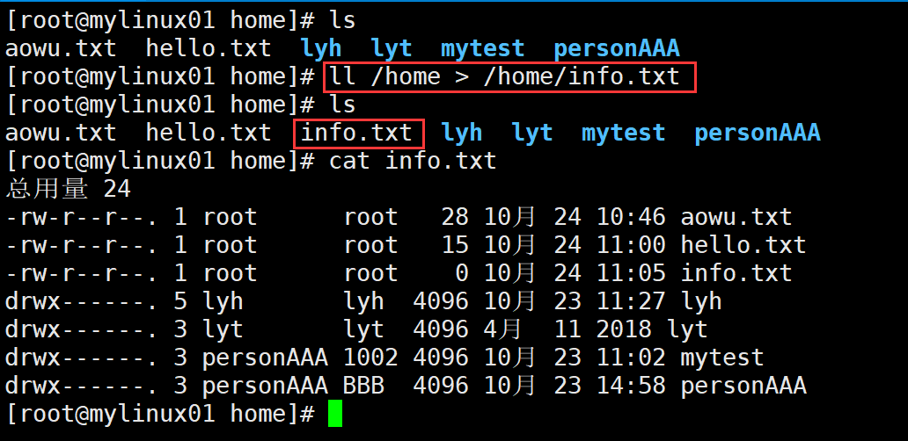

    将当前日历信息**追加**到 /home/mycal 文件中

    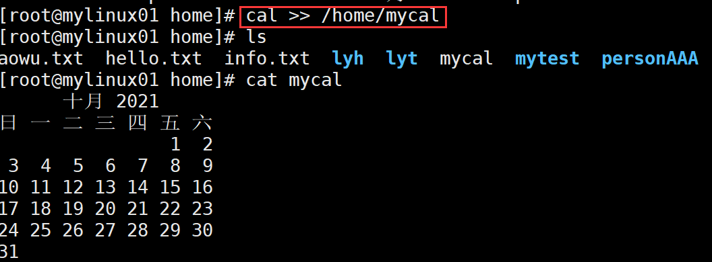

    可视化界面展示

    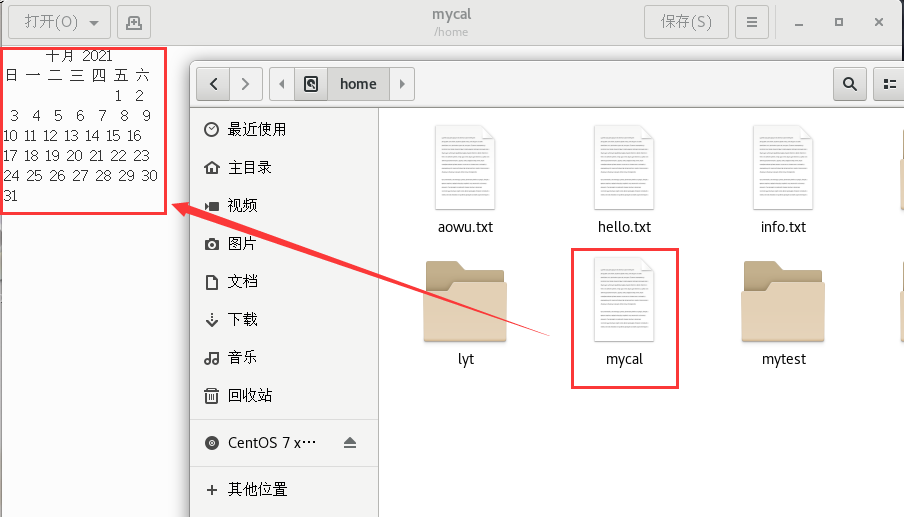

    将mycal的内容**覆盖**到mycal2

    

16. **ln指令**

    (1) 基本语法 **[ln 参数 原文件或目录名 链接名]** ，加了参数**-s**之后便成为软链接，**软链接**也称为符号链接，类似于windows里的快捷方式，主要存放了链接其他文件的路径；如果没有参数，则是**硬链接**，且**不允许将硬链接指向目录**。硬链接并不是一种特殊类型的文件，只是在同一个文件系统中允许多个目录项指向同一个文件的一种机制。

    ```shell
    -s 将一个文件指向另外一个文件的文件名，也就是软链接
    ```

    (2) 作用：给原文件创建一个链接

    在/home目录下创建一个**软链接**myroot,连接到/root 目录

    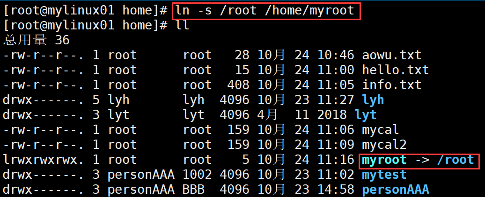

    访问软链接，指向/root 目录，但此时使用 **pwd指令** 查看目录时，仍然看见的是软链接所在的目录，且该软链接文件很小，因为它只是**记录了要指向的文件名**而已。

    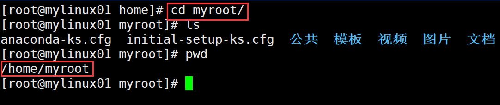

    使用 **rm 软链接名** 删除软链接，删除了软链接对原文件不会产生任何影响，且链接数始终是为 **1** ，因为该文件指向的磁盘空间仍然只有它自己一个文件在指向。但如果删除原文件，则该软链接就会因为无法找到记录的文件名对应的文件而成为**死链接**。

    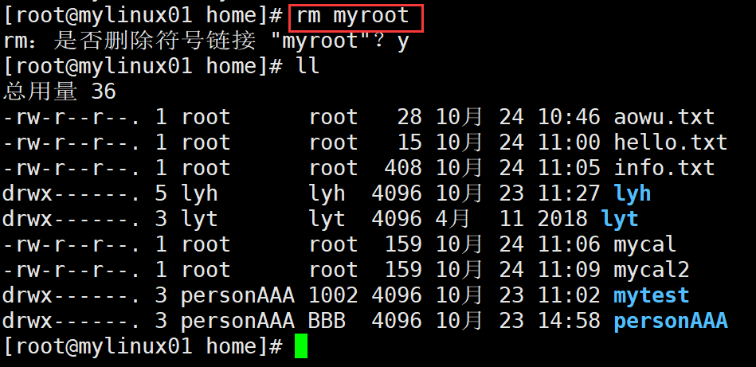

    现在测试一下**硬链接**，在这之前先查看一下即将要被硬链接的 cat 文件

    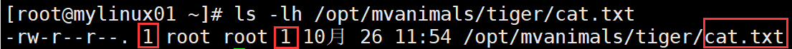

    在/home 目录下给 /opt/mvanimals/tiger/cat.txt 创建一个**硬链接** hard

    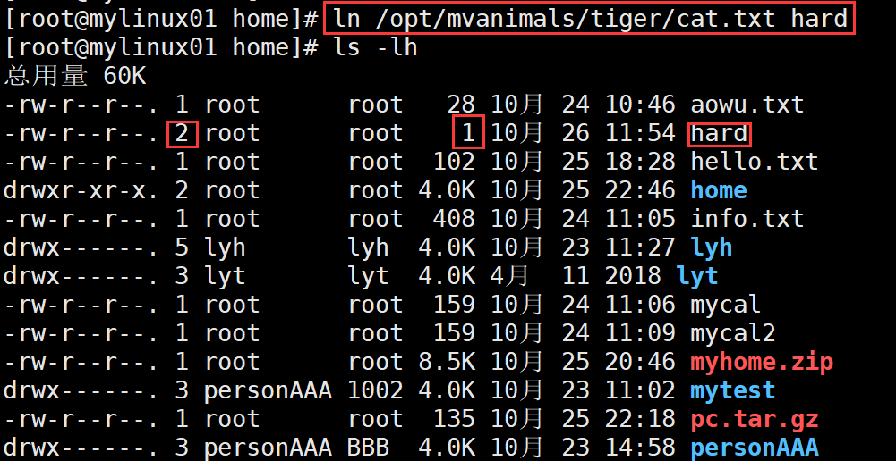

    链接之后的cat.txt

    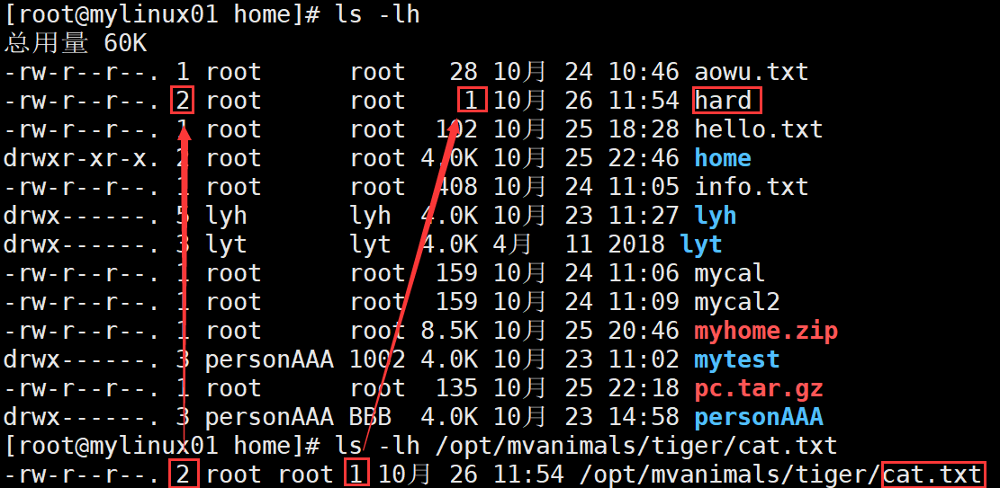

    ​	可以看出，两个文件**大小相同**，再看详细信息的第2列，原来cat.txt的**链接数**是 **1**，说明这一块硬盘存储空间只有cat一个文件指向它，而建立起 **cat** 和 **hard** 硬链接之后，这块硬盘看见就会有 **cat** 和 **hard** 两个文件同时指向它，所以 **hard** 和 **car** 的**链接数**都变成了 **2**，因为这两个文件指向**同一块**硬盘空间。

    如果此时修改 **hard** 的内容为 **"this is hard"**，再查看 **cat** 的内容，就会有：

    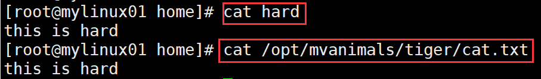
    如果删除其中的一个文件(不管是哪一个)，就是删除了该文件和硬盘空间的指向关系，
    该**硬盘空间不会释放**，另外一个文件的内容也不会发生改变， 但是目录详细信息中的链接数会减少，例如删除 **hard** 之后查看 **cat.txt**

    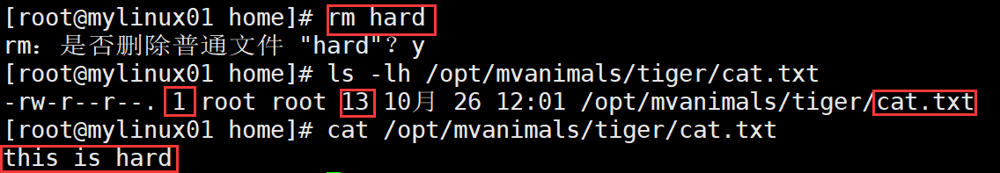

17. **history指令**

    (1) 基本语法 **[history num]**，这里的**num**指的是自定义的数字，若不定义数字，则默认显示所有历史命令

    (2) 作用：查看已经执行过的历史命令，也可以执行指定的历史命令

    显示最近使用过的10条历史命令

    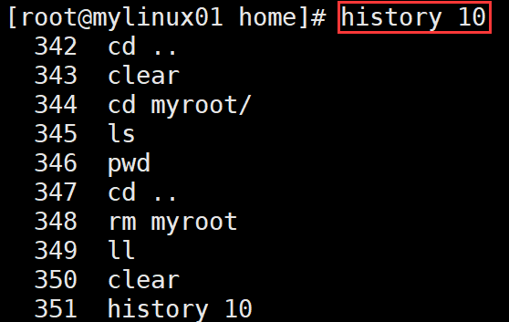

    执行历史编号为349的命令 **[!349]**

    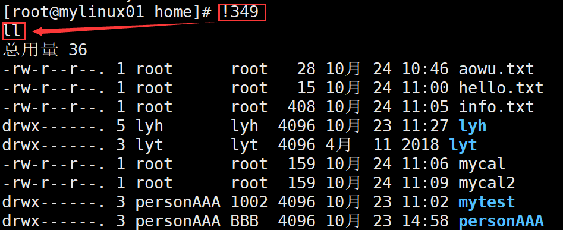

#### 4. 时间日期类

1. **date指令**

   (1) 基本语法，例如：

    + **date**				功能描述:显示当前时间
    + **date + %Y**      功能描述:显示当前年份
    + **date + %m**     功能描述:显示当前月份
    + **date + %d**       功能描述: 显示当前是哪一天
    + **date "+%Y- %m- %d %H:%M:%S"**    功能描述:显示年月日时分秒

   可以通过 **[date -s  字符串日期时间]** 来设置日期，默认的时分秒为 **00:00:00** ，需要有root权限，日期时间需要加**双引号**

   (2) 作用：显示当前日期或设置时间

   显示当前时间

   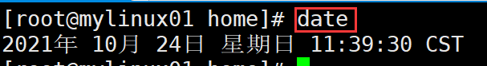

   只显示年月份，可以自定义格式

   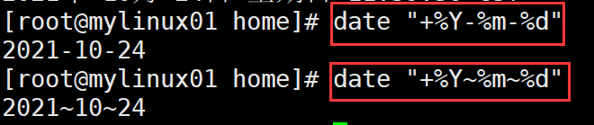

2. **cal指令**

   (1) 基本语法 **[cal 选项]**，不加选项则显示本月日历

   (2) 作用：查看日历

   显示当前日历，高亮部分代表当前天数

   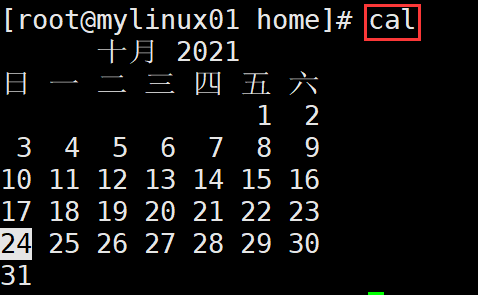

    显示2021年日历

   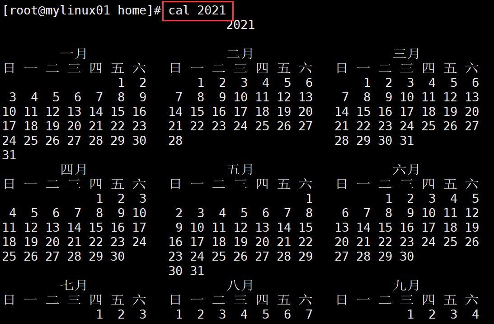

#### 5. 搜索查找类

1. **find指令**

   (1) 基本语法 **[find 目录 选项或搜索方式]**

   ```shell
   -name ：按照指定文件名查找文件。
   -user ：查找属于指定用户名所拥有的文件。
   -size ：按照文件大小来查找文件。
   ```

   (2) 作用：find指令将从指定目录向下**递归地遍历**其各个子目录，将满足条件的文件或者目录显示在终端，若都不满足则不显示 (**从硬盘中查找，默认为当前目录**)。	
   **按文件名**：根据名称查找/home目录下的 hello.txt 文件，也可以通过通配符查找
   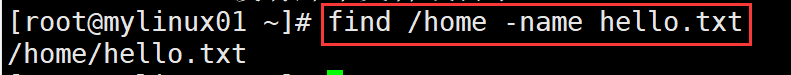

   **按拥有者**：查找/opt 目录下，用户名称为 root 的文件
   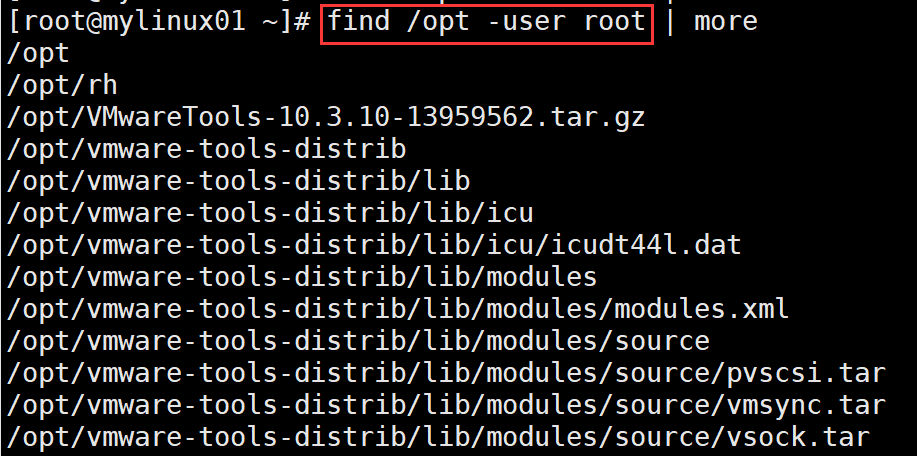

   查找 home 文件目录下大于1k的文件，注意单位 **"k"** 为小写 (**+n大于，-n小于，n等于，单位有k，M，G**)
   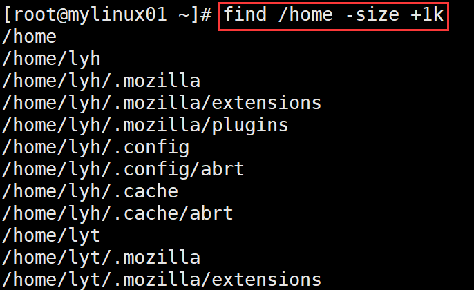
   
   如果单位误输入大写的 **"K"**，则报错
   
   
   
2.  **locate指令**

   (1) 基本语法 **[locate 搜索文件]**

   (2) 作用：locate指令可以快速定位文件路径。locate指令利用事先建立的系统中所有文件名称及路径的 **locate数据库** 实现快速定位给定的文件。Locate指令无需遍历整个文件系统，查询速度较快，但不一定是实时结果。为了保证查询结果的准确度，管理员必须**定期更新locate**。由于locate指令基于数据库进行查询，所以**第一次运行前**，必须使用 **[updatedb]** 指令创建**locate数据库**。

   使用 locate 指令快速定位 hello.txt 文件所在目录

   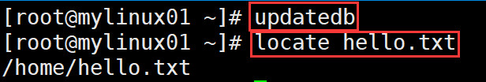

   如果不及时更新数据库，则会出现找不到文件的情况(注：找不到文件时则没有任何提醒)

   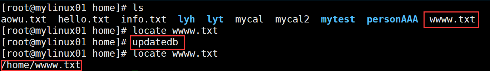

3. **which指令**

   (1) 基本语法 **[which 要查找的目标]**

   (2) 作用：which 是通过 PATH 环境变量到该路径内查找可执行文件，所以基本的功能是寻找可执行文件，也可以查找某个指令在哪个目录下。

   查找 **[ls]** 指令在哪个目录下

   

   寻找可执行文件?

   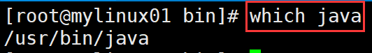

4. **grep指令和管道符号 | **

   (1) 基本语法 **[grep 选项 查找内容 源文件]**

   ```shell
   -n 显示匹配行及行号
   -i 忽略字母大小写
   ```

   (2) 作用：**grep** 可以用于过滤查找，**"|"** 表示将前一个命令的处理结果输出传递给后面的命令处理。
   请在hello.txt 文件中，查找 "yes" 所在行，并且显示行号

   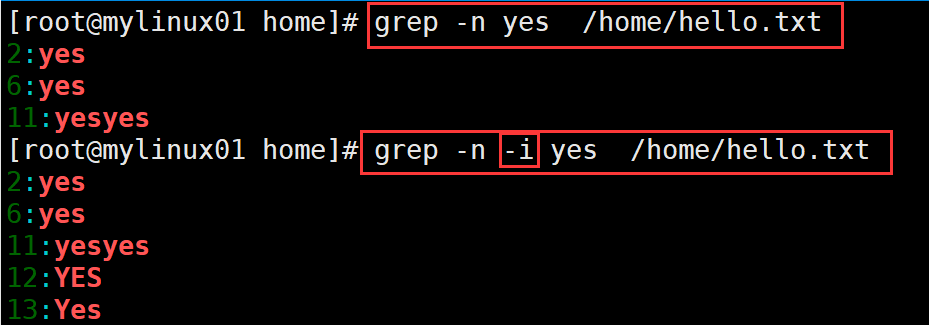

   其他写法：**[cat /home/hello.txt | grep -n  yes]**

   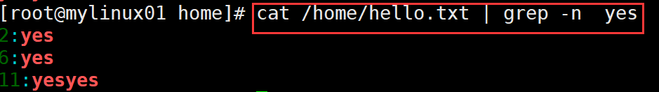

5. **待完善**

   **whereis**
   	也是从数据库中查找文件，只能用于程序名的搜索，而且只搜索二进制文件（参数-b）、man 说明文件（参数-m）和源代码文件（参数-s）

   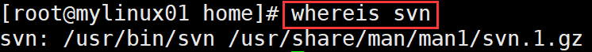

   **注意**：当我们用 whereis 和 locate 无法查找到我们需要的文件时，可以使用 find，但是 find是在硬盘上遍历查找，因此非常消耗硬盘的资源，而且效率也非常低，因此建议优先使用 whereis 和 locate。

   ```shell
   locate 	是在数据库里查找，数据库大至每天更新一次。 
   whereis 也是在数据看看中查找，可以找到可执行命令、 man page和二进制文件。
   find 	就是根据条件查找文件。 
   which 	可以找到可执行文件和别名(alias)。
   ```

#### 6. 压缩和解压类
   在日常文件传输中，如果将大文件直接传输，容易丢失个别小文件，所以需要压缩

 1. **gzip/gunzip指令**

    (1) 基本语法 **[gzip 文件 / gunzip 文件]**

    (2) 作用：**gzip** 用来压缩文件，只能将文件压缩为 ***.gz**文件；

    ​				**gunzip** 则用于解压缩文件，这两个命令**不会保留原文件，只能压缩或者解压到当前目录。**

    将 /home 下的 hello.txt 文件压缩成 .gz 文件

    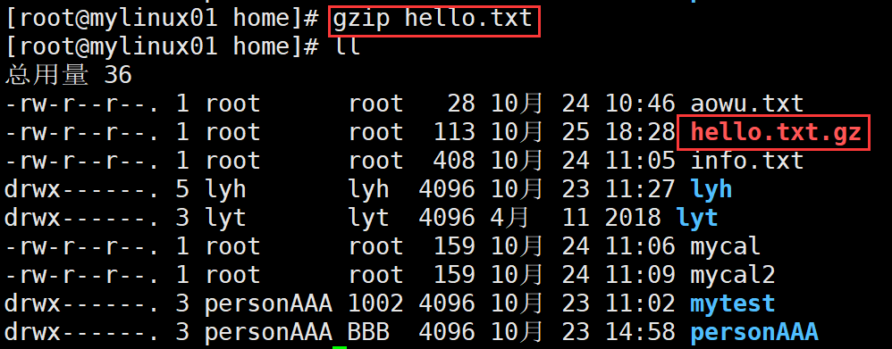

    将 /home 下的 hello.txt.gz 文件进行解压缩

    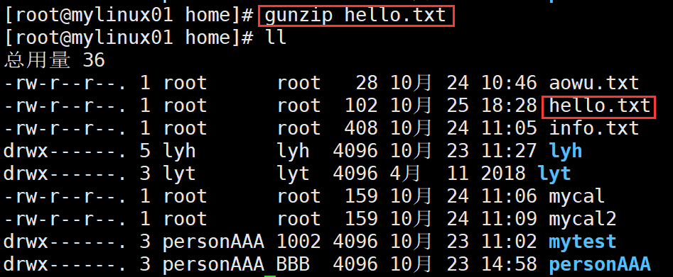

 2. **zip/unzip指令**

    (1) 基本语法 **[zip 选项 文件 / unzip 选项 文件]**

    ```shell
    -r　		用于递归压缩整个目录  -->  zip
    -d 目录　 用于指定解压的目录    -->  unzip
    ```

    (2) 作用：**zip** 用于压缩文件或目录，**unzip** 用于解压缩文件

    将 /home 下的所有文件/文件夹进行压缩成 myhome .zip，在指令后面加不加* 都是把home和home下面的**所有文件**压缩

    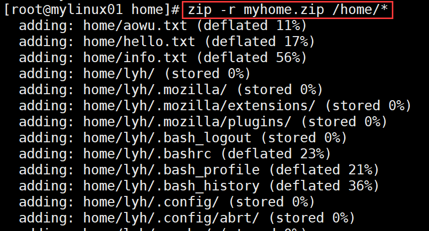

    将myhome.zip 解压到/opt/temp目录下，此时该目录不存在

    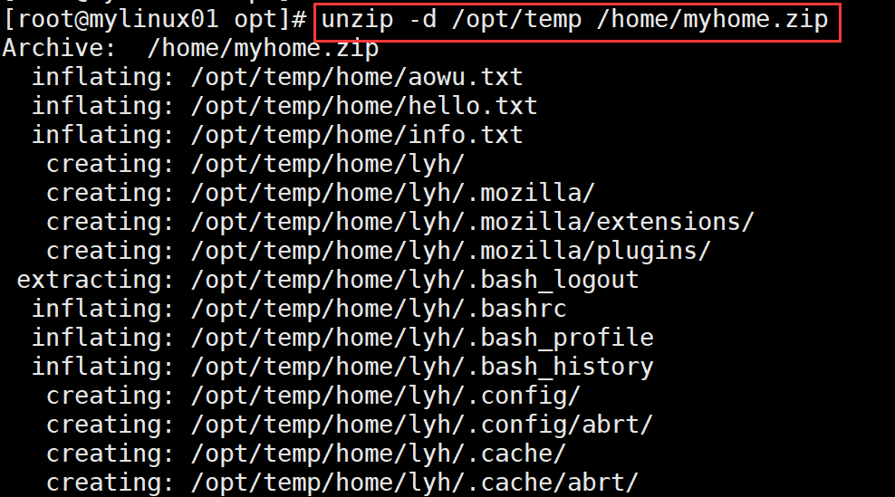

    查看解压后的文件，当指定的解压目录不存在时，会**自动创建该目录**

    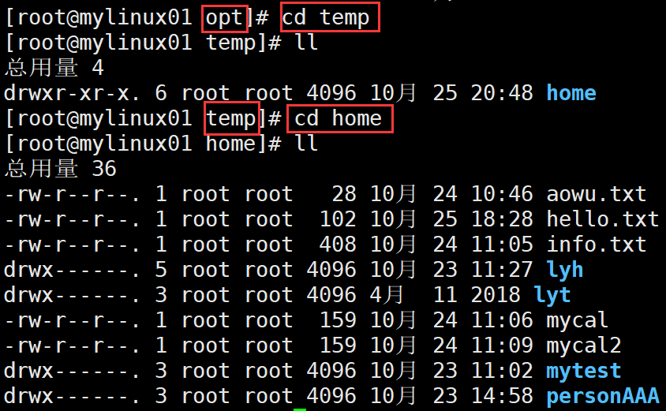
    
 3. **tar指令**

    ​	(1) 基本语法 **[tar 选项 xxx.tar.gz 打包的内容]**
    
    ```shell
    -c   创建打包文件
    -x   解压打包文件
    -t   显示 tar 包中的文件列表
    -z   使 tar 指令具有 gzip 指令的功能，可以创建时打包文件进行压缩，解包时进行解压缩
    -Z   使 tar 指令具有 compress 指令的功能，可以创建时打包文件进行压缩，解包时进行解		压缩
    -j   使 tar 指令具有 bzip2 指令的功能，可以创建时打包文件进行压缩，解包时进行解压缩
    -v   显示打包的详细过程
    -f   指定 tar 包文件名
    -p   保留原文件的原始属性
    -P   打包文件时使用绝对路径
    -C   指定解包路径
    -N<date>  		  打包新文件，仅打包比指定日期更新的文件
    --exclude<flie>   指定打包时忽略的文件
    ```
    
    ​	(2) 作用：tar 是 Linux 中的打包命令，打包和压缩是两个**不同**的概念，打包指的是将**多个文件或目录打包成一个文件**，而压缩指的是将**大文件通过某个算法压缩成一个小文件**，方便节省硬盘存储和网络中传输。在 Linux 中很多压缩命令只能针对一个文件进行压缩，所以在压缩多个文件目录时，得**先进行打包**（tar），然后**再进行压缩** (gzip、bzip2)。
    
    ​	现在压缩多个文件，将 /home/pig.txt 和 /home/cat.txt 压缩成 pc.tar.gz，两个文件之间需要一个**空格**隔开。若在压缩文件时，当后面的备份目录使用**绝对路径**时，会出现 **tar: 从成员名中删除开头的“/”** ，此时，对tar增加选项 **[P]**，即可消除该提示；另一方面，压缩时使用**相对路径**，则不会出现上面的提示，且解压会直接在**当前目录**下。
    
    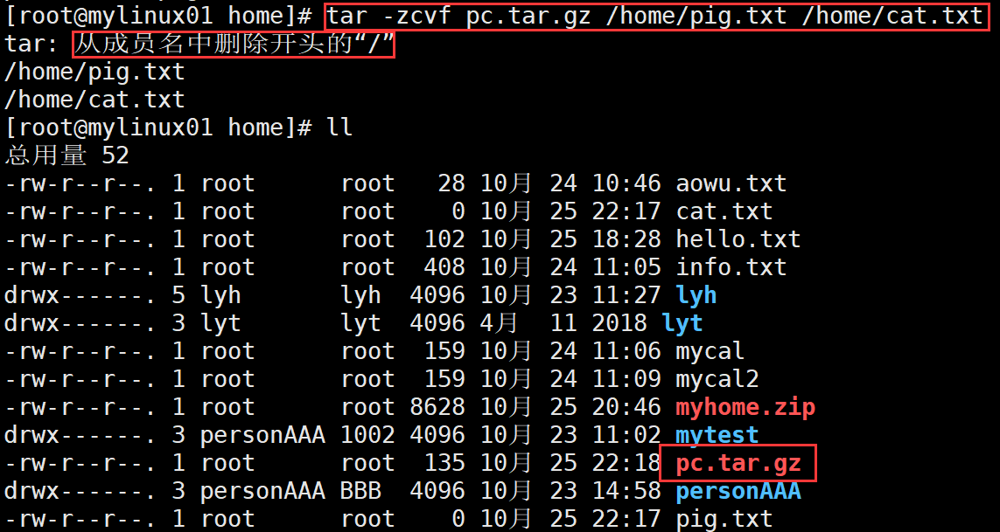
    
    将 pc.tar.gz 解压到当前目录，可以看到，tar指令在打包的时候连同目录一起打包压缩
    
    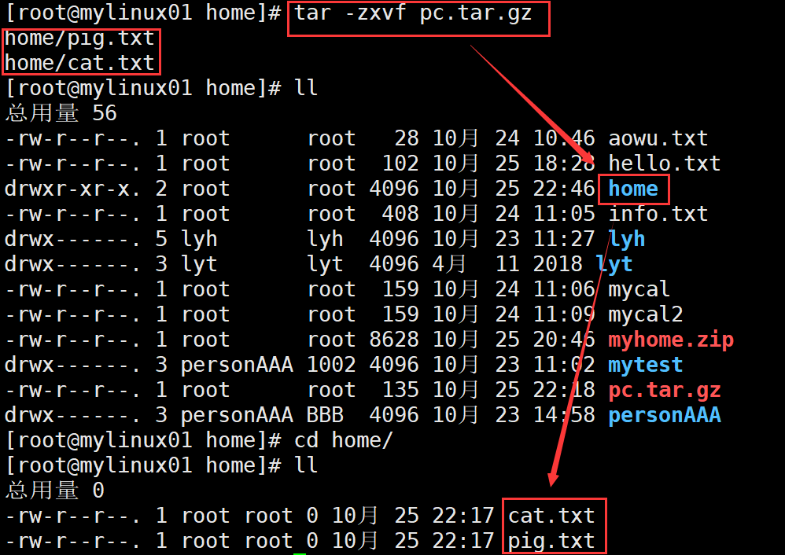
    
    使用选项 **[-C]** 将 pc.tar.gz 解压到 test 目录
    
    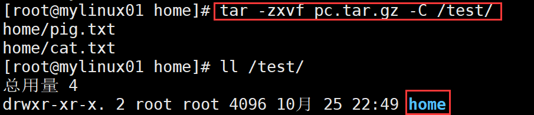
    
    **注：指定目录时，要存在有此目录，否则会报错；且上述选项中， -f 需要放在末尾用于指定名字，其他选项顺序随意。**

#### 7. 帮助类

 1. **man指令**

    (1) 基本语法 **[man 命令或配置文件] **(**manual**)

    (2) 作用：获取帮助信息

    查看 **[ls]** 命令帮助信息，**[man ls]**

    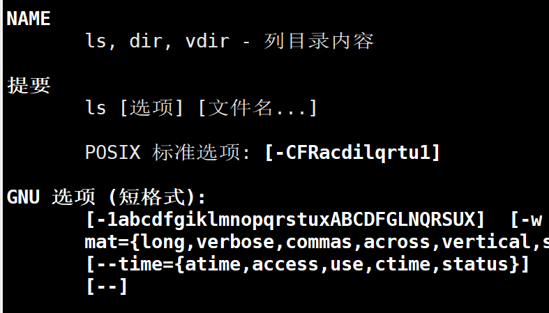

    进入 **man **命令内容界面后，按 **h** 键，即可查看界面的日常操作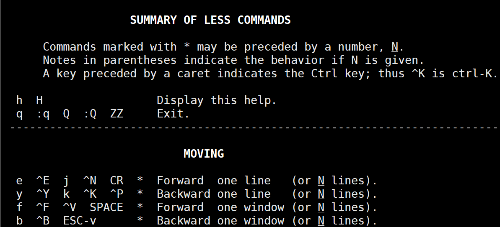

     查看配置文件services的帮助信息 **[man services]**

    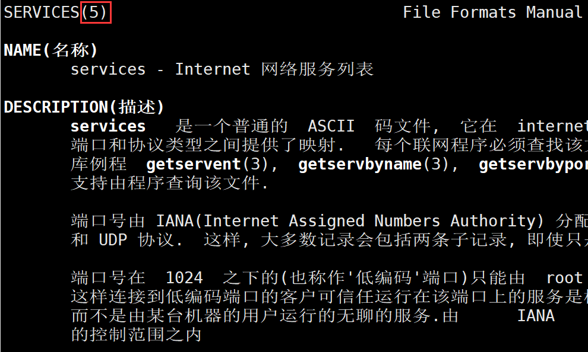

    其中，命令后面的数字以及符号代表：

    ```shell
     1：用户命令(/bin, /usr/bin, /usr/local/bin)
     2：系统调用
     3：库用户
     4：特殊文件(设备文件)
     5：文件格式(配置文件的语法)
     6：游戏
     7：杂项(Miscellaneous)
     8：管理命令(/sbin, /usr/sbin, /usr/local/sbin)
    
     <> ：	必选
     [] ：	可选
     ...：	可以出现多次
     |  ：	多选一
     {} ：	分组
    
     NAME       ：		命令名称及功能简要说明
     SYNOPSIS   ：		用法说明，包括可用的选项
     DESCRIPTION：		命令功能的详尽说明，可能包括每一个选项的意义
     OPTIONS    ：		说明每一个选项的意义
     FILES      ：		此命令相关的配置文件
     BUGS       ：		此命令曾经出现的bug
     EXAMPLES   ：		使用示例
     SEE ALSO   ：		另外参照
    ```

    常用操作：

    ```shell
    翻屏：
        向后翻一屏：SPACE
        向前翻一屏：b
        向后翻一行：ENTER
        向前翻一行：k
    
    查找：
        /KEYWORD: 向后查找
        n：	     下一个
        N：		 前一个
    
        ?KEYWORD：向前查找
        n： 		 下一个
        N：		 前一个
    
    退出：
        q：退出
    ```

 2. **help指令**

    (1) 基本语法 内部命令：**[help 命令]** ，外部命令：**[命令 --help]**

    其中，**命令类型**分为
    **内置命令**：**Bash** 自身提供的命令
    **外部命令**：**Bash** 之外的命令，通在：/bin、/usr/bin、/sbin、/usr/sbin 目录下
    
    (2) 作用：查询 shell 内置命令帮助
    
    查看支持的内置命令 **[help]**
    
    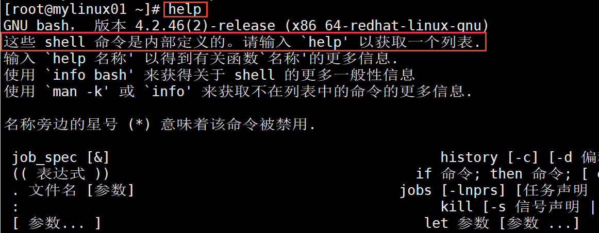
    
    查找外部命令 **[ls]** 的信息，若语法使用错误会报错
    
    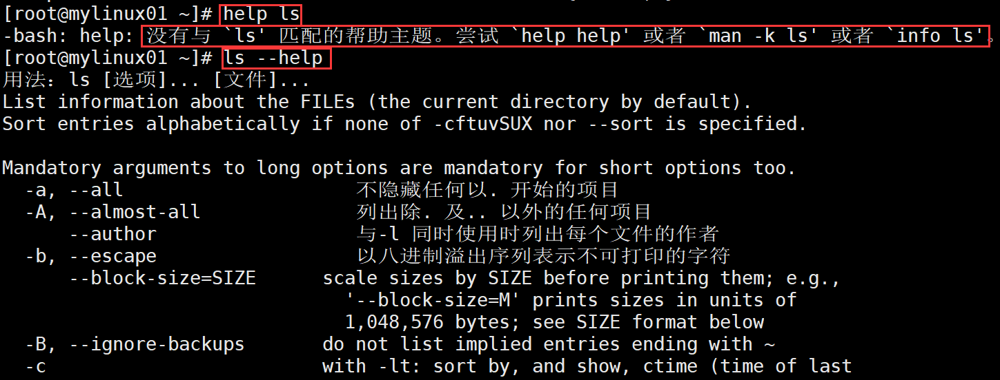
    
    查找内部命令 **[echo]** 的信息
    
    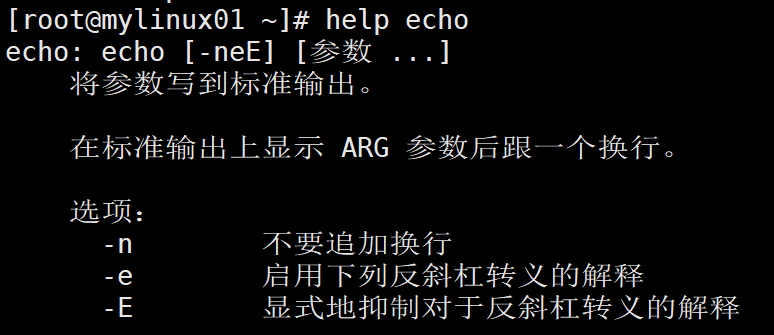
    
    可以使用 **[type]** 命令可以查看命令的类型
    
    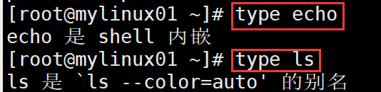
    
 3. **whatis指令**

    (1) 基本语法 **[whatis 命令]**

    (2) 作用：输出man命令的简要信息

    查看 **[pwd / ls / cd]** 的简要信息

    

 4. **其他待完善**

    **info** (**informatio**)：查看 info 格式帮助，相比 man 命令的帮助信息较完整

    **tldr**：命令手册工具（开源软件，非操作系统命令），需要安装

    推荐使用 **man** 和 **tldr** 。

    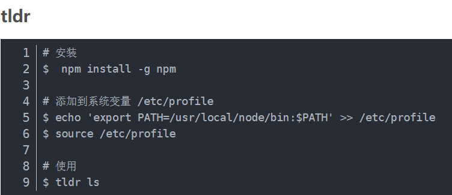

***

## 八、组管理和权限管理

#### 1. Linux组基本介绍

​		Linux 中每个用户都属于一个组，不能独立于组外。每个文件也拥有**所有者、所有组、其他组**三个概念，而且每一个文件都有相应的读、写、执行三个权限，理解组和权限的概念是至关重要的。

​		默认情况下，哪个用户创建了哪个文件（目录），这个用户便是这个文件（目录）的所有者，而这个用户所在的组也就是这个文件（目录）的所有组。**除文件的所有者、所在组内的用户外，其他用户都是另外组。**

​		关于组与用户的创建、删除、修改内容可看 **Ctrl + 左键点击前往** [8. 用户组](# 8. 用户组)

#### 2. [ll] 命令后查询结果的含义

​		以下图为例：


+ 其中，**第 1 位是确定文件类型**

```shell
d 表示目录，相当于windows的文件夹
- 表示普通文件
（以下三种类型可以通过命令 ll /dev 查看相应的信息）
l 表示软链接，相当于windows的快捷方式
c 表示字符设备文件（鼠标、键盘）
b 表示块文设备，比如硬盘
```

+ 而 **2 到 4 位**表示**所有者**拥有的权限 --- User，**5～7 位**表示**所在组**拥用的权限 --- Group，**8 ~ 10位**表示**其他组**拥有的权限 --- Other。
+ 权限后面的数字根据类型判断，如果是**目录**，代表此目录下**子目录数**； 如果是**文件**，代表**硬链接数** 。
+ 数字后面所跟的名字例如 **[root root]** 分别表示**所有者 (前一个)** 和**所在组 (后一个)** 。
+ 所在组后面的数字根据类型判断，它代表**文件字节数大小**，如果是**目录**则是 **4096**。
+ 再后面则是日期 **月 日 时 : 分**，表示**最后修改的时间** 。
+ 时间后面是**文件名** 。

#### 3. rwx权限介绍

1.  **rwx作用到文件**

   (1) **[ r ]**代表可读(read)：可以读取，查看 

   (2) **[ w ]**代表可写(write)：可以修改，但是不代表可以删除该文件，删除一个文件的**前提条件**是对该文件所在目录有 **"write" **权限

   (3) **[ x ]**代表可执行(execute)：可以被执行

2. **rwx作用到目录**

   (1) **[ r ]**代表可读(read)：可以读取，使用 **[ls]** 命令查看目录内容

   (2) **[ w ]**代表可写(write)：可以修改，对目录内进行创建、删除或重命名

   (3) **[ x ]**代表可执行(execute)：可以进入该目录

3. 在表示权限的9个字符中，**每3个为一组**，这些权限可以用数字表示，且数字可以进行组合，例如 **rwx = 7**

   * r = 4
   * w = 2
   * x = 1

#### 4. 修改权限 -- chmod

​	通过 **chmod指令** ，可以修改**文件或者目录**的权限，**如果要对目录内的文件进行操作，需要有对该目录的相应权限**。

 1. **通过 +、-、=、u、g、o、a 修改权限**

    ```shell
    +：增加权限 	-：减去权限   = ：直接赋值权限
    u：所有者 	 g：所在组 	  o ：其他组   a：所有人
    ```

    例如：

    ```bash
    chmod u=rwx, g=rx, o=r  [file name]   # 所有者权限为 rwx，所在组权限为 rw，其他组为 r 
    chmod g-x, o+x [file name]           # 所在组减去 x 权限，其他组增加 x 权限
    ```

    给 apple.txt 文件的所有者读写执行的权限，给所在组读执行权限，给其它组读执行权限。

    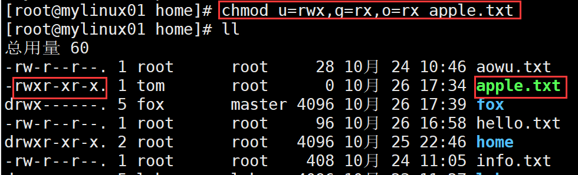

    给 apple.txt 文件的所有者除去执行的权限，增加组写的权限

    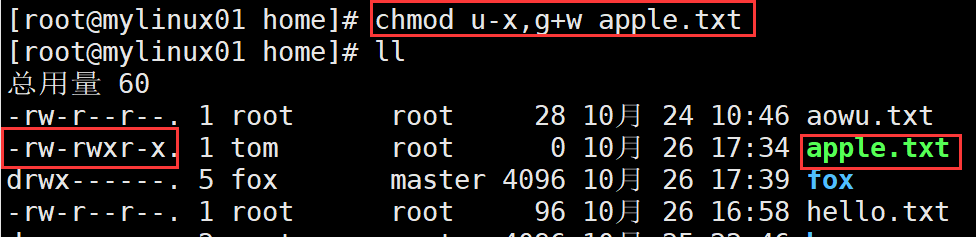
    
    给 apple.txt 文件的所有用户添加读的权限
    
    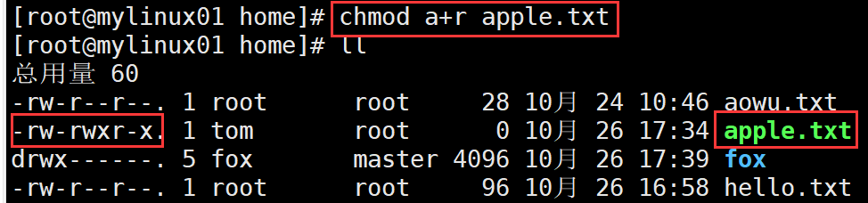
    
    **注：**Linux系统中文件有多种颜色，不同颜色文件代表不同类型的文件，具体如下：
    
    - **蓝色**：    目录
    - **绿色**：    可执行文件
    - **红色**：    压缩文件
    - **浅蓝色**：链接文件
    - **白色**：    普通文件
    - **黄色**：    设备文件

2. **通过数字方式修改权限**

   将 rwx 看成是一个三位二进制数，按照计算规则可知，在十进制下**r = 4 , w = 2 , x = 1**；通过不同的组合，可以得到不同的数值。

   例如：

   ```shell
   chmod  777  [file name]       # 此命令等同于  chmod a=rwx [file name]
   chmod  755  [file name]       # 此命令等同于  chmod u=rwx, g=rw, o=rw [file name] 
   ```
   
   将 /home/apple.txt 文件的权限修改成 rwx r-x r-x , 使用给数字的方式实现
   
   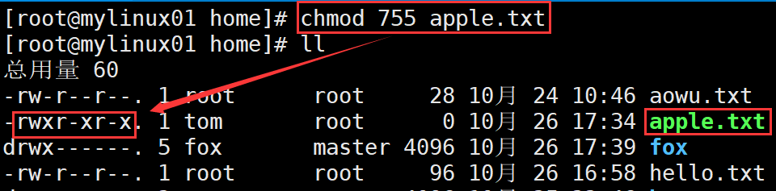

#### 5. 修改文件所有者 -- chown

基本语法为 **[chown 选项 新的所有者名字 文件名/目录名]**，可以改变文件/目录**所有者**（change owner） 。

​					**[chown 选项 新的所有者名字:新的所有组 文件名/目录名]**，可以改变文件/目录**所有者**和**所在组** 。

​					**必须得有 root 权限才能更改**

```shell
-R ：递归参数，目录下所有子目录和文件都修改
```

将/home/apple.txt 文件的所有者修改成 lyh

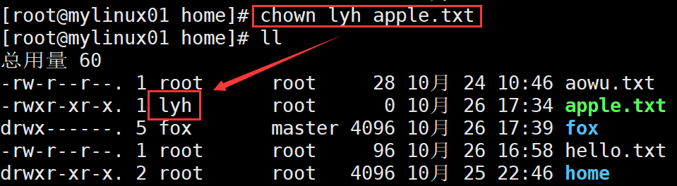

/home/test目录下所有的文件和目录的所有者都修改成 lyh

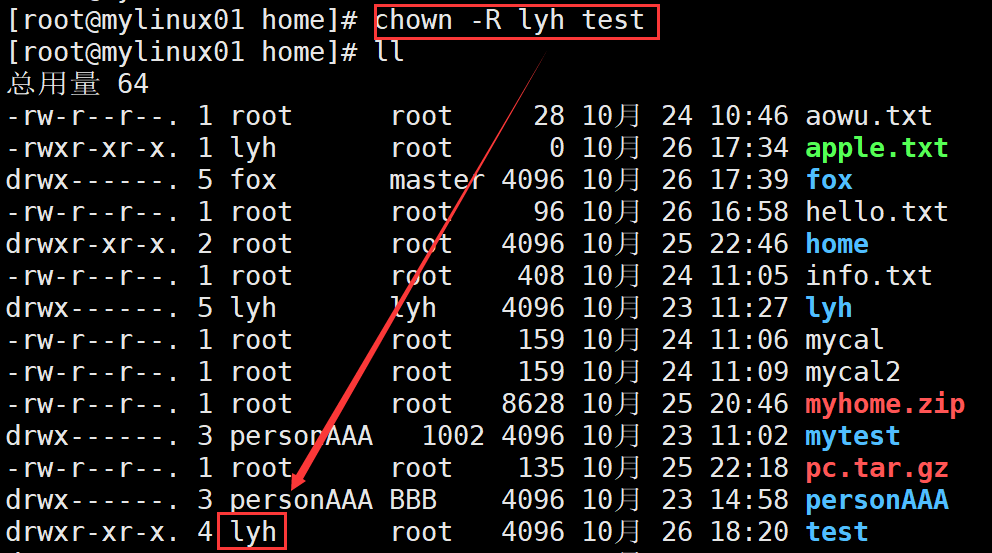

查看其子目录

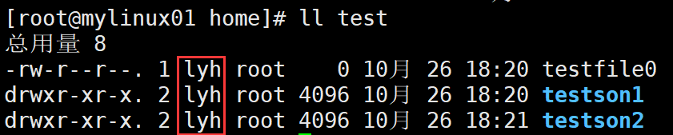

#### 6. 修改文件所在组 -- chgrp

基本语法为 **[chgrp 新的所在组 文件名/目录名]** ，可以改变**文件所在组**（change group）。

```shell
-R ：递归参数，目录下所有子目录和文件都修改
```

**必须得有 root 权限才能更改**

将/home/apple.txt 文件的所在组修改成 fruit。

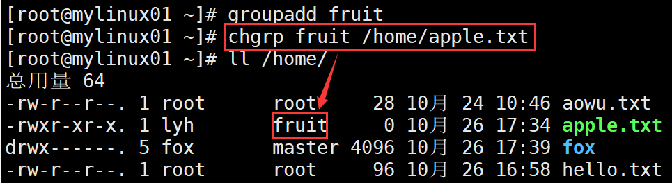

将/home/test目录下所有的文件和目录的所在组都修改成 fruit

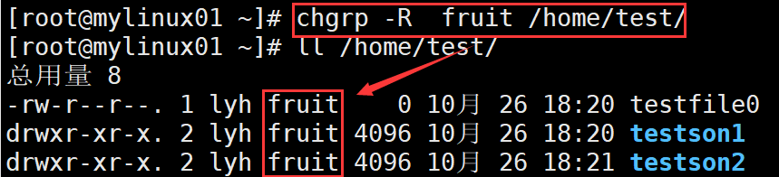

***

## 九、定时任务调度

#### 1. croud任务调度

 1. **概述**

    任务调度：是指系统在某个时间执行的特定的命令或程序。
    任务调度分类：如系统工作，有些重要的工作必须周而复始地执行。如病毒扫描等
    个别用户工作：个别用户可能希望执行某些程序，比如对mysql数据库的备份。

    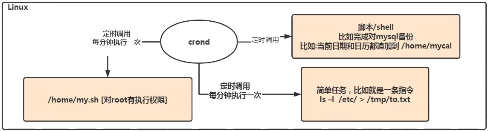

2. **crontab指令**

   (1) 基本语法 **[crontab 选项]** (**cron table**)

   ```shell
   crontab [-u username]　　　　//省略用户表表示操作当前用户的crontab
   -e      编辑工作表
   -l      列出当前有哪些任务调度
   -r      终止任务调度
   service crond restart  重启任务调度
   ```

   

   (2) 作用：我们经常使用的是crontab命令是cron table的简写，它是cron的配置文件，也可以叫它**作业列表**。crontab 命令在 Linux 中是用做任务调度使用的，指的就是**让系统定时的去调用某些指令或者某个脚本**，完成我们想要做的一些定时执行的任务，有许多的应用场景，比如说数据库备份、周期性的日子分析等。

   可以在以下文件夹内找到相关**配置文件**

   - **/var/spool/cron/** 目录下存放的是每个用户包括root的crontab任务，每个任务以创建者的名字命名
   - **/etc/crontab** 这个文件负责调度各种管理和维护任务。
   - **/etc/cron.d/** 这个目录用来存放任何要执行的crontab文件或脚本。
   - 还可以把脚本放在 **/etc/cron.hourly、/etc/cron.daily、/etc/cron.weekly、/etc/cron.monthly** 目录中，让它每小时/天/星期/月执行一次。

   

   (3) crontab的使用

   ​	当使用 **[crontab -e 指令]** 进入当前用户的工作表编辑，是常见的vim界面。每行是一条命令。crontab的命令构成为 **时间+动作**，其时间有**分、时、日、月、周**五种，操作符有：

   ```shell
    *  ： 表示任何时间端都执行
    ,  ： 表示不连续的时间里执行。	 例如 (10 2,4 * * *) 代表每天的 2点10 ，4点10分执行。
    -  ： 表示连续的时间范围内执行。 例如 (0 2 * * 1-3) 代表每周一到周三的2点0分执行
   */n ： 表示隔多长时间执行一次。	 例如 (*/1 * * * *) 代表每隔一分钟执行
   ```

   ​    前 5 个 ***** 号说明：

   ```shell
   第一个 * ：  一小时中的哪一分钟（0~59）
   第二个 * ：  一天中的哪一个小时（0~23）
   第三个 * ：  一个月中的哪一天（1~31）
   第四个 * ：  一年当中的那一个月（1~12）
   第五个 * ：  一周当中的星期几（0~7，0、7都代表星期日）
   ```

   ​	举例说明：

    + 每1分钟执行一次myCommand：***  *  *  *  * myCommand**
    + 每小时的第3和第15分钟执行：**3,15  *  *  *  * myCommand**
    + 在上午8点到11点的第3和第15分钟执行：**3,15  8-11  *  *  *  myCommand**
    + 每隔两天的上午8点到11点的第3和第15分钟执行：**3,15  8-11  */2  *  * myCommand**
    + 每周一上午8点到11点的第3和第15分钟执行：**3,15  8-11  *  *  1  myCommand**
    + 每晚的21:30重启smb：**30  21  *  *  *  /etc/init.d/smb restart**
    + 每个月1、10、22日的4 : 45重启smb：**45  4  1,10,22  *  * /etc/init.d/smb restart** 
    + 每周6、周日的1 : 10重启smb：**10  1  *  *  6,0/etc/init.d/smb restart** 
    + 天天18 : 00至23 : 00之间每隔30分钟重启smb：**0,30  18-23  *  *  *  /etc/init.d/smb restart**
    + 每星期六的晚上11 : 00 pm重启smb：**0   23  *  *  6  /etc/init.d/smb restart **
    + 每一小时重启smb：***  */1  *  *  *  /etc/init.d/smb restart** 
    + 晚上11点到早上7点之间，每隔一小时重启smb：***  23-7/1  *  *  *  /etc/init.d/smb restart**

 3. **应用实例**

    每隔1分钟，就将当前的日期信息，追加到 /test/mydate 文件中

    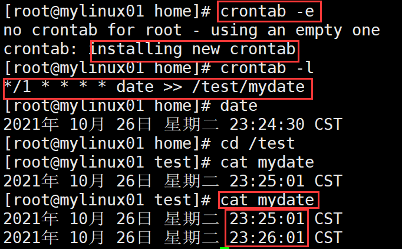

    每隔1分钟，将当前日期和日历都追加到 /home/mycal 文件中

    vim /home/cal.sh 写入内容 **date >> /home/mycal 和 cal >> /home/mycal**，给cal.sh 增加**执行权限**

    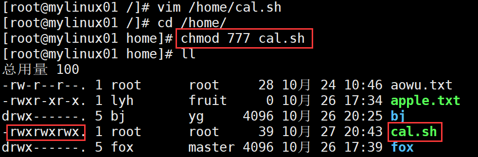

    通过 **[crontab -e]** 增加 **[*/1 * * * * /home/my.sh]**

    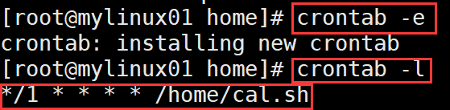

    检查任务执行情况

    

#### 2. at定时任务

1. **at命令格式**

   基本语法 **[at 选项 时间]** ，连续敲击**两次**键盘 **Ctrl + D **或 **Enter + Ctrl + D**就可以结束 **at** 命令的输入，通过 **Ctrl + Backspace** 可以退格。

   ```shell
   -m	                    当指定的任务被完成后，将给用户发送邮件，即使没有标准输出
   -l	                    atq的别名
   -d	                    atrm的别名
   -v	                    显示任务将被执行的时间
   -c	                    打印任务的内容到标准输出
   -V	                    显示版本信息
   -q                      <队列>	 使用指定的队列
   -f                      <文件>	 从指定文件读入任务而不是从标准输入读入
   -t                      <时间参数>	以时间参数的形式提交要运行的任务
   
   atq                     列出用户的计划任务，如果是超级用户将列出所有用户的任务
   						结果的输出格式为：作业号、日期、小时、队列和用户名。
   						
   atrm                    根据job number删除at任务。
   
   batch                   在系统负荷允许的情况下执行at任务，就是在系统空闲的情况下才执行at任务。
   ```

2. **at命令介绍**

   ​	在未来的某个时间点执行一次某个任务，有一个任务要在以后的一个时间里**运行一次**，那就使用 **at命令** 设置任务执行时间与执行的任务便可。如果任务比较复杂，可将命令写成**脚本**并在at命令中调用。
   
   (1) at命令是一次性定时计划任务，at的守护进程atd会以后台模式运行，检查作业队列来运行作业。
   
   (2) **atd守护进程**会检查系统上的一个特殊目录来获取at命令的提交的作业，默认情况下，atd守护进程每60秒检查一次目录，有作业时，会检查作业运行时间，如果时间与当前时间匹配，则运行此作业。

   (3) at命令是**一次性定时计划任务**，执行完一个任务后不再执行此任务了
   
   (4) 在使用at命令的时候，一定要**保证atd进程的启动**。可以通过 **[ps -ef | grep atd] 指令**检测 atd 是否在运行
   
   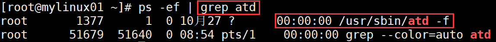
   
   (5) 示意图

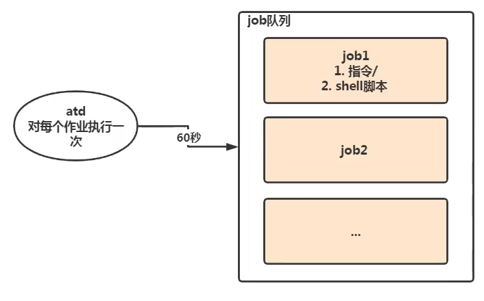

3.  **at时间定义**

   at允许使用一套相当复杂的指定时间的方法。
   ● 能够接受在当天的hh:mm（小时:分钟）式的时间指定。假如该时间已过去，那么就放在第二天执行。 例如：04:00。
   ● 能够使用midnight（深夜），noon（中午），teatime（饮茶时间，一般是下午4点）等比较模糊的词语来指定时间。
   ● 能够采用12小时计时制，即在时间后面加上AM（上午）或PM（下午）来说明是上午还是下午。 例如：12pm。
   ● 能够指定命令执行的具体日期，指定格式为month day（月 日）或mm/dd/yy（月/日/年）或dd.mm.yy（日.月.年）

   ​	**指定的日期必须跟在指定时间的后面**。 例如：04:00 2009-03-1。
   ● 能够使用**相对计时法**。指定格式为：**now + count time-units **

   ​	**now**就是当前时间；

   ​	**time-units**是时间单位，这里能够是 minutes（分钟）、hours（小时）、days（天）、weeks（星期）；

   ​	**count**是时间的数量，几天，几小时。 例如：now + 5 minutes 04pm + 3 days。
   ● 能够直接使用today（今天）、tomorrow（明天）来指定完成命令的时间。

4. **相关配置**

   - 时间规范的确切定义可以在 **/usr/share/doc/at-3.1.13/timespec** 中查看。

   - 默认情况下计划任务都是存放在 **/var/spool/at/** 文件夹中。

   - root用户可以在**任何情况**下使用at命令，而其他用户使用at命令的权限定义在 **/etc/at.allow**（被允许使用计划任务的用户）

     和 **/etc/at.deny**（被拒绝使用计划任务的用户）文件中，默认没有文件需要自己创建允许用户和拒绝用户文件。

   - 如果 **/etc/at.allow** 文件存在，只有在该文件中的用户名对应的用户才能使用at。

   - 如果 **/etc/at.allow** 文件不存在，**/etc/at.deny** 存在，所有不在**/etc/at.deny** 文件中的用户可以使用at。

   - **at.allow** 比 **at.deny** 优先级高，执行用户是否可以执行at命令，先看 **at.allow** 文件中有没有才看 **at.deny** 文件。

   - 如果 **/etc/at.allow **和 **/etc/at.deny** 文件都不存在，则只有root用户能使用at。

   - 一个空内容的 **/etc/at.deny** 表示任何用户都能使用at命令，这是默认的配置。

   - 一般情况下这两个文件存在一个即可。如果只有**少数几个用户**需要使用计划任务，那么就保留 **at.allow** 文件，如果**大部分用户**都要使用计划任务，那么保留 **at.deny** 即可。

5. **应用实例**

   在 21:45 输出 "我是at指令"

   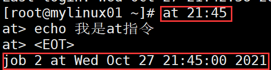

   通过 **[cat /var/spool/mail/root]** 查看输出结果

   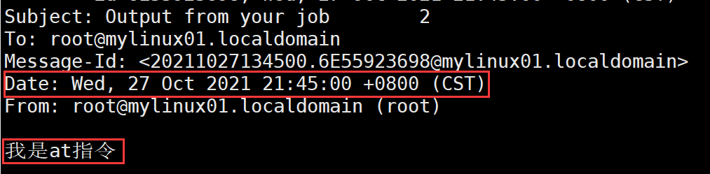

   在 21:50 去 /home 目录下创建文件 /myat，并通过 **[atq指令]**查看系统中没有执行的工作任务

   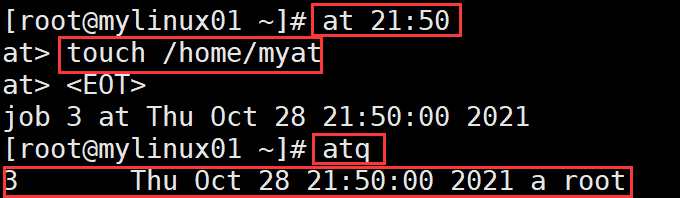

   明天17点钟，输出时间到 /home/myatdate.txt，没有文件会自动创建

   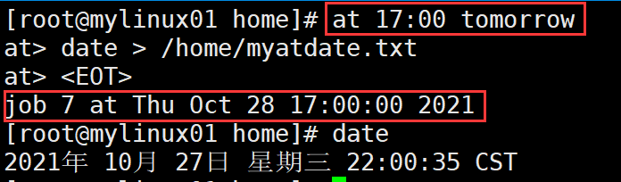

   在2分钟后，输出时间到 /home/myatdate.txt，没有文件会自动创建

   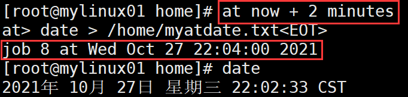

   通过 **[atrm 编号]** 删除任务列表里的任务

   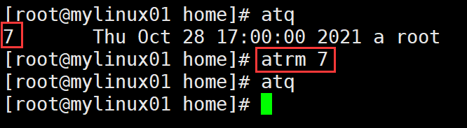

***

## 十、Linux磁盘的分区与挂载

#### 1. 分区介绍

​	Linux来说无论有几个分区，分给哪一目录使用，它归根结底就只有一个根目录，一个**独立且唯一**的文件结构 , Linux
中每个分区都是用来组成整个文件系统的一部分。
​	Linux采用了一种叫**“载入”**的处理方法，它的整个文件系统中包含了一整套的文件和目录，且将一个分区和一个目录
联系起来。这时要载入的一个分区将使它的存储空间在一个目录下获得。

​	简单来说，一个分区代表了一块具体的存储空间，Linux通过挂载的技术将这块空间挂载了一个具体的目录下面。

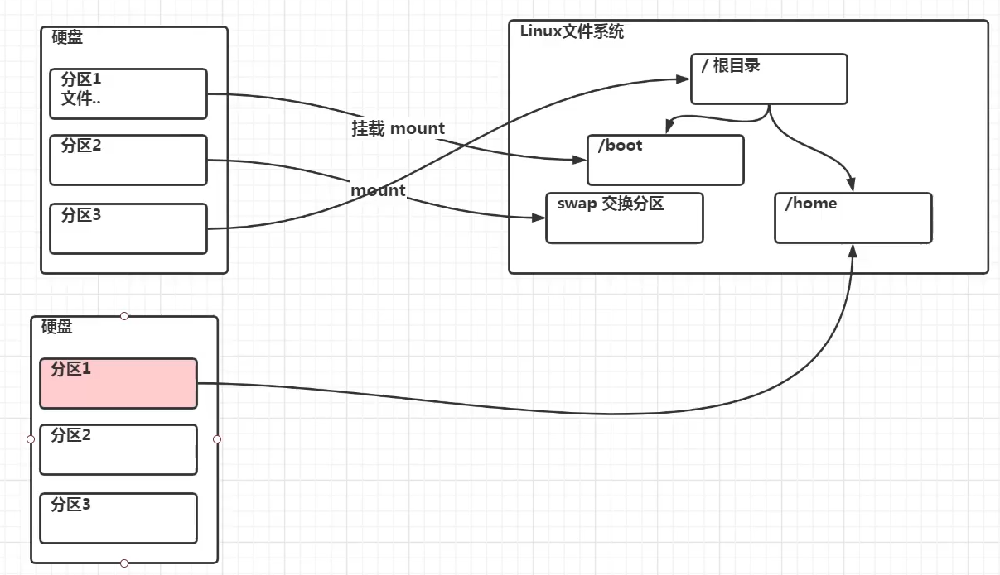

#### 2. 硬盘说明及磁盘情况查询

1. Linux硬盘分为**IDE硬盘**和**SCSI硬盘**，目前基本上是SCSI硬盘

2. 对于**IDE硬盘**，驱动器标识符为 **“hdx~”**，其中 **“hd”** 表明分区所在设备的类型，这里是指IDE硬盘。**“x”** 为盘号（x为**a**时为**基本盘**，为**b**时值**基本从属盘**，为**c**时是**辅助主盘**，为**d**是**辅助从属盘**），**“~”** 代表分区，前四个分区用数字1到4表示，他们是**主分区或扩展分区**，从5开始就是**逻辑分区**。

   **比如：**hda3 表示为第一个IDE硬盘上的第三个主分区或扩展分区，hdb2表示为第二个IDE硬盘上的第二个主分区或扩展分区。

3. 对于SCSI硬盘则标识符为 **“sdx~”**，SCSI硬盘使用 **“sd”** 来表示分区所在设备的类型的，其余则和IDE硬盘的表示方法一样。

   使用 **[lslbk]** 或者 **[lslbk -f]** 指令查看所有设备挂载情况
   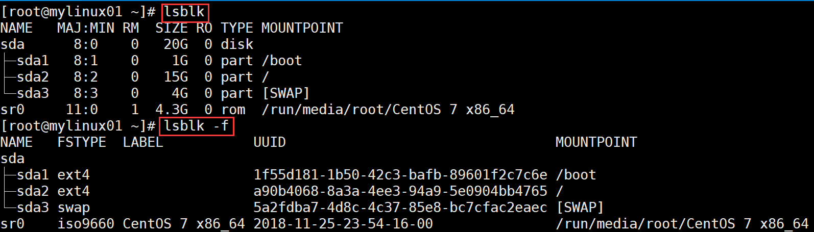
   
   其中，**NAME** 表示分区情况，**FSTYPE** 表示分区类型，**UUID** 是用于**格式化之后**分配40位的唯一不重复区分标识符，**MOUNTPOINT** 表示挂载点。
   
4. **查询指定目录的磁盘占用情况**

   + 基本语法 **[df -h]**，用于**查询磁盘整体使用情况**。

     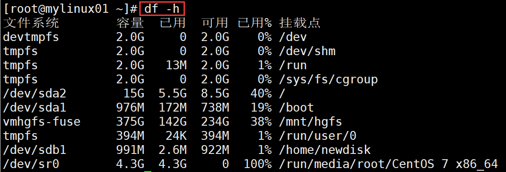

   + 基本语法 **[du 选项 目录]**，用于**查询指定目录的擦盘占用情况** (**默认为当前目录**)。

     ```shell
     -s　　指定目录占用大小汇总
     -h　　带计量单位
     -a　　含文件
     -c　　列出明细的同时，增加汇总值
     --max-depth=1　　子目录深度
     ```

     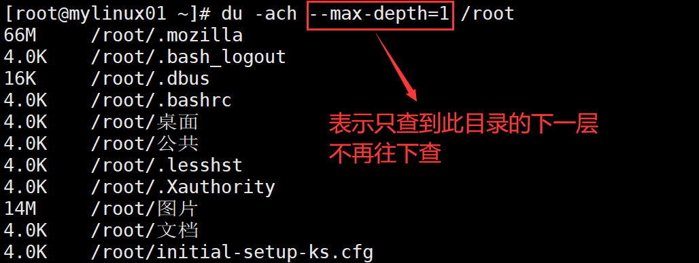

#### 3. 使用文件系统的一般方法
​	系统和用户的所有数据都存储在文件系统上，使用文件系统的前提是**先创建分区和 / 或逻辑卷**，然后将其**挂载**到文件系统目录树上，被挂载的目录称为**挂载点**。Linux 中使用的文件系统通常是在安装时创建的。对于实际运行的系统，经常还会需要对现有的分区进行调整或建立新的分区和 LVM 的情况。
要使用文件系统，一般要遵循如下步骤。

1.  在硬盘上创建分区或逻辑卷。
2.  在分区或逻辑卷上创建文件系统。类似于在Windows下进行格式化操作。
3.  挂载文件系统到系统中。在分区或逻辑卷上创建好文件系统后，可以将该分区或逻辑卷上的文件系统，挂载到系统中的相应目录下以便使用。

  + 有两种挂载方式	
    		+ 		+ 手工挂装文件系统可以使用 **[mount]** 命令。
        		+ 若需要系统每次启动时都自动挂载该文件系统，则需要在文件**/etc/fstab** 中添加相应的配置行。

4. 卸载文件系统。对于可移动介质上的文件系统，当使用完毕后， 需要使用 **[umount]** 命令实施卸载操作或执行 **[eject]** 命令直接弹出光盘。

#### 4. 挂载经典案例

　**需求：**当目前的硬盘不够用时，就要尝试给Linux新增硬盘了，并且挂载到某一个具体的目录下面/home/newdisk

　**原理：**新增一块硬盘sdb1，并挂载到/home/newdisk，此时对/home/newdisk的操作其实就是在操作sdb1这块硬盘。

1. 在右击**虚拟机**弹出的**菜单**中，选择**设置**，在**硬件选项卡**中单击 **添加(A)...** ，然后在弹出的**硬件向导框**中选择**硬盘**，一路下一步，中间只有选择磁盘大小的地方需要修改，直到完成。然后重启系统(才能识别) 。

   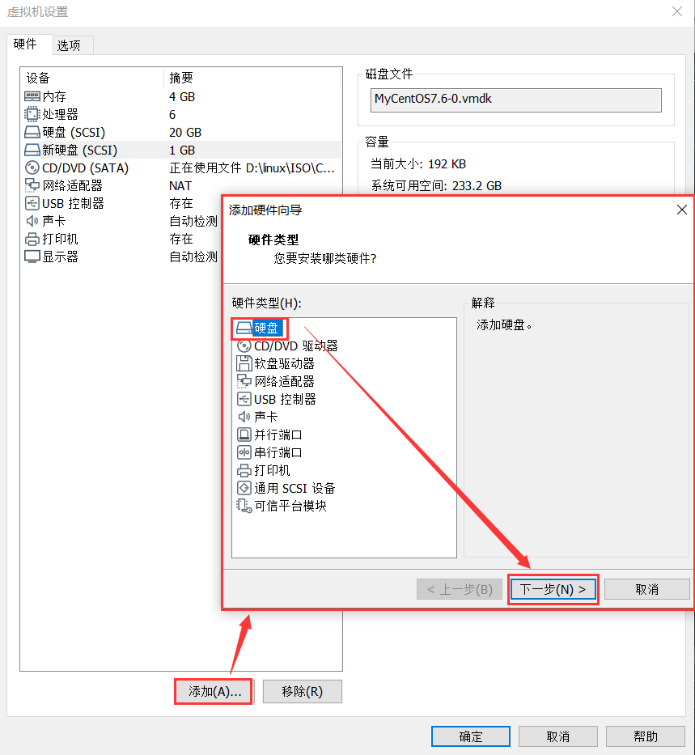

   当添加硬盘后使用 **[lsblk -f]** 发现sdb的硬盘，需要重启才能看到，此时的硬盘并没有分区，所以显示sdb后面没有数字

   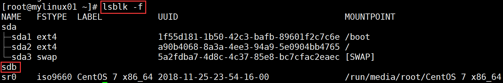
   
2. 通过**fdisk工具**开始对 /sdb 进行分区

   基本语法 **[fdisk 选项 硬盘设备名]** ，可以进入**fdisk** 的交互操作方式，对指定的硬盘进行分区操作

   ```shell
   -l 在命令行方式下显示指定硬盘的分区信息 
   ```

   **fdisk**子命令

   | 命 令 | 说                    明  | 命 令 |        说                    明        |
   | :---: | :-----------------------: | :---: | :------------------------------------: |
   |   a   |   为分区设置可启动标志    |   p   |             列出硬盘分区表             |
   |   n   |   **创建**一个新的分区    |   d   |          **删除**一个硬盘分区          |
   |   l   |  列出所有支持的分区类型   |   t   |              更改分区类型              |
   |   m   |     列出所有命令说明      |   u   |       切换所显示的分区大小的单位       |
   |   q   | 退出fdisk，**不保存更改** |   w   | 把设置**写入**硬盘分区表，然后**退出** |
   |   o   |   创建DOS类型的空分区表   |   g   |         创建GPT类型的空分区表          |
   
通过命令 **[fdisk /dev /sdb]** 进入交互模式，在开始分区后输入**n**，新增分区。

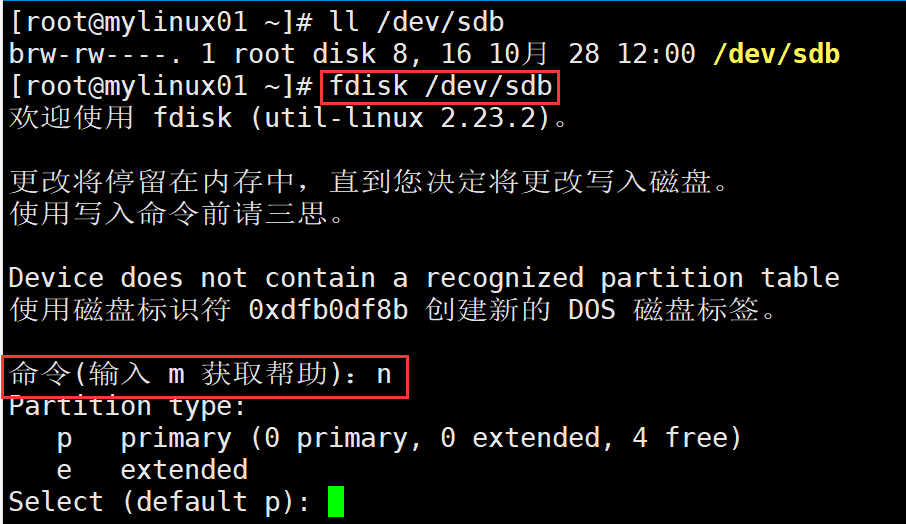

然后选择**p或直接回车**，选择分区类型为**主分区** (默认就是主分区)，自定义输入分区号(1-4,默认是1)。

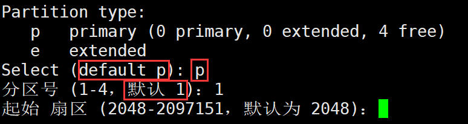

两次直接**回车**，第一次回车表示**使用默认的起始扇区位置**，第二次回车表示**分区大小截至最后一个柱面**，即**默认全部剩余空间**。最后输入**w**写入分区并退出，若不保存退出输入q。

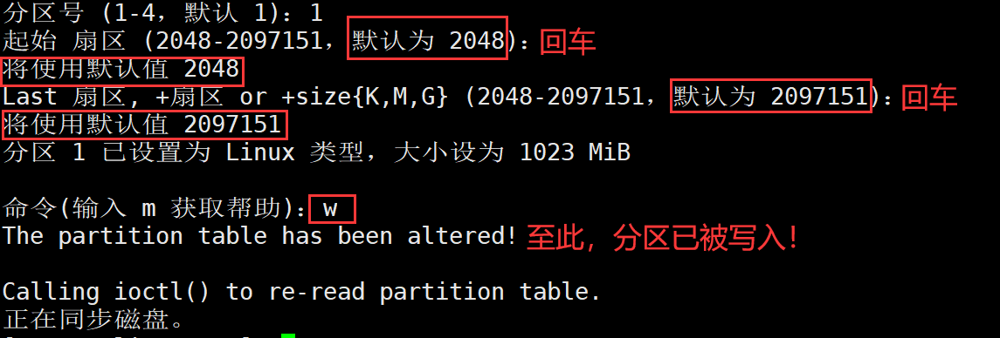

查看分区结果，此时便分区成功。

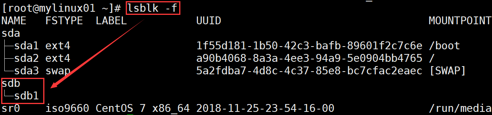

接着，输入命令 **[mkfs -t ext4 /dev/sdb1]** 进行**格式化硬盘**，其中 **ext4** 是分区类型

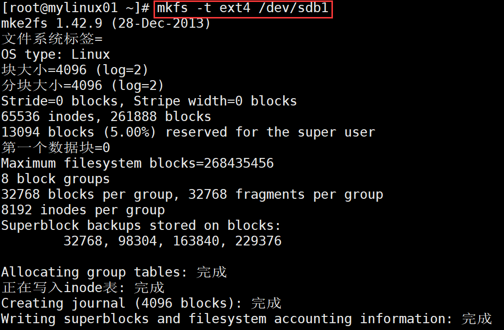

查看格式化结果。

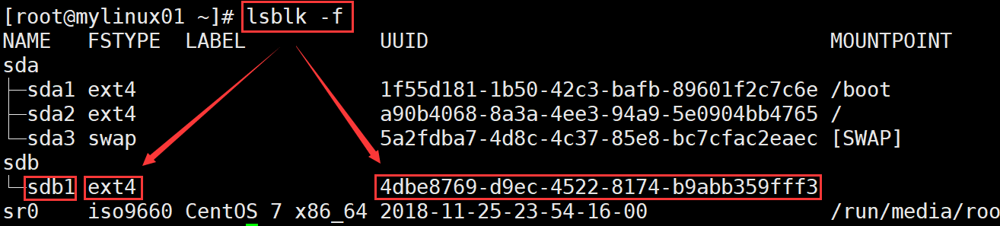

最后，将**分区挂载到系统中相应的目录下**以便使用。所谓的挂载，就是**将一个分区与一个目录联系起来**，可以通过命令 

**[mount 设备名 挂载目录]** 完成，但此种方式在**重启后就会失效**。

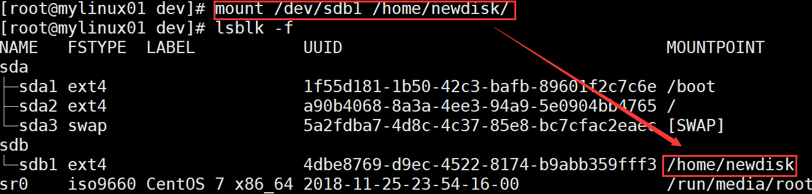
   文件系统可以被挂载，也可以被卸载。**卸载文件系统**的命令是**umount**，该命令可以把文件系统从Linux系统中的挂载点分离。要卸载一个文件系统，可以指定要卸装的文件系统的**目录名(挂载点)**或**设备名**。**umount**命令的格式如下：

+ **[umount 设备名称 或者 挂载目录]** ，例如 **umount /dev/sdb1** 或者 **umount /home/newdisk**。
  

如果一个文件系统处于**busy** 状态，则不能卸载该文件系统。如下情况将导致文件系统处于**busy**状态:

+ 文件系统上面的缓存文件正在被使用。
   + 文件系统上面有打开的文件。
   + 某个进程的工作目录在此文件系统上。
   

最典型的错误是**在挂载点目录下实施卸载操作**，此时文件系统处于**busy**状态。


   使用 **[mount]** 命令手动挂装的文件系统在**关机时会被自动卸载**，但系统**再次启动后不会被自动挂载**。要在启动时自动挂载文件系统必须修改系统挂载表 —— 配置 文件 **/etc/fstab**。系统启动所要挂载的**文件系统**、**挂载点**、**文件系统类型**等都记录在 **/etc/fstab** 文件里。若想在系统启动时**自动挂载文件系统**，通过修改 **/etc/fstab** 实现自动挂载，添加完成后，执行 **[mount -a]** 或者**重启**即可生效。

此处的 **UUID** 也可以使用**设备名称**来替代，即 **/dev/sdb1** 。

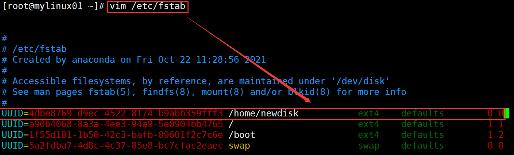

fstab文件栏位说明：（依照从左到右的顺序）

|    栏 位    |                            说 明                             |
   | :---------: | :----------------------------------------------------------: |
   | file system | 要挂载的设备，可以使用**设备名**，也可以通过 **UUID** 或 **LABEL** 来指定 |
   | mount point |                          挂载点目录                          |
   |    type    |                      挂载的文件系统类型                      |
   |   options   |   **挂载选项**。挂载设备时可以设置多选项，不同选项间用逗号隔开   |
   |    dump     | 使用 **dump命令** 备份文件系统的频率，空白或者值为 **0** 时，系统认为不需要备份 |
   |    pass     | 开机时 **fsck命令**会自动检查文件系统，pass 规定了检查的顺序。挂载到 / 分区的文件系统，此栏位应是 **1** ，其余是 **2**，若为 **0** 表示不需要检查 |

查看挂载结果。

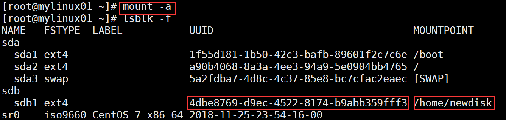

#### 5. 关于磁盘情况的工作实用指令

1. 统计/opt 文件夹下**文件**的个数 **[ll /opt | grep "^-" | wc -l]**

   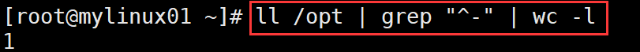

2. 统计/opt 文件夹下**目录**的个数 **[ll /opt | grep "^d" | wc -l]**

   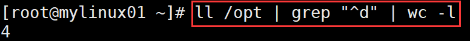

3. 统计/opt 文件夹下**文件**的个数，包括子文件夹里的 **[ls -lR  /opt | grep "^-" | wc -l]**

   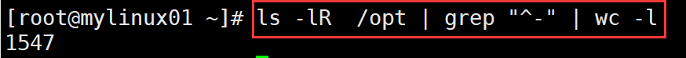

4. 统计/opt文件夹下**目录**的个数，包括子文件夹里的 **[ls -lR  /opt | grep "^d" | wc -l]**

   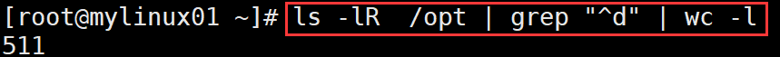

5. 以**树状**显示目录结构 **tree** 目录

    如果没有tree，则使用 **[yum install tree]** 安装

   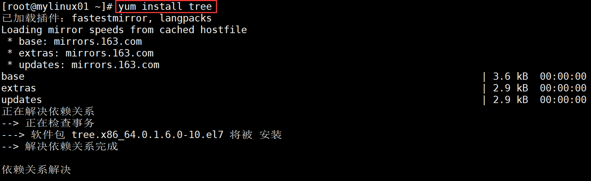

   安装完成

   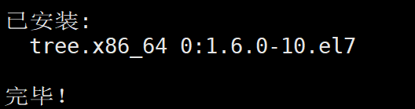

   使用 **[tree]** 命令查看 /home 目录

   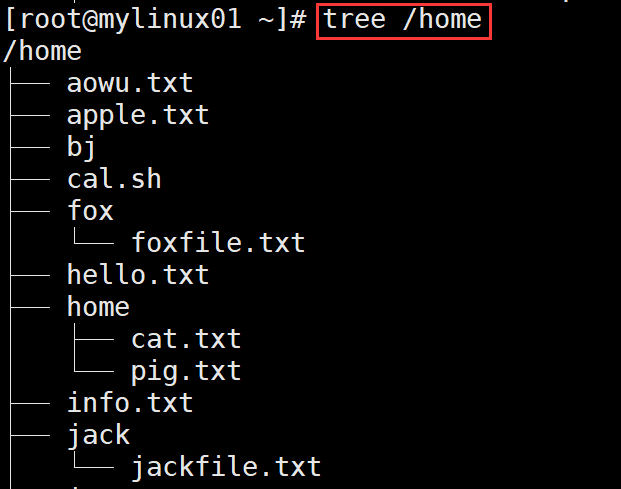

***

## 十一、进程管理

#### 1. 进程概述

 1. **进程的概念**
    进程(Process) 是**一个程序在其自身的虚拟地址空间中的一次执行活动**。之所以要创建进程，就是为了使多个程序可以并发地执行，从而提高系统的资源利用率和吞吐量。

    + 进程和程序的**概念不同**，下面是对这两个概念的比较。
      + 程序只是一个**静态**的指令集合；而进程是一个程序的**动态**执行过程，具有生命期，是
        动态地产生和消亡的。
      + 进程是资源申请、调度和独立运行的单位，因此使用系统中的运行资源；而程序不能
        申请系统资源，不能被系统调度，也不能作为独立运行的单位，因此不占用系统的运
        行资源。
      + **程序和进程无一一对应的关系**。 一 方面一个程序可以由多个进程所共用，即一个程序
        在运行过程中可以产生多个进程；另一方面，一 个进程在生命期内可以顺序地执行若
        干个程序。

    Linux操作系统是**多任务**的，如果一个应用程序需要几个进程并发地协调运行来完成相关工作，系统会安排这些进程并发运行，同时完成对这些进程的调度和管理任务，包括CPU、内存、存储器等系统资源的分配。

 2. **Linux 中的进程**
    在Linux系统中总是有很多进程同时在运行，每一个进程都有一个**识别号**，叫作**PID** (**Process ID**)，用于与其他进程区别。系统启动后的第一个进程是 **systemd**，其PID是 **1** 。**systemnd**是唯一一个**由系统内核直接运行**的进程。新的进程可以用系统调用fork来产生，就是从一个已经存在的进程中派生出一个新进程，旧的进程是新产生的进程的**父进程**，新进程是产生它的进程的子进程。

 3. **进程的类型**
    可以将运行在Linux系统中的进程分为 **3** 种不同的类型。

    + **交互进程**：由个Shell启动的进程。交互进程既可以在前台运行，也可以在后台运行。
    + **批处理进程**：不与特定的终端相关联，提交到等待队列中顺序执行的进程。
    + **守护进程**：在Linux启动时初始化，需要时运行于后台的进程。

    以上3种进程有各自的特点、作用和使用场合。

 4. **进程的启动方式**
    启动一个进程有两个主要途径：**手工启动**和**调度启动**。

    + **手工启动**

      由用户输入命令，直接启动一个进程便是手工启动进程。手工启动进程又可以分为**前台启动**和后台启动。

      + **前台启动**：手工启动一个进程的最常用方式。一般地，用户输入一个命令 **[ls -l]**，这就
        已经启动了一个进程，而且是一个前台的进程。
      + **后台启动**：直接从后台手工启动一个进程用得比较少一些，除非是该进程甚为耗时，且用
        户也不急需要结果的时候。假设用户要启动一个需要长时间运行的格式化文本文件的进程，
        为了不使整个Shell 在耗时进程的运行过程中都处于“瘫痪"状态，从后台启动这个进程是明
        智的选择。

    + **调度启动**
      这种启动方式是**事先进行设置**，根据**用户要求**让进程自行启动运行，参见 [定时任务调度](#九、定时任务调度) 章节。

#### 2. 通过ps显示系统执行的进程

1. **获取进程信息**
   通过命令可以查看进程状态，获取有关进程的相关信息。例如:

   + 显示哪些进程正在执行和执行的状态。

   + 进程是否结束、进程有没有僵死。

   + 哪些进程占用了过多的系统资源等。

2. **ps命令**

   在Linux中，可使用ps命令对进程进行查看，ps是一个功能非常强大的**进程查看命令**。

   使用该命令使用户可以确定有哪些进程**正在执行**和**执行的状态**、**进程是否结束**、**进程有没有僵死**、**哪些进程占用了过多的系统资源**等。总之，大部分信息都可以通过运行ps命令来获得。
   
   ps命令支持**3种不同类型的命令行参数**，分别是 **BSD** 风格的参数，**Unix** 风格的参数和 **GNU** 风格的长参数
   
   + **$ ps [选项]**
   
   由于 **[ps]** 命令的功能相当强大，该命令有大量的选项参数，这里只介绍几个最常用的**选项**。

|      选 项       |        说 明         |       选 项       |               说 明                |
| :--------------: | :------------------: | :---------------: | :--------------------------------: |
|        **a**     |     显示当前终端的所有进程信息     |      f / -H       |    显示进程树，等价于 **--forest** |
|        e         | 在命令后显示环境变量 |      w / -w       | 宽行输出。通常用于显示完整的命令行 |
|        **u**     | 显示用户名和启动时间等信息 |        -e         | 显示所有进程，等价于 **--A** |
|        **x**     | 显示没有控制终端的进程 |        -f         | 完全显示。增加用户名、PPID、 进程起始时间 |
| <span style="white-space:nowrap;">o / -o &lt; list&gt;</span> | 由用户自定义输出列，**list** 是一个以逗号间隔的输出项列表 | <span style="white-space:nowrap;">--sort &lt;order&gt;</span> | 指定按哪/哪些列排序，**order** 格式为: [+\|-]key[**,**+\|-]key[**,**...]] |

   而 **[ps -aux]** 命令可以**显示所有包含其他使用者的进程**，其输出的**重要信息的含义**如下：

| 输 出 项 |                说 明                |   输 出 项    |                     说 明                      |
| :------: | :---------------------------------: | :-----------: | :--------------------------------------------: |
|   PID    |               进程号                |     TIME      |        进程自从启动以来占用CPU的总时间         |
|   PPID   |           父进程的进程号            |     USER      |                     用户名                     |
|   TTY    |         进程从哪个终端启动          |     %CPU      |          占用CPU时间与总时间的百分比           |
|   STAT   |            进程当前状态             |     %MEM      |         占用内存与系统内存总量的百分比         |
|  START   |         进程开始执行的时间          |     SIZE      | 进程代码大小+数据大小+栈空间大小，单位 **KB**  |
|   VSZ    | 进程占用的虚拟内存空间，单位 **KB** | COMMAND / CMD | 启动进程所用的命令和参数，如果过长会被截断显示 |
|   RSS    | 进程所占用的内存的空间，单位 **KB** |               |                                                |

   其中，在**进程状态 (STAT)** 一栏中**表示状态的字符含义**如下：

| 状 态 |                            说 明                             |
| :---: | :----------------------------------------------------------: |
|   R   |      进程正在执行中(进程排在执行队列里，随时都会被执行)      |
|   S   |                  进程处于睡眠状态(sleeping)                  |
|   T   |                          追踪或停止                          |
|   D   |                        不可中断的静止                        |
|   Z   | 僵尸进程(zombie)，进程已经被终止，但其父进程并不知道，没有妥善处理 |
|   W   |       进程没有固定的pages，即没有足够的内存分页可分配        |
|   L   |                  有内存分页分配并锁在内存内                  |
|   <   |                        高优先级的进程                        |
|   N   |                        低优先级的进程                        |

   通过 **[ps -ef] 全格式显示进程信息**的**BSD风格**参数含义如下：

| 选 项 |                            说 明                             |
| :---: | :----------------------------------------------------------: |
|  UID  |                            用户ID                            |
|  PID  |                            进程ID                            |
| PPID  |                           父进程ID                           |
|   C   | CPU用于计算执行优先级的因子。当数值越大时，表明进程是**CPU密集型运算**，执行优先级会**降低**；而数值越小，则表明进程是**I/O密集型运算**，执行优先级会**提高** |
| STIME |                        进程启动的时间                        |
|  TTY  |                        完整的终端名称                        |
| TIME  |                           CPU时间                            |
|  CMD  |                   启动进程所用的命令和参数                   |

3. **应用实例**

   显示当前用户在**Shell**下所运行的进程信息

   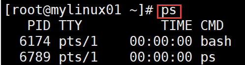

   列出系统中正在运行的所有进程的详细信息，如果想看清所运行的进程的完整命令行，可以使用 **w** 参数。

   例如 **[ps -efw]** 或 **[ps -auxw]** 。

   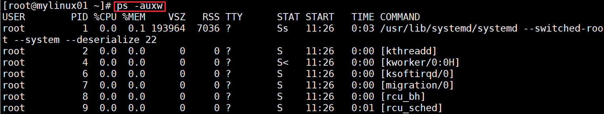

   以**全格式显示**当前所有的进程，查看 **sshd** 进程的父进程。

   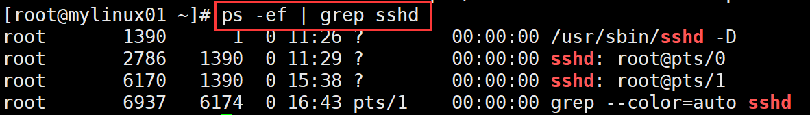
   
4. **查看进程树pstree**

   基本语法 **[pstree 选项]** ，通过pstree可以更加直观的来看进程信息

   ```shell
   -p：显示进程的PID
   -u：显示进程的所属用户
   ```

   用树状形式显示进程的pid

   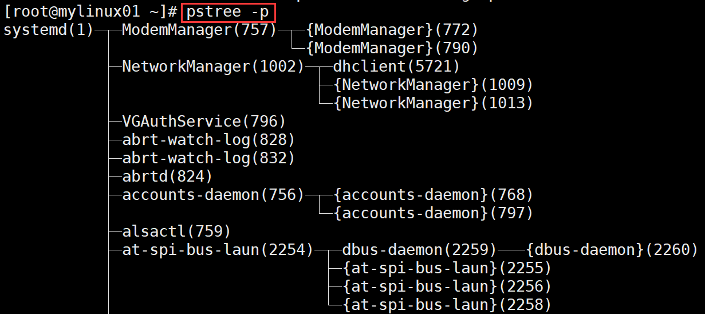

   用树状形式显示进程的所属用户

   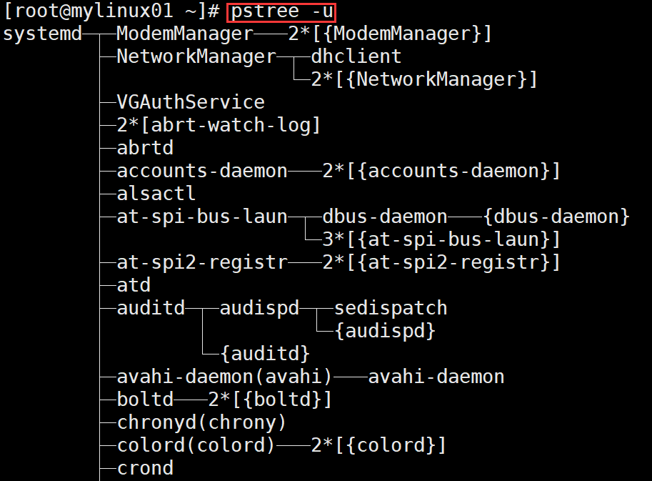

#### 3. 终止进程

1. **为什么要杀死进程**

   在系统运行期间，若发生了如下情况，就需要将这些进程杀死。

   + 进程占用了过多的CPU时间
   + 进程锁住了一个终端，使其他前台进程无法运行。
   + 进程运行时间过长，但没有预期效果或无法正常退出。
   + 进程产生了过多的到屏幕或磁盘文件的输出。

2. **进程信号**
   进程信号是在软件层次上对**中断机制**的一种模拟，在原理上，一个进程收到一个信号与处理器收到一个中断请求可以说是一样的。 

   进程信号是**最基本的进程间通信方式**：可以在进程之间直接发送，而不需要用户界面；可以在Shell中通过 **kill** 命令发送给进程。
   Linux对每种进程信号都规定了默认关联动作。可以使用如下命令查看可用的进程信号及其详细信息。

   +  通过命令 **[kill -l]**

     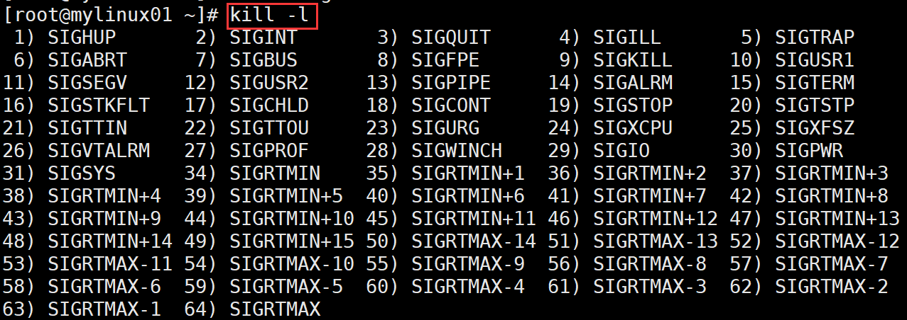

   + 通过命令 **[man 7 signal]**

     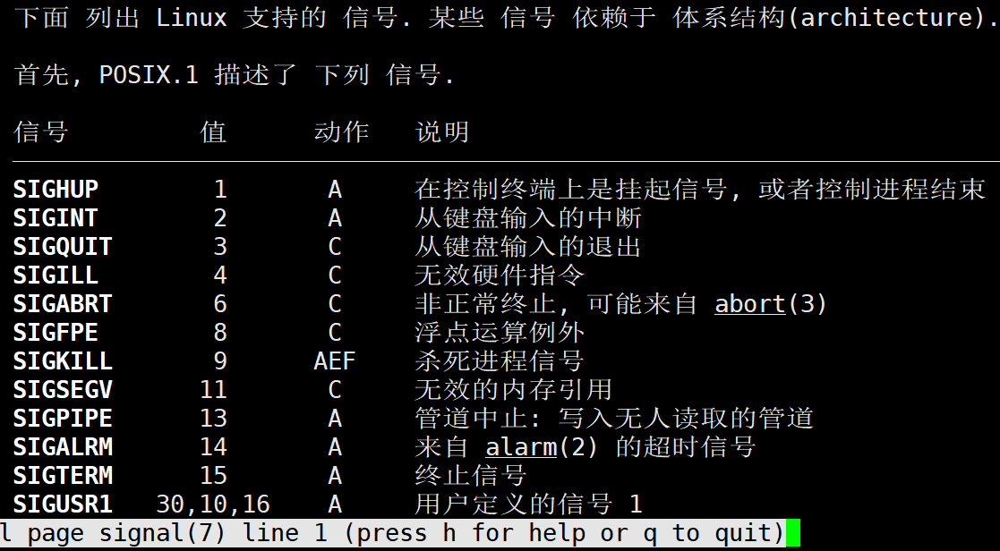

   一些常用进程信号说明。

   |  信 号  | 数 值 |                  用 途                  |
   | :-----: | :---: | :-------------------------------------: |
   | SIGHUP  |   1   |              重读配置文件               |
   | SIGINT  |   2   | 从键盘上发出的强行终止信号 **(Ctrl+C)** |
   | SIGKILL |   9   |  结束接收信号的进程 **(强行杀死进程)**  |
   | SIGTERM |  15   |        正常的终止信号 **(默认)**        |

   可以发送进程信号的命令，通过这些命令可以为进程发送 **SIGTERM(15)** 或 **SIGKILL(9)** 信号**杀死进程**。

   |  命 令  |                  说 明                   |
   | :-----: | :--------------------------------------: |
   |  kill   | 通过指定进程的**PID**为进程发送进程信号  |
   | killall | 通过指定进程的**名称**为进程发送进程信号 |
   |  pkill  | 通过**模式匹配**为指定的进程发送进程信号 |

   注：

   + **killall** 使用**进程名称**而不是PID，所以所有的**同名进程**都将被杀死。
   + **pkill** 在杀死进程时应使用精确匹配(-x)，以免殃及池鱼。

3. 终止进程实例

   踢掉登录用户 lyh

   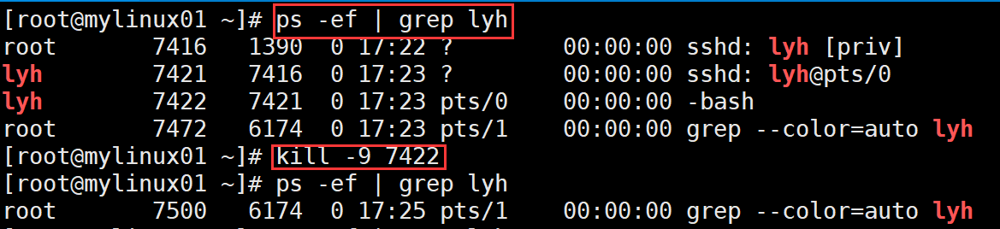

   也可以使用 **[pkill]** 完成

   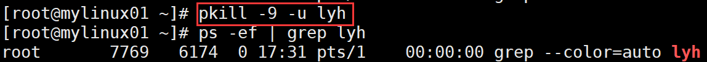

   终止远程登录服务sshd，在适当时候通过命令 **[/bin/systemctl start sshd.service]**再次重启sshd服务

   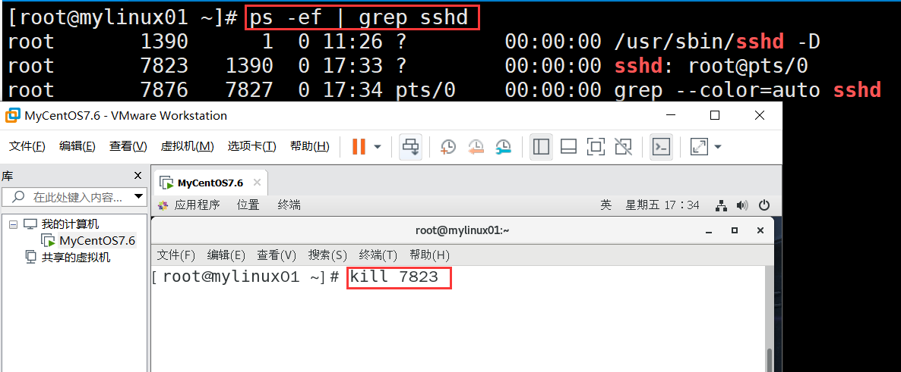

   终止多个文本编辑器进程 **gedit**

   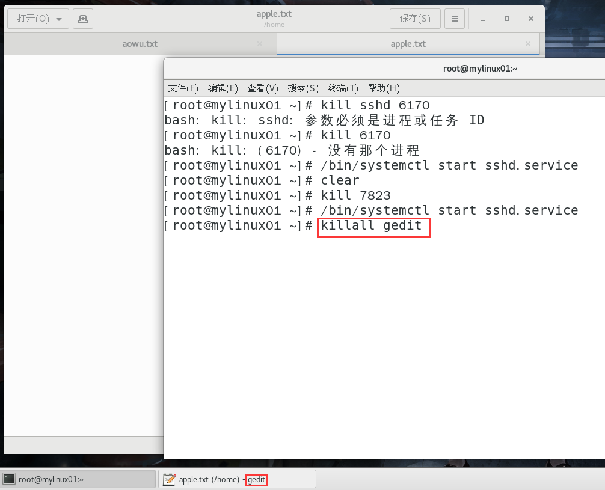

#### 4. 管理守护进程

 1. **什么是守护进程**

    Limux服务器的主要任务就是**为本地或远程用户提供各种服务**。通常Linux 系统上提供**服务**的程序是由运行在后台的**守护程序**(Daemon) 来执行的。一个实际运行中的Linux 系统一般会有多个这样的程序在运行。这些后台守护进程在**系统开机后**就运行了，

    并且在时刻地监听前台客户的服务请求，一旦客户发出了服务请求， 守护进程便为它们提供服务。Windows系统中的守护进程

    被称为 **“服务” **。按照服务类型，守护进程可以分为如下两类：

    + **系统守护进程**：如dbus、crond、 cups、 rsyslogd 等。
    + **网络守护进程**：如sshd、httpd、 postfix、 xinetd 等。

    简单来说，**服务 (service)本质就是进程** 。但是是运行在**后台**的，通常都会**监听某个端口**，等待其它程序的请求，因此我们又称为**守护进程 **。

	2. **CentOS7.0之前的服务管理**

    + **service管理指令**

      + 基本语法 **service 服务名** **[ start | stop| restart | reload | status ]**

      + 在CentOS7.0后很多服务不再使用service ,而是**systemctl** 

      + service 指令管理的服务在 **/etc/init.d** 查看

        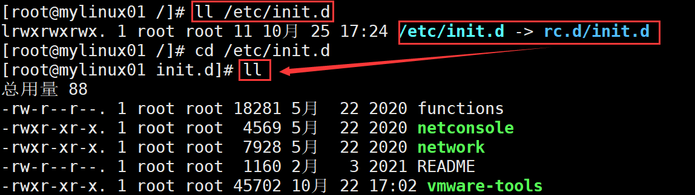

    + **service指令案例**

      + **service network status**

        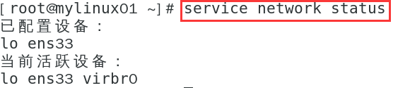

      + **service network stop**，此时网络连接会断开，远程登录的 xshell 将断开

        

      + **service network start**

        

    + **查看服务名**

      + 通过 **[setup]** 命令弹出的可视化窗口，选择**系统服务**即可查看

        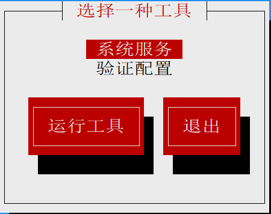

        通过键盘**上下键**将光标移动到想要操作的服务前，再敲击**空格键**即可选择是否自动启动

        

      + 通过指令 **[ll /etc/init.d]** 可以看到 **service** 指令管理的服务

        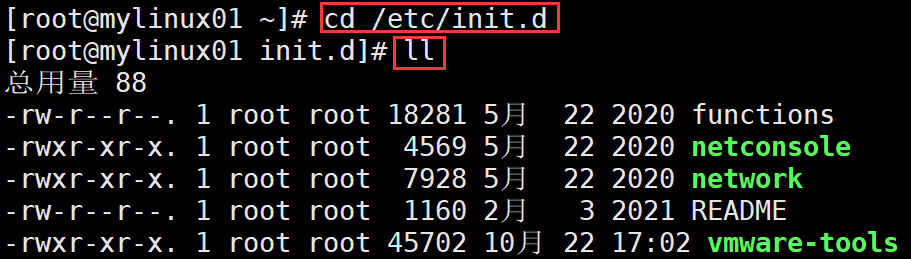

    + **chkconfig指令**

      + 通过 **chkconfig** 命令可以给服务的各个运行级别设置**自启动/关闭**，chkconfig指令管理的服务在 **/etc/init.d** 查看
        但是在Centos7.0后，很多服务使用 **systemctl** 管理。关于运行级别相关内容可以查看 [运行级别](#1. 运行级别) 章节。

      + 基本语法 **[chkconfig 服务名 --list]**，可以查看服务；**[chkconfig 服务等级 服务名 on/off]**，可以对相应的运行级别服务进行开关。当通过chkconfig指令重新设置服务自启动或关闭后，需要**重启**才能生效。

      + 实例演示：将network服务在运行级别5中查看并关闭自启动

        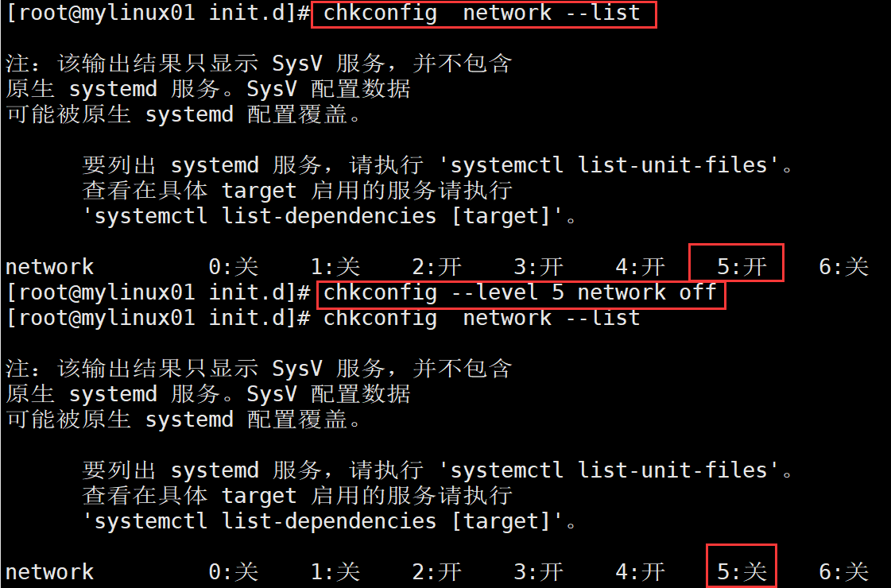

	3. **使用systemctl管理服务**

    + **系统初始化进程**
      系统初始化进程是一个特殊的守护进程，其**PID为 1**，它是所有其他守护进程的**父进程或祖先进程**。也就是说，系统上所有的守护进程都是由系统初始化进程进行管理的(如启动、停止等)。

      + **systemctl管理指令**
    
        在系统运行中，可以使用 **systemctl** 显示、启动、停止和重启指定服务。systemctl 指令管理的服务在 **/usr/lib/systemd/system** 查看。基本语法 **[systemctl start | stop | restart| status 服务名]**
    
      |                            命 令                             |                      说 明                      |
      | :----------------------------------------------------------: | :---------------------------------------------: |
      |      systemctl **start** &lt;ServiceName&gt; [.service]      |            启动名为ServiceName的服务            |
      |      systemctl **stop** &lt;ServiceName&gt; [.service]       |            停止名为ServiceName的服务            |
      |     systemctl **restart** &lt;ServiceName&gt; [.service]     |            重启名为ServiceName的服务            |
      |   systemctl **try-restart** &lt;ServiceName&gt; [.service]   | 仅当名为ServiceName的服务正在运行时才重新启动它 |
      |     systemctl **reload** &lt;ServiceName&gt; [.service]      |      重新加载名为ServiceName服务的配置文件      |
      |     systemctl **status** &lt;ServiceName&gt; [.service]      |   查看名为ServiceName服务的状态信息及日志信息   |
      |    systemctl **is-active** &lt;ServiceName&gt; [.service]    |       查看名为ServiceName服务是否正在运行       |
      | systemctl [list- units] **--type service **或 <br/> systemctl [list-units] **-t service** |            显示当前已运行的所有服务             |
      | systemctl [list-units] **--type service --all** 或<br/>systemctl [list-units] **-at service** |                  显示所有服务                   |
      | systemctl [list-units] **--type service --failed** 或<br/>systemctl [list-units] **-t service --failed** |    显示已加载的但处于 **failed** 状态的服务     |
    
       + **使用systemctl管理服务实例**
      
         显示 **crond** 服务的状态信息及日志信息
      
         
      
         停止 **crond** 服务
      
         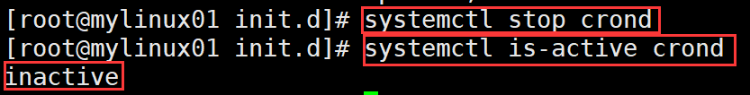
      
         启动 **crond** 服务
      
         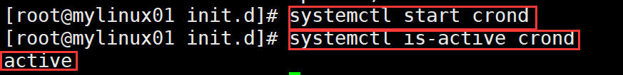
      
         显示当前已运行服务
      
         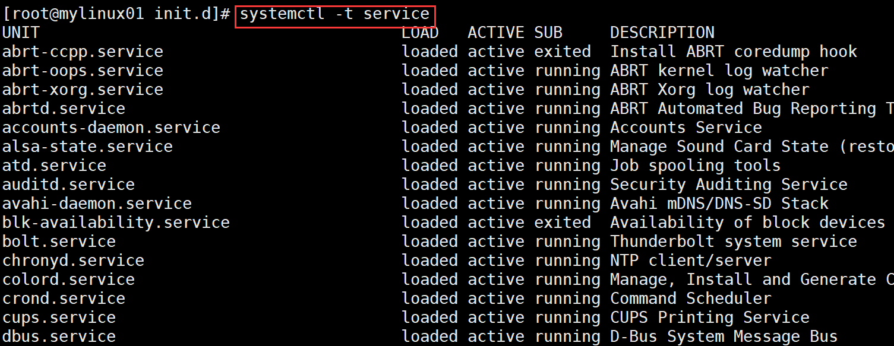
      
         显示所有服务
      
         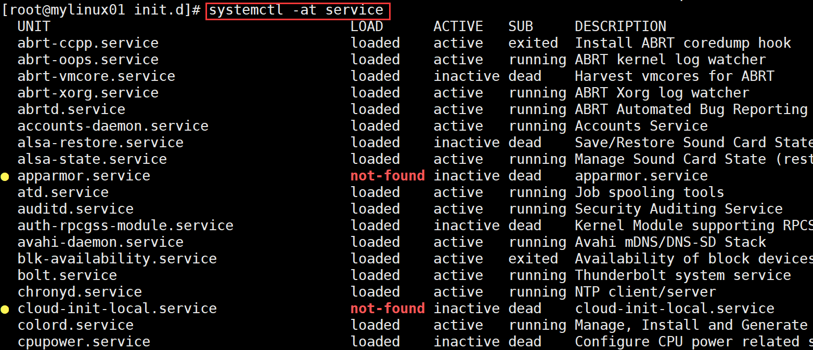
      
      + **服务的持久化管理**
      
        所谓持久化管理，就是管理某项服务是否在每次启动系统过程中启动，可以使用以下列出的 **systemctl** 命令实现管理。
      
        |                            命 令                             |                     说 明                     |
        | :----------------------------------------------------------: | :-------------------------------------------: |
        |      systemctl **enable** &lt;ServiceName&gt; [service]      |     在启动系统时启用名为ServiceName的服务     |
        |     systemctl **disable** &lt;ServiceName&gt; [service]      |     在启动系统时停用名为ServiceName的服务     |
        |    systemctl **is-enabled** &lt;ServiceName&gt; [service]    | 查看名为ServiceName的服务是否在启动系统时启用 |
        | systemctl list-unit files **--type service** 或 <br/>systemctl list-unit-files **-t service** |       查看所有服务是否在启动系统时启用        |
      
      + **使用systemctl管理服务持久化实例**
      
        显示 **crond** 服务是否在启动系统时启用
      
        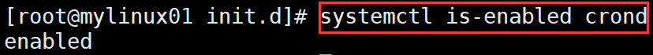
      
        在启动系统时停用名为 **crond** 的服务
      
        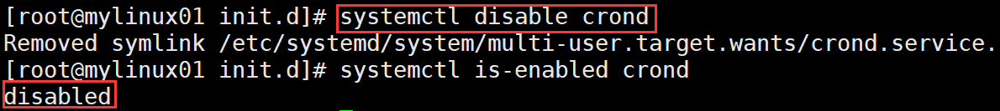
      
        在启动系统时启用名为 **crond** 的服务
      
        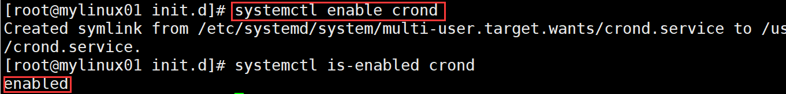
      
        查看所有服务是否在启动系统时启用
      
        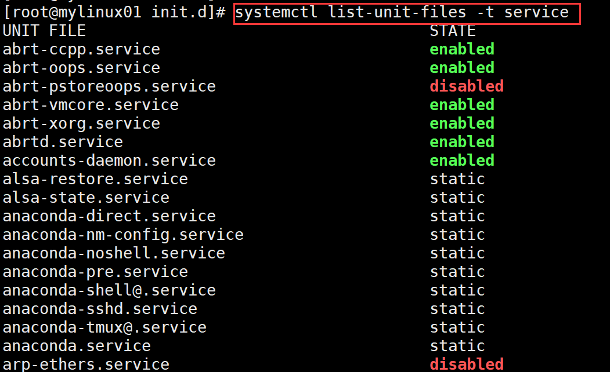
      
        其中，状态为 **static** 的服务由 **systemd** 在开机时启动。这类服务**不能使用 systermctl enable / disable 命令**手工管理，即**静态服务不能动态管理**，所以可以使用 **[l grep]** 管道命令屏蔽显示那些无须动态管理的服务。
      
        命令为：**[ systemctl list-unit-files -t service |grep -v static ]**
      
        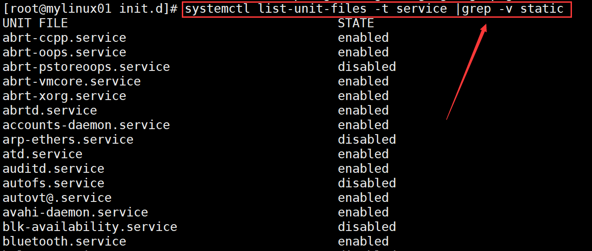

#### 5. 动态监控进程

1. **系统监视概述**

   为了更好地维护系统，管理员经常需要收集一些系统信息，如进程、内存、文件系统、硬件等使用信息。然后通过这些信息判断系统是否正常，并通过这些信息对系统故障做出正确判断。

2. **top命令**

   + **top的功能**

     top命令显示了当前正运行的进程及其重要信息，包括其内存和CPU用量。该列表既是实时的 (**默认每3秒刷新一次**)，也是互动的。top与ps命令很相似，它们都用来显示正在执行的进程。top与ps最大的不同之处，在于top在执行一段时间可以**更新**正在运行的的进程。

     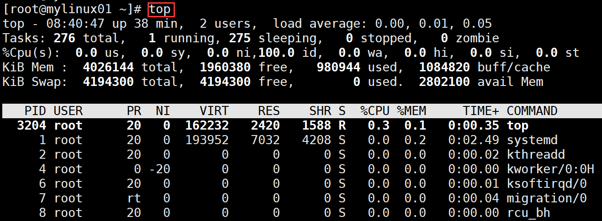

   + **top的交互命令**

     全局命令

     |          交 互 命 令           |                            说 明                             |
     | :----------------------------: | :----------------------------------------------------------: |
     | &lt;Space&gt; 或 &lt;Enter&gt; |                         立即刷新显示                         |
     |             ? 或 h             |                       显示帮助信息屏幕                       |
     |            g[1234]             | 默认提供了**4**种字段方案的窗口，分别为**1:Def**， **2:Job**，**3:Mem**，4**:UsT**，可以用 **GI-G4** 切换 |
     |               A                | 是否在一个界面中同时显示4种字段方案，显示窗口的乒乓切换开关  |
     |             a 和 w             | 在4种字段方案的显示窗口中移动以确认当前窗口。**a**表示下一个窗口， **w**表示上一个窗口 |
     |               Z                |                  设置不同窗口的颜色配置方案                  |
     |               u                |                显示指定用户的进程(仅匹配EUID)                |
     |               U                |        显示指定用户的进程(匹配RUID、EUID、SUID 和UID)        |
     |               k                |                        杀死指定的进程                        |
     |               r                |                  重新设置一个进程的优先级别                  |
     |             d 或 s             |           改变两次刷新显示之间的时间间隔，单位为秒           |
     |               W                |          将当前的top设置写入 **~ / .toprc** 文件中           |
     |               q                |                           退出top                            |

     统计信息区命令

     | 交 互 命 令  |                            说 明                             |
     | :----------: | :----------------------------------------------------------: |
     | l (小写字母) |            是否显示系统平均负载信息的乒乓切换开关            |
     |      m       | 是否显示系统内存和交换空间信息的切换开关 (可以切换数字显示和使用比例图示显示） |
     |      t       | 是否显示进程的CPU使用信息的切换开关 (可以切换数字显示和使用比例图示显示) |
     |   1 (数字)   |      显示所有CPU的平均状态还是每个CPU状态的乒乓切换开关      |

     进程信息区命令

     |  交 互 命 令   |                            说 明                             |
     | :------------: | :----------------------------------------------------------: |
     |       x        |         是否对当前排序字段进行加亮显示的乒乓切换开关         |
     |       y        |       是否对当前正在运行进程进行加亮显示的乒乓切换开关       |
     |       c        |               是否显示完整命令行的乒乓切换开关               |
     |       f        |               在当前显示窗口中添加或者删除字段               |
     |       o        |             调整当前显示窗口中字段的显示先后顺序             |
     |     F 或 O     |                 在当前显示窗口中指定排序字段                 |
     |       R        |                是否进行逆向排序的乒乓切换开关                |
     | **<** 或 **>** |       移动排序字段。**<** 为向左移动，**>** 为向右移动       |
     |       M        |                     按 **%MEM** 字段排序                     |
     |       N        |                     按 **PID** 字段排序                      |
     |       P        |                     按 **%CPU** 字段排序                     |
     |       T        |                    按 **TIME+** 字段排序                     |
     |       H        |                是否显示所有线程的乒乓切换开关                |
     |       i        | 是否显示 **闲置(Idled)进程** 和 **僵死(Zombied) 进程** 的乒乓切换开关 |

   + **top命令的输出**
     top命令的输出分为两个区域：上部分为**统计信息区**，下部分为**进程信息区**。

     + 统计信息
       **第1行**：在 **“top - ”** 之后显示的是**uptime**命令的输出，它从 **/proc/loadavg** 中获得平均负载信息。

       依次显示的信息有**当前时间**、**系统已经运行的时间**、 **当前有多少登录用户**、**1分钟系统平均负载**、5**分钟系统平均负载**、**15 分钟系统平均负载**。

       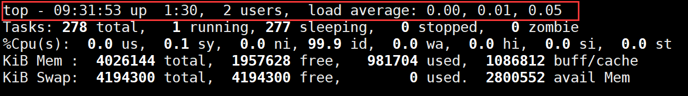

       **第2、3行**：显示的是**进程和CPU的汇总信息**。

       1. 第2行显示**当前的任务统计信息**。依次分别为**进程总数(total)**、 **正在运行的进程数(runing)**、**睡眠的进程数(sleeping)**、 **停止的进程数(stopped)** 和**僵尸进程数( zombie)**。

          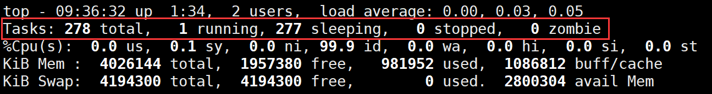

       2. 第3行显示**当前的CPU统计信息(与vmstat命令的输出类似)**。依次分别为**用户态进程占用CPU百分比(%us)**、 **核心态进程占用CPU百分比(%sy)**、**调整过优先级的用户态进程占用CPU时间的百分比(%ni)**、**空闲CPU百分比(%id)**、 **等待系统IO的CPU时间百分比(%wa)**、**CPU用于处理硬件中断的时间百分比(%hi)**、 **CPU用于处理软中断的时间百分比(%si)** 和**被虚拟机偷掉的CPU时间百分比**，仅用于运行虚拟机的情况**(%st)**。

          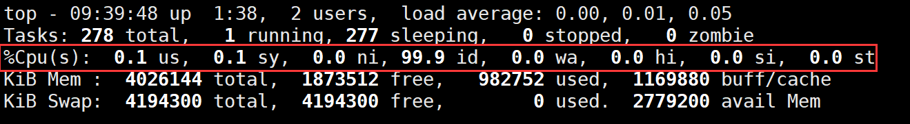

       **第4、5行**：显示的是**物理内存和交换空间的汇总信息(与 free 命令的输出类似)**。其中，**buffers** 指的是**块设备的读写缓冲区**，**cached** 指的是**文件系统本身的页面缓存**。它们都是Linux操作系统底层的机制，目的是**加速对磁盘的访问**。

       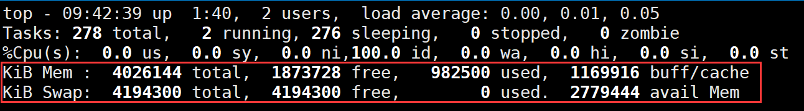

     + 进程信息

       top命令显示的输出项如下，也可以使用top的 **f** 交互命令查看所有输出项信息。

       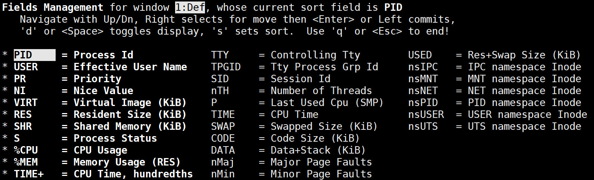

       | 输 出 项 |                            含 义                             |
       | :------: | :----------------------------------------------------------: |
       |   PID    |                            进程ID                            |
       |   USER   |                      进程所有者的用户ID                      |
       |    PR    |               进程优先执行顺序，值越小越早执行               |
       |    NI    |        进程nice值。负值表示高优先级，正值表示低优先级        |
       |   VIRT   |    进程使用的虚拟内存总量，单位**KB** **(VIRT=SWAP+RES)**    |
       |   RES    | 进程使用的、未被换出的物理内存大小，单位**KB** **(RES=CODE+DATA)** |
       |   SHR    |                 SHR共享内存大小，单位**KB**                  |
       |    S     | 进程状态。**D**=不可中断的睡眠状态；**R**=运行；**S**=睡眠；**T**=跟踪/停止；**Z**=僵尸进程 |
       |   %CPU   |           进程自上次更新到现在的CPU时间占用百分比            |
       |   %MEM   |                   进程使用的物理内存百分比                   |
       |  TIME+   |            进程使用的CPU时间总计，**单位1/100秒**            |
       | COMMAND  |                          执行的命令                          |
       |   PPID   |                         父进程的PID                          |
       |  RUSER   |               实际用户名 **(Real User Name)**                |
       |   UID    |                            用户ID                            |
       |  GROUP   |                    组名 **(Group Name)**                     |
       |   TTY    |                           控制终端                           |
       |    P     |                在**SMP**环境中，最近使用的CPU                |
       |   SWAP   |                    交换的大小，单位**KB**                    |
       |   TIME   |                 进程自启动以来使用的CPU时间                  |
       |   CODE   |     执行代码使用的物理内存大小，单位**KB**，也称**TRS**      |
       |   DATA   | **数据(Data)** 和 **栈(Stack)** 使用的物理内存大小，也称**DRS**，单位**KB** |
       |   nFLT   | 一个任务发生的**主页面错误**的数量。 当一个进程试图读写当前未在其地址空间中的虚拟页面时，将发生一个页面故障。主页面故障发生时，为了获取可用的页面将**导致一次磁盘访问** |
       |   nDRT   | 自上次写入磁盘后已被修改的页面数。必须将这些页面写入磁盘后，与其对应的物理内存位置才能被其他的虚拟页面使用 |
       |  WCHAN   | 根据**内核链接的地图(System.map)**  显示当前睡眠任务的内核函数的名称或地址 |
       |  Flags   | 进程任务调度标志，这些标志记录在 &lt;**linux/sched.h**&gt; 中 |
       

   + **应用实例**

     监视用户lyh，先通过 **[top]** 命令进入交互模式

     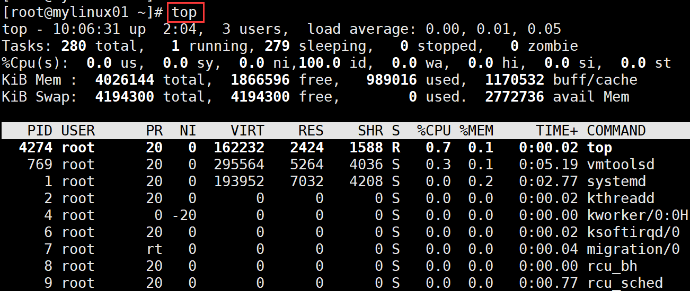

     然后输入 **[u]** 回车，再输入用户名lyh即可

     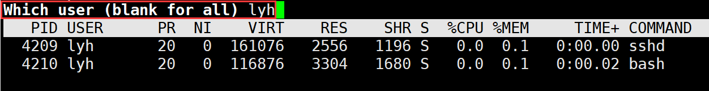

     输入**[d]** 回车来指定系统状态更新时间为1秒	即每个1秒自动更新，**默认是3秒**

     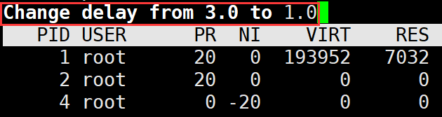

3. **netstat监控网络状态**
   + **netstat** 是网**络状态查看命令**，既可以查看到本机开启的端口，也可以查看有哪些客户端连接。

     **端口**就是用于网络通信的接口，是**数据从传输层向上传递到应用层的数据通道**。可以理解为每个常规服务都有默认的端口号（默认端口可以修改），通过不同的端口号，就可以确定不同的服务，这个端口是所有人都知道的，客户端可以通过固定的端口访问指定的服务。而通过在服务器中查看已经开启的端口号，就可以判断服务器中开启了那些服务。

     ntestat 基本语法 **[netstat 选项]**

     ```shell
     -a：列出所有网络状态，包括 Socket 程序；
     -c 秒数：指定每隔几秒刷新一次网络状态；
     -n：使用 IP 地址和端口号显示，不使用域名与服务名；
     -p：显示 PID 和程序名；
     -t：显示使用 TCP 协议端口的连接状况；
     -u：显示使用 UDP 协议端口的连接状况；
     -I：仅显示监听状态的连接；
     -r：显示路由表；
     ```

   + 应用实例

     查看服务名为 sshd 的服务信息

     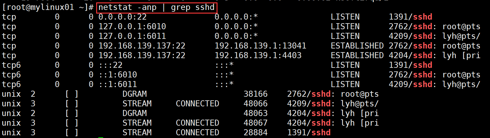

     查看本机开启的端口。
     这是本机最常用的方式，使用选项 **"-tuln"** 。因为使用了 **"-I"** 选项，所以只能看到监听状态的连接，而不能看到已经连接状态的连接。

     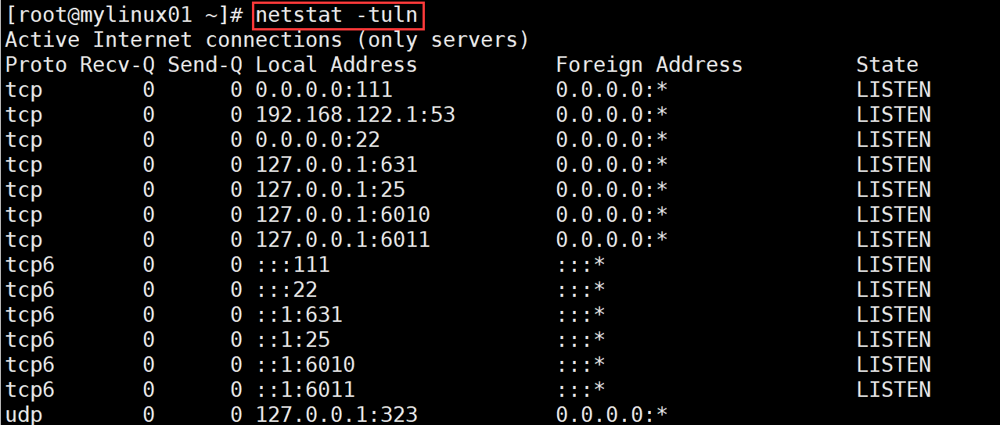

     其中，第一行的信息含义为：

     |    输 出 项    |                            说 明                             |
     | :------------: | :----------------------------------------------------------: |
     |     Proto      |        网络连接的协议，一般就是 TCP 协议或者 UDP 协议        |
     |     Recv-Q     |  表示接收到的数据，已经在本地的缓冲中，但是还没有被进程取走  |
     |     Send-Q     | 表示从本机发送，对方还没有收到的数据，依然在本地的缓冲中，不具备 ACK 标志的数据包 |
     | Local Address  |                    本机的 IP 地址和端口号                    |
     | ForeignAddress |                  远程主机的 IP 地址和端口号                  |
     |     State      |                             状态                             |

     在状态一栏中，我们最常用的就是 **LISTEN** 和 **ESTABLISHED** 状态，一种代表正在监听，另一种代表已经连接。常见的状态主要有以下几种：

     |    状 态    |                            说 明                             |
     | :---------: | :----------------------------------------------------------: |
     |   LISTEN    |    监听状态，只有 TCP 协议需要监听，而 UDP 协议不需要监听    |
     | ESTABLISHED | 已经建立连接的状态。如果使用 **"-I"** 选项，则看不到已经建立连接的状态 |
     |  SYN_SENT   |             SYN 发起包，就是主动发起连接的数据包             |
     |  SYN_RECV   |                    接收到主动连接的数据包                    |
     |  FIN_WAIT1  |                        正在中断的连接                        |
     |  FIN_WAIT2  |         已经中断的连接，但是正在等待对方主机进行确认         |
     |  TIME_WAIT  |         连接已经中断，但是套接字依然在网络中等待结束         |
     |   CLOSED    |                       套接字没有被使用                       |

     查看本机有哪些程序开启的端口。
     如果使用 **"-p"** 选项，则可以查看到是哪个程序占用了端口，并且可以知道这个程序的 PID。

     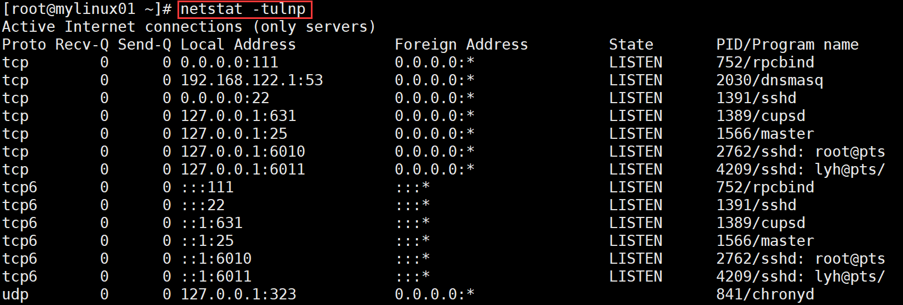

     查看所有连接。
     使用选项 **"-an"** 可以查看所有连接，包括**监听状态的连接（LISTEN）**、已经**建立连接状态的连接（ESTABLISHED）**、**Socke 程序连接**等。因为连接较多，所以输出的内容有很多。

     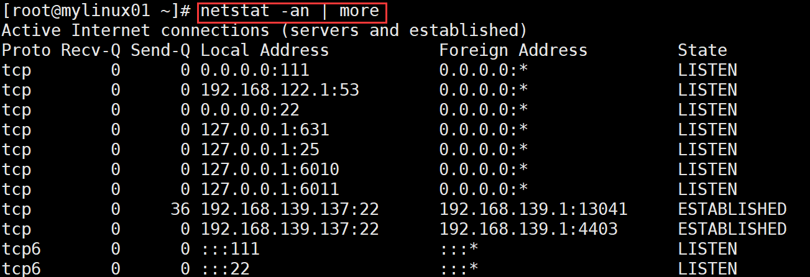

***

## 十二、Shell脚本编程

#### 1. Shell脚本简介

1. **什么是Shell脚本**

   ​	Shell除了是**命令解释器**之外还是一种**编程语言**，用Shell编写的程序类似于DOS下的批处理程序。用户可以在文件中存放一系列的命令，通常将Shell编写的程序称为Shell脚本或Shell程序。将命令、变量和流程控制有机地结合起来将会得到一个功能强大的编程工具。Shell 脚本语言非常**擅长处理文本类型的数据**，由于 Linux 系统中的所有**配置文件**都是**纯文本**的，所以Shell脚本语言在管理Linux系统中发挥了巨大作用。

2. **Shell 脚本中的成分**

   ​	Shell脚本是以**行**为单位的，在执行脚本的时候会将其分解成一行一行依次执行。 Shell脚本中所包含的成分主要有**注释**、**命令**、**Shell 变量**和**结构控制语句**。

   + **注释**：用于对脚本进行解释和说明，在注释行的前面要加上符号**#**，这样在执行脚本的时候Shell就不会对该行进行解释。
   + **命令**：在Shell脚本中可以出现任何在交互方式下能使用的命令。
   + **变量**：Shell 支持**字符串变量**和**整型变量**。
   + **结构控制语句**：用于编写复杂脚本的流程控制语句。

3. **Shell 脚本的建立与执行**

   用户可以使用任何文本编辑器编辑Shell脚本文件，如**nano**、**vim**、 **gedit** 等。
   对Shell脚本文件的**调用**可以采用几种方式。

   + **在子Shell中执行**

     当执行一个脚本文件时，Shell 就会产生一个**子Shell** (即一个子进程)去执行命令文件中的命令。因此，脚本文件中的**变量值不能传递到当前Shell** (即父Shell)。

     + **将文件名作为Shell命令的参数**，使用 **bash** 或 **sh** 来执行shell脚本。若是该方式来执行，那么，可以**不必事先设定shell的执行权限**，甚至都不用写shell文件中的第一行（指定bash路径）。因为该方法是将shell脚本文件作为参数传给 **sh(bash)** 命令来执行的。这时不是脚本文件自己来执行，而是被调用执行，所以**不需要执行权限**。

       其中，**``** 反引号可以**运行里面的命令并将结果返回**，等同于 **$()** 。
     
       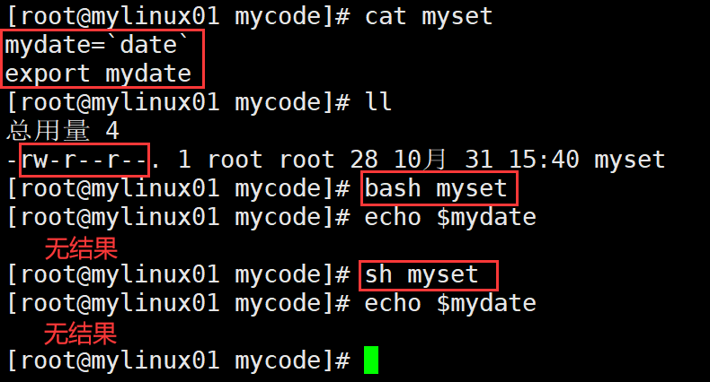
     
       由于这种执行脚本的方式是在子Shell中执行，所以当脚本执行结束返回主Shell后，变量已经没有值用。
     
     + 切换到shell**脚本所在的目录**或以**绝对路径**的方式去执行shell脚本
       
       **注意**：
     
       1. 与Windows或DOS环境不同，在Linux下没有将当前目录列入PATH环境变量，所以，当用户执行**当前目录**下的命令或脚本时应该使用该形式的命令行:	**$ ./script**
       2. 可以将创建的并添加了**可执行权限**的脚本移动到PATH环境变量指定的目录(**~bin**、**/usr/local/bin**、 **/usr/local/sbin**) 中，之后即可直接使用**文件名**执行脚本了。
     
       其中，**" ./ "** 的意思是说在**当前的工作目录**下执行shell脚本文件。如果不加上 **" ./ "**，bash可能会响应找到不到shell脚本文件的错误信息。
     
       而当要被执行脚本文件没有可执行权限时，则需要先将脚本文件的权限改为**可执行**，以便该文件可以作为执行文件调用。
     
       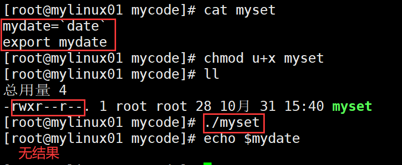
     
   + **在当前Shell中执行**

     为了使得脚本文件中的**变量值传递到当前Shell**, 必须在命令文件名前面加 **soure** 或 **"."** 命令。**source** 和 **"."**命令的功能是在**当前Shell 中**执行脚本文件中的命令，而不是产生一个子Shell来执行脚本文件中的命令。

     

     **不需要执行权限**。

     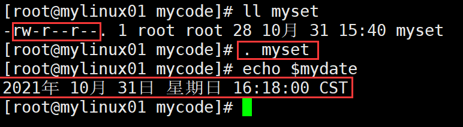

     由于这种执行脚本的方式是在**当前Shell**中执行，当脚本执行结束**变量依然有值**。

4. **Shell脚本的编码规范**

   一个bash脚本的正确的起始部分应该以 **#!** 开头，指明使用何种Shell解析本脚本。

   ```shell
   #!/bin/bash 或 #!/usr/bin/env bash
   ```

   良好的Shell编码规范还要求以注释形式说明如下的内容。

   + 脚本名称
   + 脚本功能
   + 作者及联系方式
   + 版本更新记录
   + 版权声明
   + 对算法做简要说明( 如果是复杂脚本)

#### 2. Shell变量

1. **Shell变量的分类**

   Shell变量大致可以分为以下**3**类。

   + **内部变量**：由系统提供，用户只能使用不能修改。
   + **环境变量**：这些变量决定了用户工作的环境，不需要用户定义，可以直接在Shell中使用，其中某些变量用户可以修改。
   + **用户变量**：由用户建立和修改，也称用户自定义变量。在Shell脚本编写中会经常用到。

2. **Shell 变量的定义和输出**

   Shell支持具有**字符串值**的变量。Shell 变量**不需要专门的定义和初始化语句**。一个没有初始化的 Shell 变量被认为是**空字符串**。通常通过赋值语句完成变量说明并予以赋值，并且可以给一个变量多次赋值以改变其值。在Shell中，变量的赋值使用如下语法格式。

   ```shell
   name=string
   ```

   其中：

   + **name**是变量名，变量名是以**字母或下画线开头的字母、数字和下画线字符序列**。

   + **"="** 是赋值符号。两边**不能直接跟空格**，否则Shell将视为命令。

     **案例**：定义变量A，然后撤销变量A，**可以使用 unset 撤销Shell变量的声明**。

     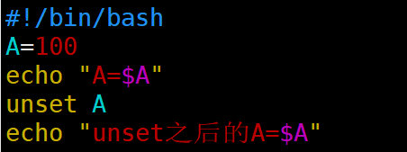

     执行结果。

     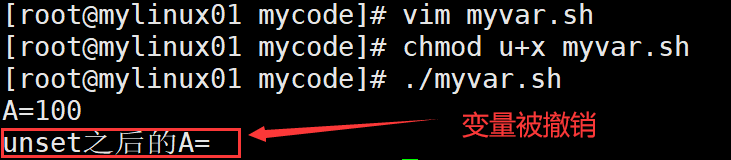

     **案例**：通过 **readonly** 声明静态的变量，此时改变量**不能unset**。

     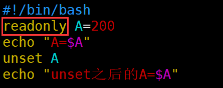

     此时会报错。

     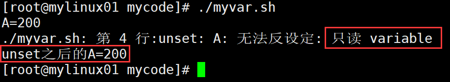

   + **string** 是被赋予的变量值。若 string 中包含**空格**、**制表符**和**换行符**，则string 必须用 **'string'** 或 **"string"** 的形式，即用单(双)引号将其括起来。**双引号内允许变量替换，而单引号则不可以**。

     **案例**：定义变量v的值为 **CentOS 7**，变量名中有空格。
   
     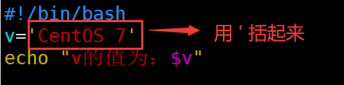
   
     执行结果。
   
     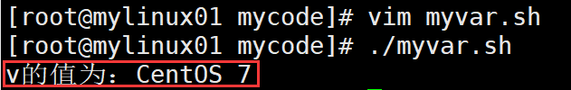
   
   通过在变量名(name) 前加 **$** 字符，即用 **$name** 的形式引用变量的值，引用的结果就是用字符串 **string** 代替 **$name**。此过程也称为**变量替换**。在字符串连接过程中为了界定变量名、避免混淆，变量替换也可以使用 **${name}** 的形式。**变量输出**可使用Shell 的内置命令 **echo (常用)** 或 **printf** （**用于格式化输出，类似C语言的printf()**）。
   
   **案例**：定义变量v的值为 **环境变量 HOSTTYPE**。
   
   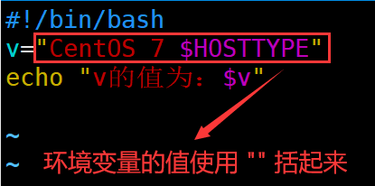
   
   执行结果。
   
   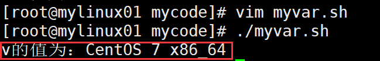
   
3. **Shell变量的作用域**

   Shell变量有其规定的作用范围。Shell 变量分为**局部变量**和**全局变量**。所有**自定义变量默认都是局部变量**；**环境变量是全局变量**。

   + 局部变量的作用范围仅限制在**其命令行所在的Shell**或**当前Shell脚本**执行过程中。
   + 全局变量的作用范围则包括**定义该变量的Shell及其所有子Shell**。

   可以使用 **export** 内置命令**将局部变量设置为全局变量**。export 的常用格式为: 

   ```shell
     #将指定的一个或多个局部变量设置为全局变量
     export <变量名1>[<变量名2>..]
     #将指定的一个或多个全局变量设置为局部变量
     export -n <变量名1>[<变量名2>..]
     #直接对一个或多个全局变量赋值
     export <变量名1=值1> [<变量名2=值2> ..]
   ```

   Shell变量作用域举例

   + 在**当前Shell**中要想使用**父辈Shell**中的变量，至少要在**当前Shell**的**父辈Shell**中设置为**全局变量**。
   + 变量在**子Shell**中值的修改不会传回**父Shell**。

   通过**export**为变量赋值，当然也可以在命令行模式下直接赋值，这里写成Shell脚本文件

   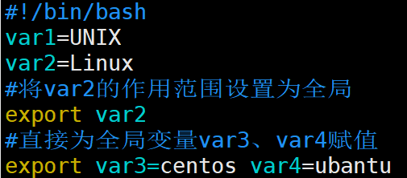

   在**当前Shell**中显示4个变量的值

   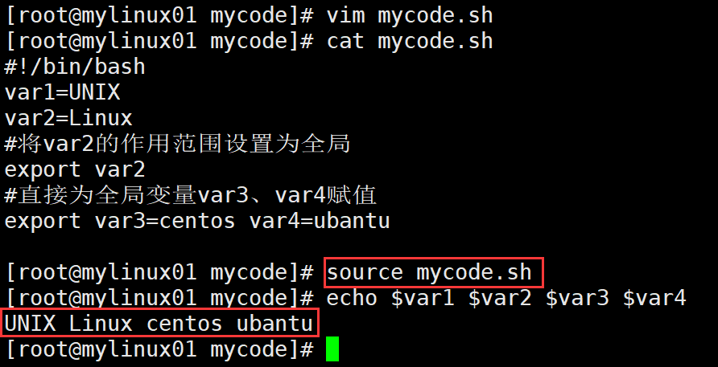

   在**父Shell**查看var1的值，并通过**bash**指令进入**子Shell**再次查看var1的值。

   由于在上一级Shell中没有被声明为**全局**，所以在**子Shell**里没有值

   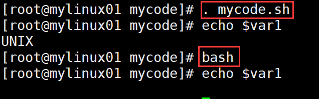

   此时查看var2、var3、var4的值，由于这3个变量在**上一级Shel**l中被声明为**全局变量**，所以在**子Shell**中仍有值。

   

   在**当前Shell**中将var2的值设置为**局部变量**，此时仍有var2值

   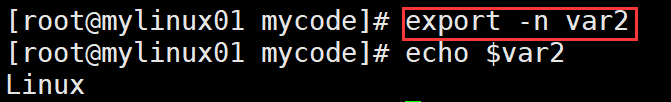

   进入孙子Shell，分别查看var1、var2和var3、var4。由于var2在当前**Shell的父Shell**中已经设置为**局部变量**，所以在孙子Shell里没有值。当然，var1 在当前Shell的祖父Shell中就是局部变量，所以在当前Shell里没有值。而var3和var4在**当前Shell的祖父Shell**中设置为全局变量且在**当前Shell的父Shell**中又没有变更，所以在当前Shell里仍有值。

   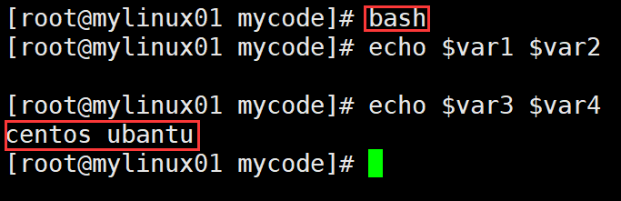

   修改当前Shell中var3的变量值并查看，然后通过指令 **exit** 返回上一级父Shell，可以发现变量在**子Shell**中值的修改不会传回**父Shell**。

   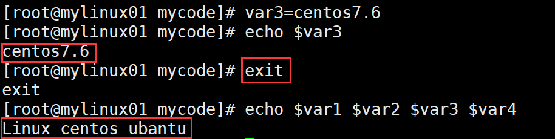

4. **Shell 环境变量**

   环境变量定义Shell的运行环境，保证Shell命令的正确执行。Shel用环境变量来确定查找路径、注册目录、终端类型、终端名称、用户名等。**所有环境变量都是全局变量(**即可以传递给子Shell)，并**可以由用户重新设置**。

   系统中常用的环境变量如下：

   | 环 境 变 量 名 |           说 明            | 环 境 变 量 名 |            说 明             |
   | :------------: | :------------------------: | :------------: | :--------------------------: |
   |      BASH      |      bash的完整路径名      |      PATH      | bash寻找可执行文件的搜索路径 |
   |     EDITOR     | 应用程序中默认使用的编辑器 |      ENV       |   Linux 查找配置文件的路径   |
   |    HISTFILE    |   用于储存历史命令的文件   |      PS1       |      命令行的一级提示符      |
   |    HISTSIZE    |     历史命令列表的大小     |      PS2       |      命令行的二级提示符      |
   |      HOME      |     当前用户的用户目录     |      PWD       |         当前工作目录         |
   |     OLDPWD     |       前一个工作目录       |      IFS       |  用于分割命令行参数的分隔符  |
   |      USER      |         当前用户名         |      LANG      |     当前用户的主语言环境     |
   |      UID       |       当前用户的UID        |    SECONDS     | 当前Shell开始后所流逝的秒数  |
   |      TERM      |     当前用户的终端类型     |                |                              |

   这些变量都是可写的，用户可以为它们赋任何值。如要使用自己的环境变量，则应该用前面介绍的**export**命令。

   例如：在 **/etc/profile** 文件中定义 **TOMCAT_HOME** 环境变量并查看。

   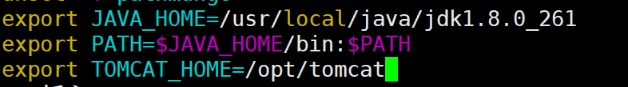

   在输出该环境变量前，需通过命令 **[source /etc/profile]** 让其生效。

   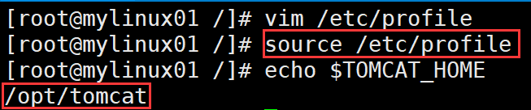

   + 用户还可以使用不带任何参数的 **env**、**printenv** 或 **export** 命令，显示当前定义的所有环境变量。

     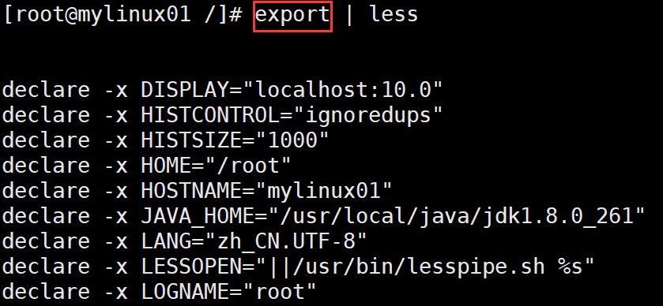

   + 要取消一个环境变量的声明或赋值，也可以使用 **unset** 命令。

#### 3. Shell变量操作

1. **变量替换扩展**

   |      功 能       |   表 达 式   |                            说 明                             |
   | :--------------: | :----------: | :----------------------------------------------------------: |
   |    使用默认值    | ${var:-word} | 若var存在且非空，则值为$var；<br/>若var未定义或为空值，则值为word，但var的值不变 |
   |    赋予默认值    | ${var:=word} | 若var存在且非空，则值为$var；<br/>若var未定义或为空值，则值为word，且var被赋值word |
   | 非空或未定义报错 | ${var:?word} | 若var存在且非空，则值为$var；<br/>若var未定义或为空值，则输出信息word，并终止脚本 |
   |   使用另外的值   | ${var:+word} | 若var存在且非空，则值为word；<br/>若var未定义或为空值，则返回空值，但var的值不变 |

   变量替换扩展**使用举例**

   + 通常变量替换扩展作为赋值语句的右值使用，即**将变量替换扩展再赋予另一个变量来使用**。
   + 使用变量替换扩展可以将Shell 脚本中的 **if 语句**简化为一个使用变量替换扩展的赋值语句。

   当var1值为空，则此时 **${var1:-linux}** 返回 linux，而**${var1}**的值也未变。

   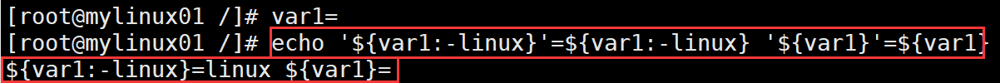

   当var1值为空，则此时 **${var1:=linux}** 返回 linux，而**${var1}**的值也赋值为 linux。

   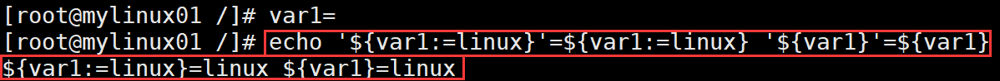

   当var2值不为空，则此时 **${var2:-linux}** 返回其原值 unix，而**${var2}**的值也未变。

   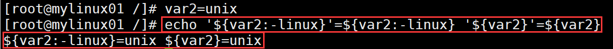

   当var2值为空，则此时 **${var2:=linux}** 返回其原值 unix，而**${var2}**的值也未变。

   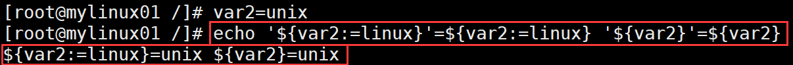

   **删除变量var1**

   当var1未定义，所以**${var1:+linux}**返回空，而**${var1}**的值也未变。

   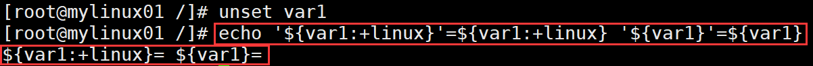

   当var1未定义，所以**${var1:?"Error, Please define it."}**退出执行并显示用户给定的字符串。

   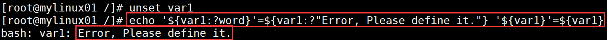

   当var2值不为空，所以**${var2:+linux}**置换成了linux，而**${var2}**的值未变。

   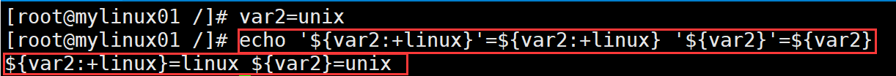

   当var2值不为空，所以**${var2:?"Error, Please define it."}**仍显示原来的值，且**${var2}**的值也未变。

   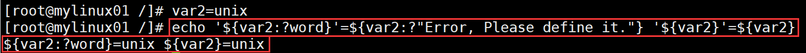

2. **变量的字符串操作**

   **变量字符串操作表**如下：

   + **字符计数**

     | 表 达 式 |          说 明          |
     | :------: | :---------------------: |
     | ${#var}  | 返回字符串变量var的长度 |

   + **截取子串**

     |     表 达 式      |                    说 明                     |
     | :---------------: | :------------------------------------------: |
     |   ${var:**m**}    |     返回${var}中从第m个字符到最后的部分      |
     | $ {var:**m**:len} | 返回${var}中从第m个字符开始，长度为len的部分 |

   + **删除子串**

     |    表 达 式     |                    说 明                    |
     | :-------------: | :-----------------------------------------: |
     | ${var#pattern}  | 删除${var}中开头部分与pattern匹配的最小部分 |
     | ${var##pattern} | 删除${var}中开头部分与pattern匹配的最大部分 |
     | ${var%pattern}  | 删除${var}中结尾部分与pattern匹配的最小部分 |
     | ${var%%pattern} | 删除${var}中结尾部分与pattern匹配的最大部分 |

   + **字符串替换**

     |    表 达 式     |                  说 明                   |
     | :-------------: | :--------------------------------------: |
     | ${var/old/new}  |     用new替换${var}中第一次出现的old     |
     | ${var//old/new} |  用new替换${var}中所有的old (全局替换)   |
     | ${var/#old/new} | 用new替换${var}中开头部分与old匹配的部分 |
     | ${var/%old/new} | 用new替换${var}中结尾部分与old匹配的部分 |

   **变量的字符串操作使用举例**
   
   ​	返回字符串 str 的长度
   ​	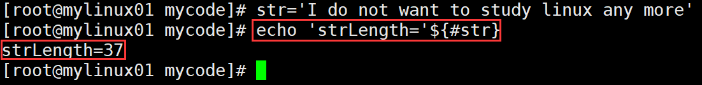
   
   ​	 截取str从第9个字符到串尾
   
   ​	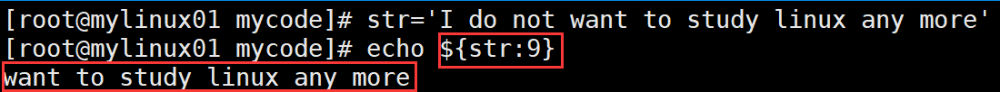
   
   ​	 截取str从第9个字符开始的7个字符
   
   ​	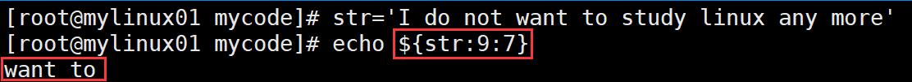
   
   ​	 删除开始的字符串I do
   
   ​	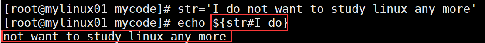
   
   ​	 删除开始的I 到 love 的所有字符（**最短匹配**）
   
   ​	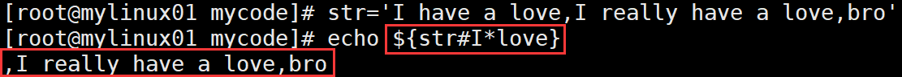
   
   ​	 删除开始的I 到 love 的所有字符（**最长匹配**）
   
   ​	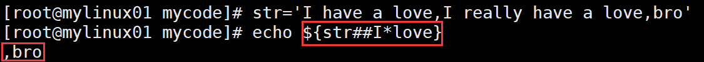
   
   ​	 替换开始的I do 为 he does
   
   ​	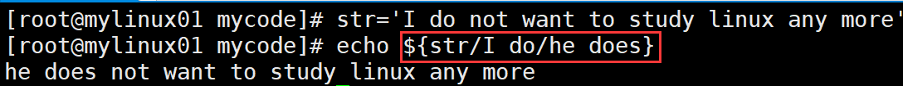
   
   ​	 替换末尾的 more 为 less
   
   ​	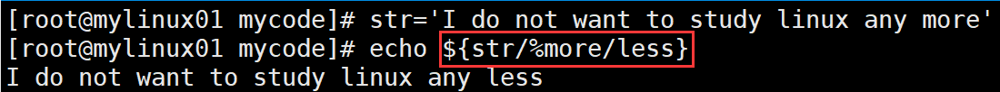
   
3. **变量的数值计算**

   若一个变量的值是纯数字的，不包含字母、小数点及其他字符，bash 可以将其视为**长整型值**，并可做**整型运算**。bash**不支持浮点数运算**，可使用 **bc 命令**进行浮点运算，但通常很少用到。如 **[echo 3.14*2|bc]** 。

   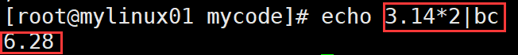

   Chet Ramey在bash 2.04 版本之后引入了Shell算术运算符 **$[...] 或 $((...))**，在此运算符中可以使用C语言风格的表达式结构。这为在Shell中进行运算提供了极大的方便。在此之前，如果要进行数值计算，必须使用**let命令**或更早出现的**expr命令**。（**expr**中的乘法运算符为 **'\ *'** 而不是 *****）

   |       运 算 符        |            说 明             |
   | :-------------------: | :--------------------------: |
   |      +，-，*，/       |          四则运算符          |
   |         **，%         | 幂运算符、模运算符(整除取余) |
   |        ++，--         |       自增/自减运算符        |
   | =，+=，-=，*=，/=，%= |          赋值运算符          |
   | <，>，<=，>=，==，!=  |          比较运算符          |
   |      &&，\|\|，!      |    逻辑运算符(与、或、非)    |

   **Shell算术运算符举例**

   计算 2+3^2-1001%5 的值

   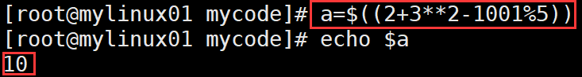

   也可以使用 **$[...]** 的方式计算

   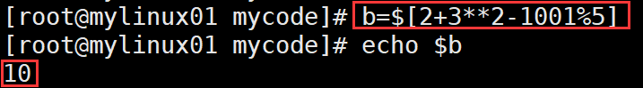

   可以进行关系、逻辑运算，**真为1，假为0**

   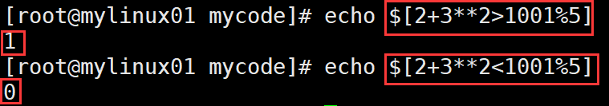

4. **Shell变量的输入**

   Shell变量除了可以**直接赋值**之外，其值还可以使用内置的**read命令**从标准输入获得。read命令的基本语法 **[read 选项 参数]**

   ```shell
   -p 选项p用于为指定输入提示。变量名也可以省略，省略时将用户输入的内容存入环境变量$REPLY中。
   -t 指定读取值时等待的时间(秒)，如果没有在指定的时间内输入，就不再等待了
   ```

   **从标准输入读取变量的值实例**

   读取控制台输入的name

   

   若未指定变量名，则将结果存入**$REPLY**中

   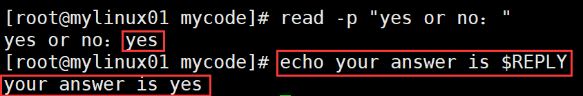

   在指定的时间内输入num值，超时则结束

   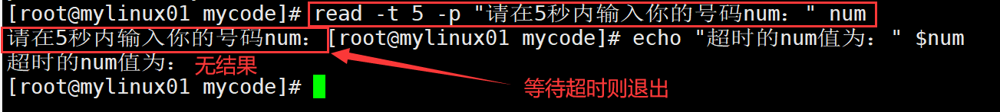

#### 4. Shell的特殊变量

​	特殊变量通常是只读的，即用户只能使用其值而不能使用赋值语句改写其值。在Shell脚本中通常会使用条件测试与这些特殊变量结合进行判断，再根据判断结果进行不同的操作。Shell特殊变量主要包括如下两类：

1. **位置参数 (Positional Parameters)**

   + 通过**命令行**给命令或脚本传递执行参数。
   + 在调用 **shell 函数**时为其传递参数。
   + 可用 **shift 命令**实现位置参数的迁移。

    Shll 的位置参数列表：

   | 位 置 参 数 |                            说 明                             |
   | :---------: | :----------------------------------------------------------: |
   |     $0      |                           脚本名称                           |
   |     $n      | n是大于等于1的整数，表示第n个位置参数。当n>9时，要使用${n}的形式进行引用 |
   |     $#      |                        位置参数的个数                        |
   |  $@、"$@"   |        将每个位置参量看成单独的字符串**(以空格间隔)**        |
   |     $*      |         将所有位置参量看成一个字符串**(以空格间隔)**         |
   |    "$*"     |        将所有位置参量看成一个字符串**(以 $IFS 间隔)**        |

2. **专用参数( Special Parameters)**

   + bash **预定义**的与进程状态相关的特殊变量。
   + 用户不能修改其值。

   Shell的进程状态变量：

   | 特 殊 变 量 |                            说 明                             |
   | :---------: | :----------------------------------------------------------: |
   |     $$      |                        当前进程的PID                         |
   |     $!      |                运行在后台的最后一个作业的PID                 |
   |     $?      | 在此之前执行的命令或脚本的返回值，0表示成功，非0表示不同原因的失败 |
   |     $_      |            在此之前执行的命令或脚本的最后一个参数            |

   命令 **shift [n]** 用于将位置参量列表依次左移n次，**默认为左移一次**。一旦位置参量列表被移动，**最左端的那个参数就会从列表中删除**。命令shift 经常与循环结构语句一起使用，以遍历每一个位置参数。

   **Shell特殊变量举例**

   编辑脚本文件vartest.sh

   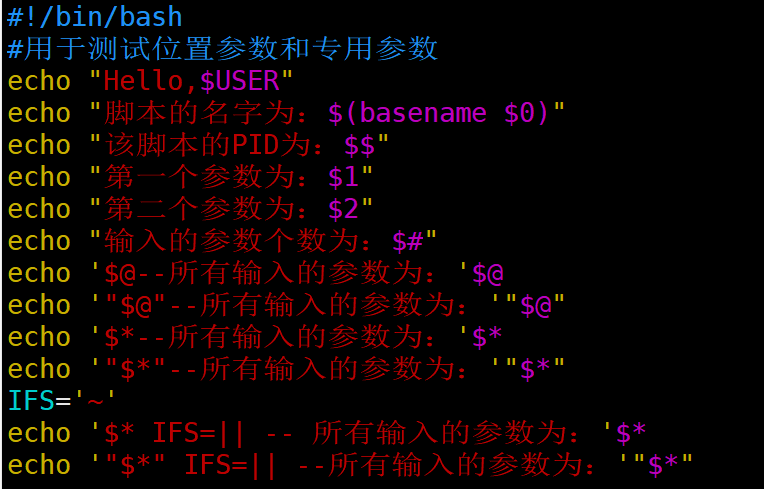

   为脚本添加可执行权限并传递命令行参数，执行

   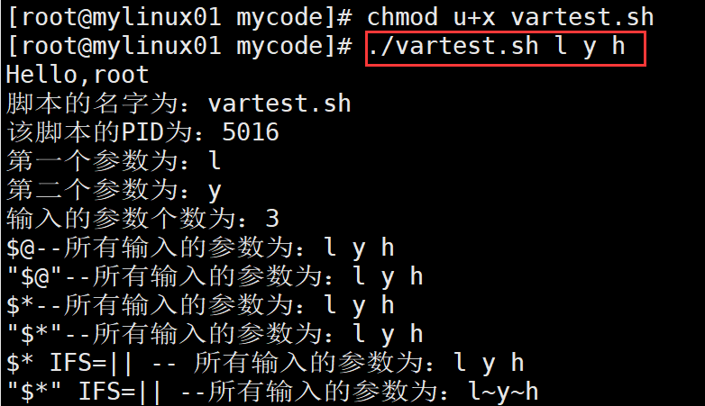

   可以通过 **[echo $_]** 显示在此之前执行的命令的最后一个参数

   

   编辑脚本文件pp_shift.sh

   

   为该脚本添加可执行权限并传递命令行参数，执行

   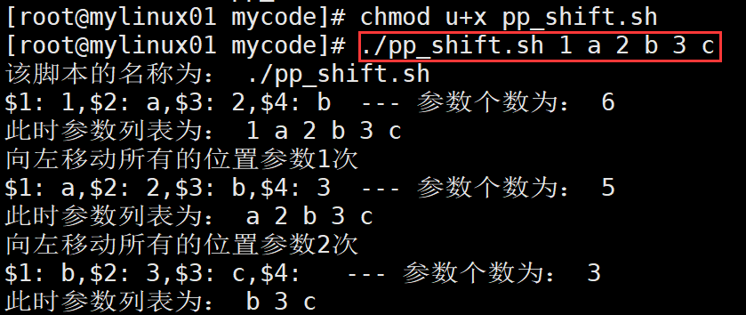

   每个命令都会返回一个**退出状态码**(也称返回状态)。**成功的命令返回0，而不成功的命令返回非零值**。非零值通常都被解释成一个错误码。行为良好的Linux命令、程序和工具，都会返回0作为退出码以表示成功。同样地，脚本中的函数和脚本本身也会返回退出状态码。在脚本或者是脚本函数中执行的**最后的命令**决定退出状态码。在脚本中，**exit n命令**将会把**退出状态码(n)传递给父Shell** (n必须是**十进制数**，范围是**0 ~ 255**)。
   **常用的错误码有**: 1表示通用错误，如0作为除数等; 126 表示命令或脚本没有执行权限; 127 表示命令没找到。

   显示当前进程的PID

   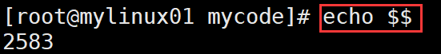

   显示在此之前执行的命令的返回值

   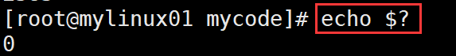

   调用子Shell并显示当前进程的PID

   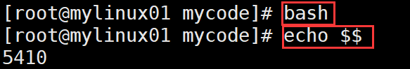

   指定返回值并返回**父Shell**，然后显示上一个Shell脚本的返回值

   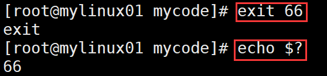

   执行不存在的命令，查看其返回值

   

   执行不具有执行权限的命令，查看其返回值

   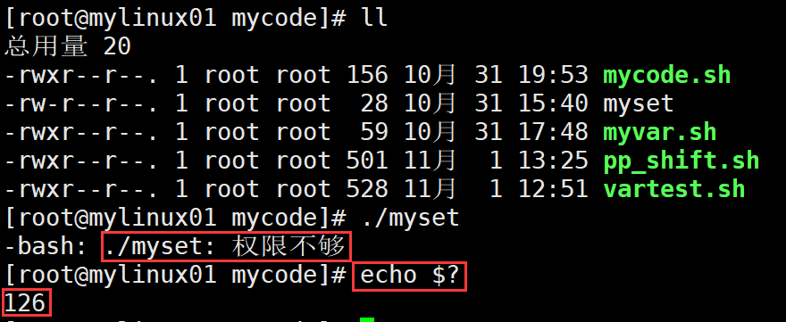

#### 5. 条件测试

1. **测试语句**

   在bash的各种流程控制结构中通常要进行各种测试，然后再根据测试结果执行不同的操作。测试语句语法如下：

   ```shell
   格式1: test <测试表达式>
   格式2: [ <测试表达式> ]
   格式3: [[ <测试表达式> ]
   ```

   使用条件测试可以判断命令成功或失败、表达式为真或假。bash 中没有布尔类型，使用测试语句的退出状态码表示真假：

    **0 表示命令成功或表达式为真**；**非0则表示命令失败或表达式为假**。注意：

   + 格式1和格式2是**等价**的；格式3是扩展的**test命令** 。
   + 在 **[[...]]** 中可以使用Shell通配符进行模式匹配。
   +  **&&**，**||**，**< 和 >** 操作符能够正常存在于 **[[...]]** 中，但不能在 **[..]** 中出现。
   + **[** 和 **[[** 之后的字符必须为**空格**，**]** 和 **]]** 之前的字符必须为**空格**。
   + 要对整数进行关系运算，可以使用Shell的**算术运算符 ((...))** 进行测试。

2. **文件测试操作符**

   在书写测试表达式时，可以使用如下的文件测试操作符：

   | 操 作 符 |          说 明           |    操 作 符     |                      说 明                      |
   | :------: | :----------------------: | :-------------: | :---------------------------------------------: |
   | -e file  |       文件是否存在       |     -x file     |                是否为可执行文件                 |
   | -f file  |      是否为普通文件      |     -O file     |             测试者是否为文件的属主              |
   | -d file  |      是否为目录文件      |     -G file     |            测试者是否为文件的同组人             |
   | -L file  |    是否为符号链接文件    |     -u file     |           是否为设置了**SUID**的文件            |
   | -b file  |     是否为块设备文件     |     -g file     |           是否为设置了**SGID**的文件            |
   | -c file  |    是否为字符设备文件    |     -k file     |            是否为设置了粘贴位的文件             |
   | -s file  | 文件长度不为0 (非空文件) | file1 -nt file2 |              file1 是否比 file2 新              |
   | -r file  |      是否为只读文件      | file1 -ot file2 |              file1 是否比 file2 旧              |
   | -w file  |      是否为可写文件      | file1 -ef file2 | file1 是否与 file2 共用相同的 **i-node** (链接) |

3. **字符串测试操作符**

   在书写测试表达式时，可以使用如下的字符串测试操作符：

   | 操 作 符  |         说 明          |      操 作 符      |         说 明          |
   | :-------: | :--------------------: | :----------------: | :--------------------: |
   | -z string |  测试字符串是否为空串  | string1 == string2 | 测试两个字符串是否相同 |
   | -n string | 测试字符串是否为非空串 | string1 != string2 | 测试两个字符串是否不同 |

4. **整数二元比较操作符**

   在书写测试表达式时，可以使用如下的整数二元比较操作符：

   |  操 作 符 功 能   | 相 等 | 不 等 | 大 于 | 大 于 等 于 | 小 于 | 小 于 等 于 |
   | :---------------: | :---: | :---: | :---: | :---------: | :---: | :---------: |
   | 在 [[...]] 中使用 |  -eq  |  -ne  |  -gt  |     -ge     |  -lt  |     -le     |
   | 在 ((...)) 中使用 |  ==   |  !=   |   >   |     >=      |   <   |     <=      |

5. **使用逻辑操作符**

   使用逻辑连接符能实现复杂的条件测试：

   |  操 作 符 功 能   | 实 现 "与" 逻 辑 | 实 现 "或" 逻 辑 | 实 现 "非" 逻 辑 |
   | :---------------: | :--------------: | :--------------: | :--------------: |
   |  在 [...] 中使用  |        -a        |        -o        |        !         |
   | 在 [[...]] 中使用 |        &&        |       \|\|       |        !         |

6. **条件测试操作符使用举例**

   编写一个脚本文件condition.sh

   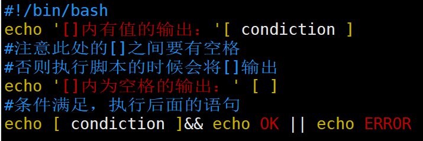

   运行结果并测试：

   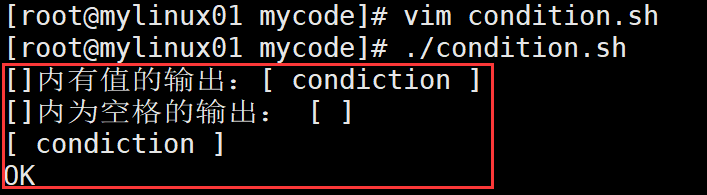

#### 6. if语句

1. **if 语句语法**

   if语句实现一种分支结构，其语法如下：

   ```shell
   if 
   	<condition1>	#如果条件测试condition 1为真(返回值为0)
   then	#那么
   	<commands 1>	#执行语句块commands 1
   [
   elif 
   	< condition 2>	#若条件测试condition 1不为真，而条件测试condition2为真
   then	#那么
   	< commands 2>	#执行语句块commands 2
   ]
   #可以有多个lf.. then..语句块，也可以一个都没有
   [
   else	# else语句块最多只能有一个，是最后的默认分支，也可以省略
   	<commands n>	#执行语句块commands n
   ]
   fi	#if语句必须以f终止
   ```

2. **if语句使用举例**

   对用户输入的内容进行判断并输出信息。

   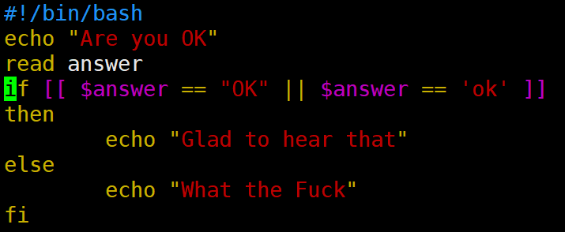

   运行脚本查看结果。

   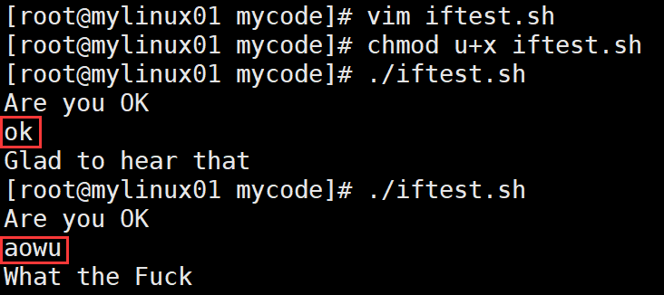

   对用户输入的年龄进行判断并对不同的年龄段输出相应的信息。

   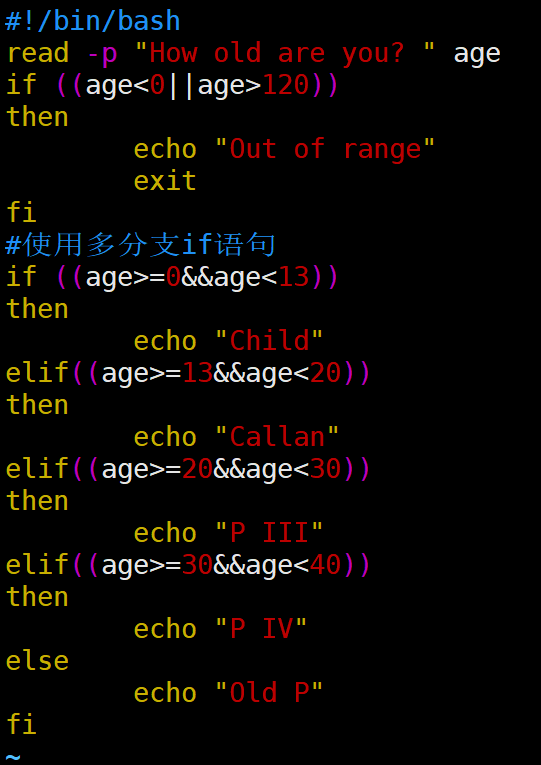

   运行脚本查看结果。

   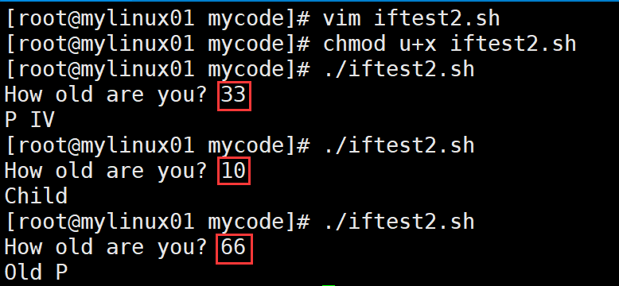

#### 7. case语句

1. **case语句语法**

   case语句实现一种分支结构，其语法如下：

   ```shell
   case expr in	#expr为表达式，关键字in 不要忘
   	patterm1)	#若expr与ptterm1匹配，注意括号
   		commands1	#执行语句块commands1
   		;;	#跳出case结构
   	patterm2)	#若expr与patterm2匹配
   		commands2	#执行语句块commands2
   		;;	#跳出case结构
   	...	#可以有任意多个模式匹配块
   	*)	#若expr与上面的模式都不匹配
   		commands	#执行语句块commands
   		;;	#跳出case结构
   esac	#case语句必须以esac 终止
   ```

   + 表达式expr按顺序匹配每个模式，一旦有一个模式匹配成功，则执行该模式后面的所有命令，然后退出case。
   + 如果expr没有找到匹配的模式，则执行默认值 **"\*)"** 后面的命令块 (类似于if语句中的else块)；"***)块**" 可以不出现。
   + 所给的匹配模式 **"patter?"** 中可以含有**通配符**和**逻辑或 "|"**。
   + 除非特殊需要，否则每个命令块的最后必须有一个双分号 **";;"** (与C语言中switch分支结构的break语句功能一致)，可以独占一行，或放在语句块最后一个命令的后面。

2. **case语句使用举例**

   根据用户的选择显示不同的信息。

   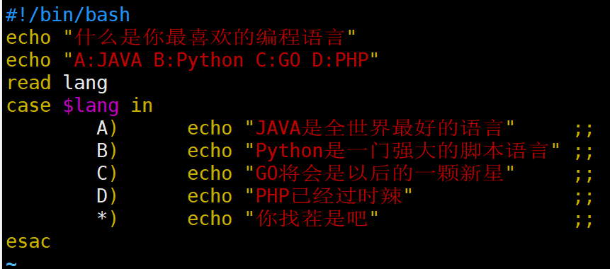

   运行脚本查看结果。

   

#### 8. while 和 until 语句

 1. **while 和 until 语句语法**

    + 当型循环

      ```shell
      while condition		当条件测试 condition 为真（其退出码$?为0）时执行循环体commands，否则退出循环 
      do
      	commands
      done
      ```

    + 直到型循环

      ```shell
      until condition		当条件测试 condition 为真（其退出码$?为0）时结束循环，否则继续执行循环体 commands
      do
      	commands
      done
      ```

	2. **while 和 until 使用举例**

    编写一个猜数程序，直到猜中才退出。

    bash提供了两个循环控制语句

    + **break**：用来跳出循环，继续执行done之后的语句。
    + **continue**：只会跳过本次循环，忽略本次循环剩余的代码，进入循环的下一次迭代。

    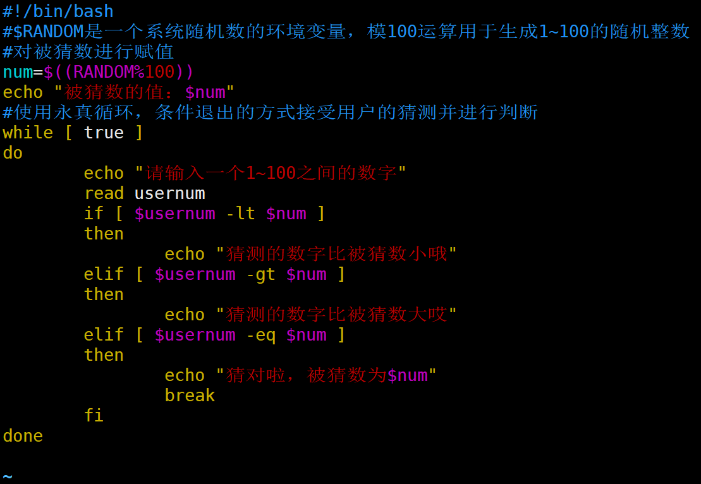

    运行脚本查看结果。

    

#### 9. for语句

1. **for语句语法**

   + **foreach型循环**

     ```shell
     for variable in List	
     do
     	commands
     done	
     ```

     先将列表 list 的第1个值赋给变量variable后执行循环体commands；再将列表 list 的第2个值赋给变量 variable 后执行循环体

     commands；如此循环，直到 list 中的所有列表元素值都已用完终止循环。

     (1) 循环执行的次数取决于列表 list 中元素的个数

     (2) 此结构中in List可省略，省略时相当于 **in "$@"**

   + **C语言型for循环**

     ```shell
     for((exp1;exp2;exp3))
     do
     	commands
     done
     ```

     首先仅执行一次 expr1。执行 expr2 ，其值为假时，终止循环；其值为真时执行循环体commands，执行一次 expr3，进入下一次循环。**此结构用于计数型循环时最方便。**

2. **for语句使用举例**

   使用字面常量列表作为 List。

   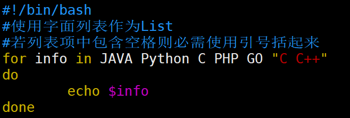

   执行脚本。

   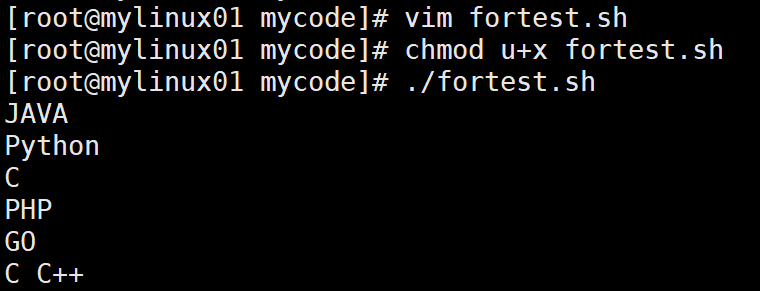

   使用变量列表作为 List。

   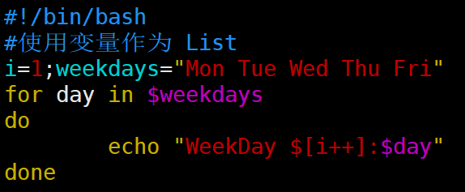

   执行脚本。

   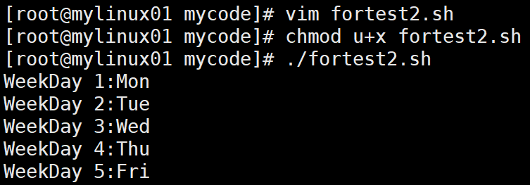

   使用位置参数 **$@** 作为 List。

   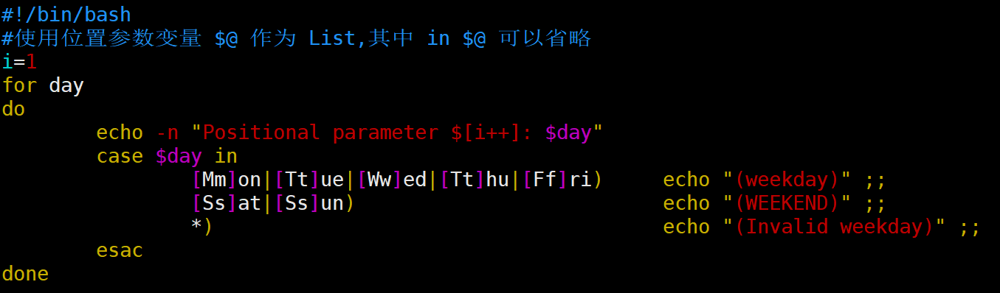

   执行脚本。

   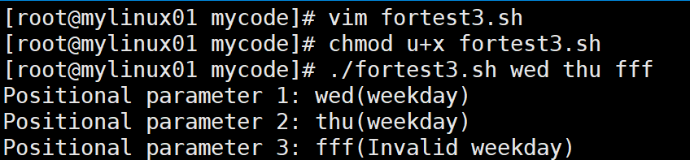

#### 10. 函数

1. **函数及其用途**

   bash提供了子程序调用的功能，即函数。通常在如下情况使用函数。

   + 简化程序代码，实现脚本代码重用。一次定义多次调用。
   + 实现结构化编程，将一个大型脚本的动作划分为多个组，每个组定义为一个函数，从而增强脚本的可读性。
   + 为了加快任务的运行，管理员可以将常用的功能定义为多个函数，并将其保存在一个文件中(类似其他语言的"模块")，然后在 **~/bashrc** 或在命令行使用 **source (.)** 命令调用这个文件，这样所定义的函数就被调入内存，从而加快运行速度。

2. **函数的定义和调用**

   使用函数之前必须先定义，函数的定义语法如下。

   ```shell
   [function] name(){	#function关键字可以省略，name为函数名
       commands		#函数体
   }					#函数体用{}括起来
   ```

   函数和调用它的主程序可以保存在同一个文件中，函数的定义必须出现在调用之前；

   函数和调用它的主程序也可以保存在不同的文件中， 保存函数的文件必须先使用 **source** 命令执行，之后才能调用其中的函数。

   执行函数的方法与执行Shell命令无异，即直接呼叫函数名name即可。

   ```shell
   name [参数1] [参数2] [参数n] #参数可以省略
   ```

   任何传递至函数的参数可以加在 **name** 的后面，既可以在**Shell 脚本**中调用(函数需先定义而后调用)；

   也可以在**命令行**上直接调用(定义函数的文件需先使用 **source** 命令加载)。

   + 调用函数时，使用**位置参数**的形式为函数传递参数。
   + 函数内的 **$1 - ${n}** 、**$***和**$@**表示其接收的参数。
   + 函数调用结束后位置参数 **$1 - ${n}** 、**$***和**$@**将被重置为调用函数之前的值。
   + 在主程序和函数中，**$0** 始终代表脚本名。

   当函数的最后一条命令执行结束后函数即结束。函数的返回值就是最后一条命令的退出状态码，其返回值被保存在系统变量**$?**中。
   用户可以使用 **return** 或 **exit** 命令显式地结束函数，区别在于 **return** 命令结束函数的执行，而 **exit** 命令会中断当前函数及调用它的 Shell 的执行。**return** 和 **exit** 命令还可以使用一个参数指定返回值，如return 1。

3. **定义和调用函数举例**

   计算若干个正整数的最大值：**使用全局变量返回函数值**

   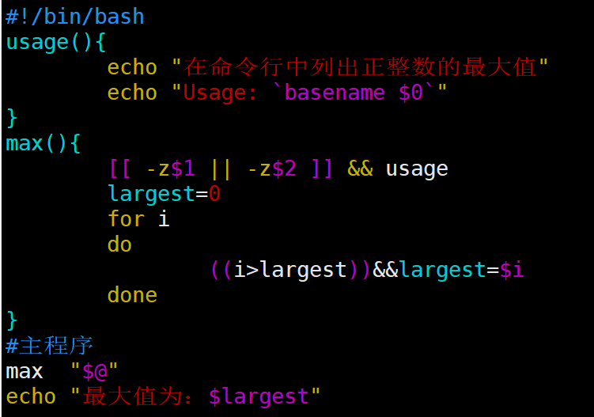
   
   执行脚本。
   
   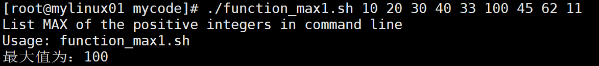
   
   计算若干个正整数的最大值：**通过标准输出返回函数值**
   
   
   
   执行脚本。
   
   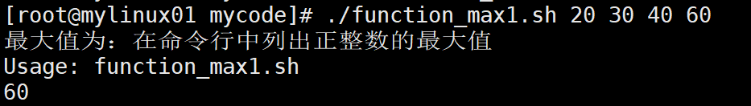
   
   其中：
   
   + 在第一个脚本中，变量largest未声明为局部变量，所以其作用域为当前脚本(调用函数的主程序)和max函数，即在主程序和max
     函数中操作的是同一个largest 变量(其变量地址相同)， 所以在主程序中也可以使用函数中定义的largest变量值。
   + 在第二个脚本中，max函数最后使用echo 命令将变量largest的值送到标准输出，在主程序中使用命令替换 **max $@** 获取函数的值。
   
4. **案例——定时备份数据库**

   **需求分析：**

   + 每天凌晨 2:30 备份数据库 mydb 到 /data/backup/db
   + 备份开始和备份结束能够给出相应的提示信息
   + 备份后的文件要求以备份时间为文件名，并打包成.tar.gz 的形式，比如: 2021-03-12_ 230201.tar.gz 
   + 在备份的同时，检查是否有10天前备份的数据库文件，如果有就将其删除。

   查看数据库。

   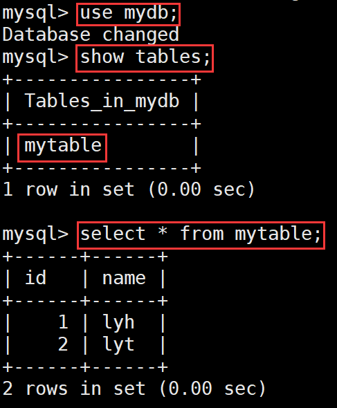

   在 /usr/sbin 下编写脚本，因为usr/bin是root用户执行的权限 而且以后也会用root身份给他设置任务调度。

   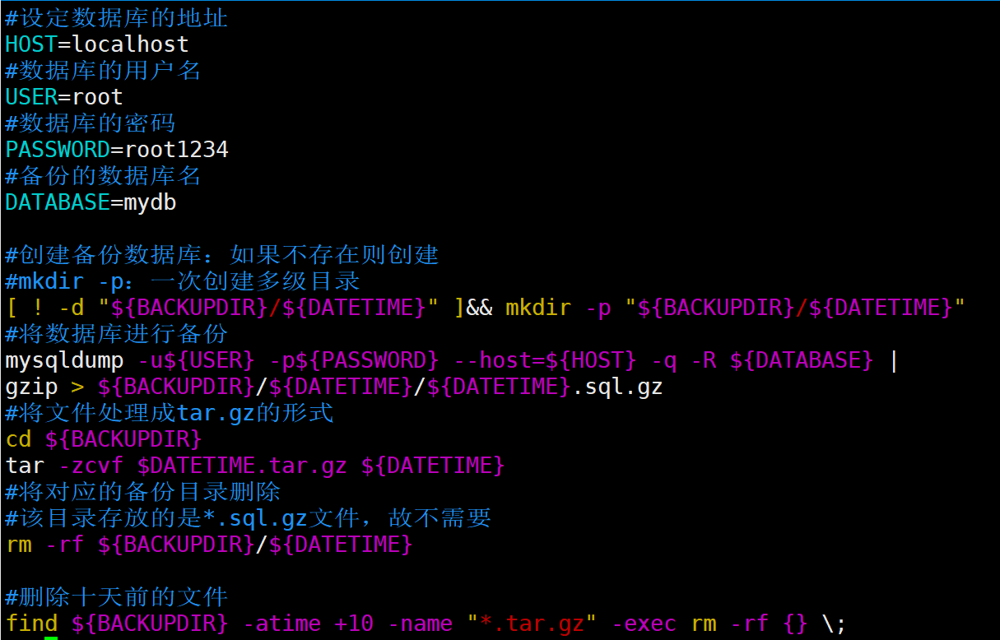

   执行脚本并查看结果。

   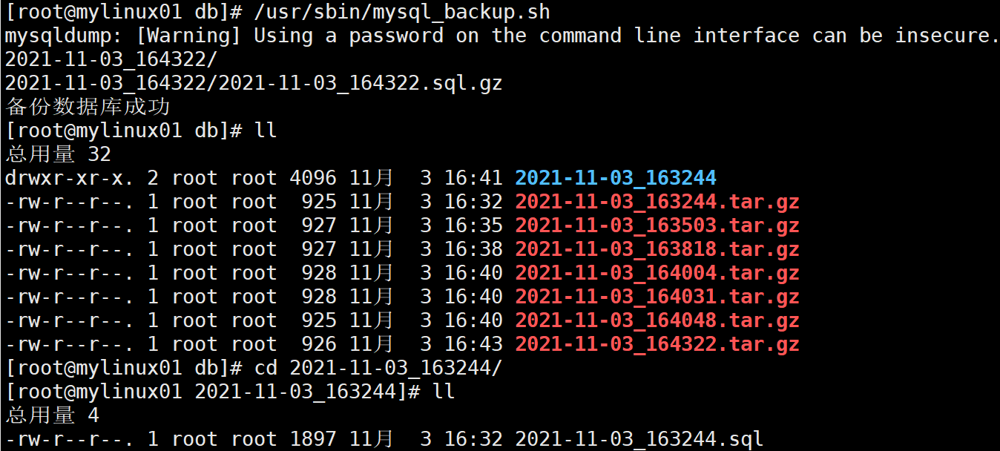

   查看备份内容。

   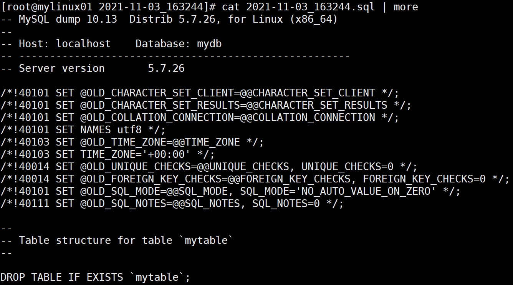

   通过指令 **[crontab -e]** 编写命令。

   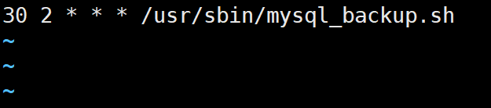

   查看定时任务计划。

   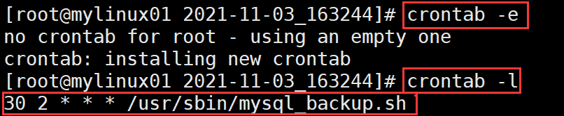

   至此，案例编写完成。

***

## 十三、日志管理

#### 1.基本介绍

​	日志文件是重要的系统信息文件，其中记录了许多重要的系统事件，包括用户的登录信息、系统的启动信息、系统
的安全信息、邮件相关信息、各种服务相关信息等。日志对于安全来说也很重要，它记录了系统每天发生的各种事情，通过日志来检查错误发生的原因，或者受到攻击时攻击者留下的痕迹。可以理解日志是用来记录重大事件的工具。

​	日志文件存放在 /var/log 目录下。为了查看日志文件的内容必须要有 Root 权限。日志文件中的信息很重要，只能让超级用户有访问这些文件的权限，可以使用命令 **[ls /var/log/]** 查看系统中使用的日志文件。


常用的日志文件如下：

|      日 志 文 件      |                            说 明                             |
| :-------------------: | :----------------------------------------------------------: |
|    /var/log/httpd     |              记录Apache的访问日志和错误日志目录              |
| **/var/log/boot.log** |                         系统启动日志                         |
|   **/var/log/cron**   |                 记录与系统定时任务相关的日志                 |
|     /var/log/cups     |               记录CUPS打印系统的打印信息的日志               |
|    /var/log/dmesg     | 记录了系统在启动时的消息日志。也可以使用dmesg命令直接查看内核自检信息 |
|     /var/log/btmp     | 记录错误登录的日志。这个文件是进制文件,不能直接用Vi查看，而要使用**Iastb命令**查看。 |
| **/var/log/lastlog**  | 记录系统中所有用户最后一次的登录时间的日志。这个文件也是二进制文件。要使用**lastlog命令**查看 |
|  **/var/log/mailog**  |                      记录邮件信息的日志                      |
| **/var/log/message**  | 由**rsyslogd**记录的info或更高级别的消息日志。这个日志文件中会记录Linux系统的绝大多数重要信息。如果系统出现问题，首先要检查的应该就是这个日志文件 |
|  **/var/log/secure**  | 由**rsyslogd**记录的验证和授权方面的信息。只要涉及账户和密码的程序都会记录，比如系统的登录、ssh的登录、su切换用户、sudo授权,甚至添加用户和修改用户密码都会记录在这个日志文件中 |
|     /var/log/wtmp     | **永久记录**所有用户的登录、注销信息，同时记录系统的启动、重启、关机事件。是二进制文件，而要使用**Iast命令**查看 |
|   **/var/tun/ulmp**   | 记录当前已经登录的用户的信息。这个文件会随着用户的登录和注销而不断变化，只记录当前登录用户的信息。这个文件不能用Vi查看,而要使用**w、who、users等命令**查看 |
|    /var/log/nginx     |              记录Nginx的访问日志和错误日志目录               |
|   /var/log/yum.log    |                        记录yum的日志                         |

​	大多数日志文件是纯文本文件，每一行就是一个消息。 只要是在Linux下能够处理纯文本的工具都能用来查看日志文件。可以使用**cat、tac、 more、 less、tail 和grep**进行查看。下面以 **/var/log/messages** 为例，说明其日志文件的格式。该文件中每一行表示一个消息，而且都由4个域的固定格式组成。(可以看出，实际上记录在 **/var/log/message** 文件中的消息不是特别重要或紧急)

+ **时间标签(Timestamp)**：表示消息发出的日期和时间。
+ **主机名(Hostname)**：表示生成消息的计算机的名字。
+ **生成消息的子系统的名字**：可以是Kernel, 表示消息来自内核；也可以是进程的名字，表示发出消息的程序的名字。若消息来自某个进程，则在进程名后使用**方括号**标明此进程的PID。
+ **消息(Message)**：即消息的内容。

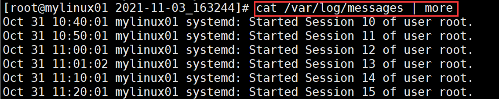

使用lyh用户通过xshell登录，第一、二次使用错误的密码，第三次使用正确的密码登录成功，然后查看在日志文件**/var/log/secure**里记录的相关信息。

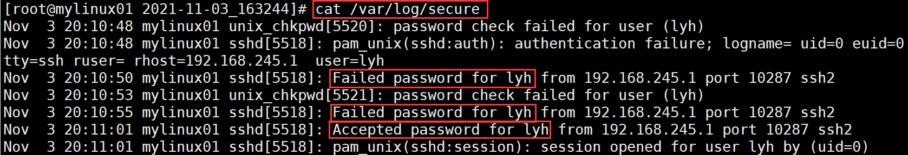

#### 2. rsyslogd日志管理服务

1. **rsyslog日志系统**

   在CentOS 7中，默认的日志系统是rsyslog，rsyslogd 功能更强大。rsyslogd 的使用、日志文件的格式，和syslogd 服务兼容的。原理示意图.rsyslog 是一个类UNIX计算机系统上使用的开源软件工具，用于在IP网络中转发日志信息。rsyslog 采用模块化设计，是syslog的替代品。rsyslog 具有如下特点：

   + 实现了基本的syslog协议。
   + 直接兼容syslogd的syslog.conf 配置文件。
   + 在同一台机器上支持多个rsyslogd进程。
   + 丰富的过滤功能，可将消息过滤后再转发。
   + 灵活的配置选项，配置文件中可以写简单的逻辑判断。
   + 增加了重要的功能，如使用TCP进行消息传输。
   + 有现成的前端Web展示程序。

   默认安装的 rsyslog 软件包提供的守护进程是**rsyslogd**，它是一项系统的**基础服务**，应该设置为开机运行。**rsyslogd 是是由systemd启动的**，在启动时会读取其配置文件。管理员可以通过编辑 **/etc/rsyslog.conf**、**/etc/rsyslog.d/* .conf** 和**/etc/sysconfig/rsyslog** 来配置 **rsyslog** 的行为。**/etc/sysconfig/rsyslog** 文件用于配置守护进程的运行参数，**/etc/rsyslog.conf **是rsyslog的主配置文件。

   **查询 Linux 中的rsyslogd 服务是否启动：ps aux | grep "rsyslog" | grep -v "grep"**

   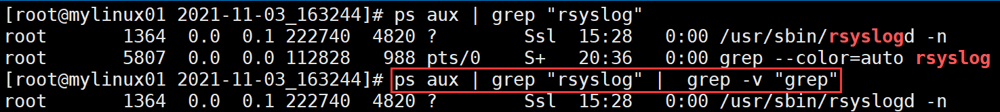

   **查询rsyslogd服务的自启动状态：systemctl list-unit-files | grep rsyslog**

   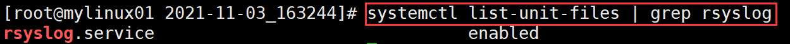

2. **rsyslog的配置文件**

   查看rsyslog的配置文件 **/etc/rsyslog.conf**。其中，配置规则的每一行格式为：**facility.priority	action，即设备.级别	动作** 。

   通俗来说，便是**日志类型.日志级别	存放日志的文件** 。其部分信息如下：

   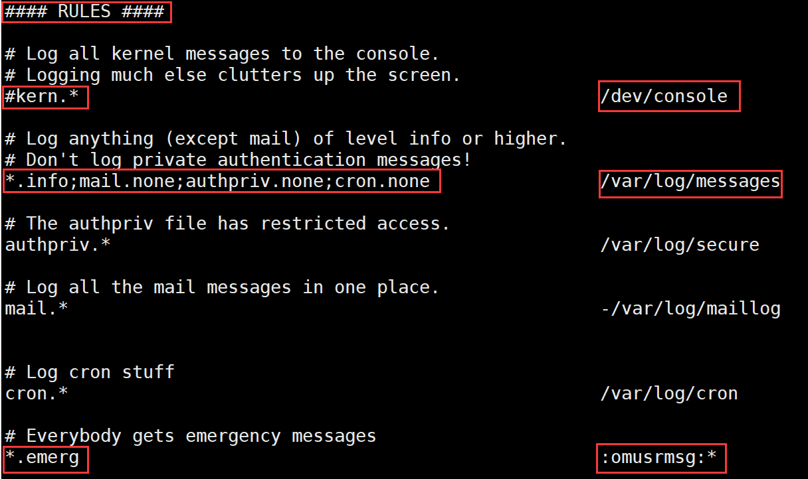

   配置文件 **/etc/rsyslog.conf**的结构如下。

   + **全局指令(Global directives)**：设置全局参数，如主消息队列尺寸、加载扩展模块等。
   + **模板(Templates)**：指定记录的消息格式，也用于动态文件名称生成。
   + **输出通道(Output channels)**：对用户期望的消息输出进行预定义。
   + **规则(Rules) [selector + action]**：指定消息规则。在规则中可以引用之前定义的模板和输出通道。
   + **以#开始的行为注释**，所有空行将被忽略。

   **设备字段(日志类型)用来指定需要监视的事件**，rsyslog.conf 设备字段说明：

   | <span style="display:inline-block;width:100px">设 备 字 段</span> |                            说 明                             |
   | :----------------------------------------------------------: | :----------------------------------------------------------: |
   |                           authpriv                           |         报告认证活动。通常，口令等私有信息不会被记录         |
   |                             cron                             |           报告与cron和at有关的信息，即时间任务相关           |
   |                            daemon                            |       报告没有明确设备定义的守护进程的信息，如xinetd等       |
   |                             ftp                              |                   报告FTP守护进程的信息。                    |
   |                             kern                             |     报告与内核有关的信息。通常这些信息首先通过klogd传送      |
   |                             Ipr                              |                   报告与打印服务有关的信息                   |
   |                             mail                             |                   报告与邮件服务有关的信息                   |
   |                             mark                             | 在默认情况下每隔20分钟就会生成一次表示系统还在正常运行的消息。Mark 消息很像经常用来确认远程主机是否还在运行的**"心跳信号" **(HeartBeat)。Mark消息另外的一个用途是事后分析， 能够帮助系统管理员确定系统死机发生的时间 |
   |                             news                             |                 报告与网络新闻服务有关的信息                 |
   |                            syslog                            |                      由syslog生成的信息                      |
   |                             user                             | 报告由用户程序生成的任何信息，即用户程序产生的相关信息，是可编程默认值 |
   |                             uucp                             |                    由UUCP子系统生成的信息                    |
   |                              *                               |                  代表除了mark之外的所有设备                  |
   |                          local 0-7                           |                  保留给本地其他应用程序使用                  |

   **级别字段(日志级别)**用于指明与每一种功能有关的级别和优先级：从上到下级别由高到低，记录信息越来越多。(none之前)

   | 级 别 字 段 |                            说 明                             |
   | :---------: | :----------------------------------------------------------: |
   |    emerg    | 出现紧急情况使得该系统不可用，有些情况需广播给所有用户，如内核崩溃等重要信息 |
   |    alert    |                    需要立即引起注意的情况                    |
   |    crit     | 严重级别，危险情况的警告，阻止整个系统或整个软件不能正常工作的信息 |
   |     err     |       错误级别，阻止某个功能或者模块不能正常工作的信息       |
   |   warning   |                    警告级别，记录警告信息                    |
   |   notice    | 普通条件信息，需要引起注意的情况，但不如**err、warning**重要 |
   |    info     |          值得报告的信息，也就是一般信息日志，最常用          |
   |    debug    |       由运行debug模式的程序所产生的消息，日志通信最多        |
   |    none     |                  禁止任何信息，什么都不记录                  |
   |      *      |                    除了none以外的所有级别                    |
   
   动作字段用于描述对应功能的动作：
   
   |   动 作 字 段   |                            说 明                             |
   | :-------------: | :----------------------------------------------------------: |
   |    filename     |          指定一个绝对路径的日志文件名来记录日志信息          |
   | :omusrmsg:users | 发送信息到指定用户，**users** 可以是用**逗号**分隔的用户列表，***** 表示所有用户 |
   |     device      |           将信息发送到指定的设备中，如/dev/console           |
   |  \| named_pipe  | 将日志记录到命名管道，用于日志调试非常方便。命名管道必须在**rsyslogd启动之前**使用**mkfifo命令**创建 |
   |    @hostname    | 将信息发送到可解析的远程主机hostname或IP，该主机必须正在运行**rsyslogd**，并可以识别rsyslog的配置文件，rsyslog使用**udp:514**端口传送日志信息 |
   |   @@hostname    | 将信息发送到可解析的远程主机hostname或IP，该主机必须正在运行**rsyslogd**，并可以识别rsyslog的配置文件，rsyslog使用**tcp:514**端口传送日志信息 |
   
   rsyslog可为某一事件指定多个动作，也可以同时指定多个设备和级别，它们之间用分号间隔。

#### 3. 日志轮替

1. **基本介绍**

   日志轮替就是把旧的日志文件移动并改名，同时建立新的空日志文件，当旧日志文件超出保存的范围之后，就会进行删除。

   centos7使用logrotate进行日志轮替管理，要想**改变日志轮替文件名字**,通过 **/etc/logrotate .conf** 配置文件中 **"dateext"** 参数。

   + 如果配置文件中有 **"dateext"** 参数，那么日志会**用日期来作为日志文件的后缀**，例如 **"secure-20201010"** 。这样日志文件名不会重叠，也就不需要日志文件的改名，只需要指定保存日志个数，删除多余的日志文件即可。
   + 如果配置文件中没有 **"dateext"** 参数，日志文件就需要进行改名了。当第一次进行日志轮替时，当前的 **"secure"** 日志会自动改名为 **"secure.1"**，然后新建 **"secure"** 日志，用来保存新的日志。 当第二次进行日志轮替时， **"secure.1"**会自动改名为 **"secure.2"** ，当前的 **"secure"** 日志会自动改名为 **"secure.1"**，然后也会新建 **"secure"** 日志，用来保存新的日志，以此类推。

2. **LogRotate命令**

   CentOS提供了一个专门的日志滚动处理程序 logrotate， logrotate 能够自动完成日志的压缩、备份、删除工作。一般把它加入到系统每天执行的计划任务中，这样管理员就不需自己去处理了。logrotate 工具由RPM包 logrotate提供，该软件包是默认安装的。

   ```shell
   logrotate 选项 logrotate配置文件的路径
   -d				详细显示指令执行过程，便于排错或了解程序执行的情况
   -v				在执行日志滚动时显示详细信息
   -f				强行实施日志滚动，即使根据配置文件的设置认为不需日志滚动
   -m command		指定发送邮件的程序，默认为/usr/bin/mail
   -s statefile	使用指定的状态文件，默认为/var/lib/logrotate.status
   ```

   管理员可以在logrotate的配置文件中设置日志的滚动周期、日志的备份数目，以及如何备份日志等。logrotate 的主配置文件是 **/etc/logotate.conf**，此文件一般用于设置全局配置语句。另外，在默认的CentOS系统中还有一一个名为 **/etc/logrotate.d** 的目录。通常每一项服务在该目录下都有一个与服务同名的配置文件，如 **syslog、 samba、cron** 等。此目录下的所有配置文件都被include到主配置文件 **/etc/logrotate.conf** 中。管理员可以在此目录下添加其他文件以滚动其他服务的日志。

   |                 配 置 语 句                  |                            功 能                             |
   | :------------------------------------------: | :----------------------------------------------------------: |
   |                   compress                   |               对滚动的旧日志文件使用 gzip 压缩               |
   |                  nocompress                  |                    不压缩滚动的旧日志文件                    |
   |                 copytruncate                 |       用在处于打开状态的日志文件，将当前日志备份并截断       |
   |                nocopytruncate                |                    备份日志文件但是不截断                    |
   | create  &lt;mode&gt;  &lt;owner>  &lt;group> |         滚动日志时使用指定的文件模式创建新的日志文件         |
   |                   nocreate                   |                      不创建新的日志文件                      |
   |                delaycompress                 |     和compress一起使用，转储的日志文件到下次滚动时才压缩     |
   |               nodelaycompress                |             覆盖delaycompress选项，转储同时压缩              |
   |                   ifempry                    |      即使是空文件也滚动日志，这个是logrotate的默认选项       |
   |                  notifempty                  |                 如果是空文件的话，不滚动日志                 |
   |            errors &lt;address&gt;            |         将滚动日志时的错误信息发送到指定的Email地址          |
   |             mail &lt;address&gt;             |            把转储的日志文件发送到指定的E-mail地址            |
   |                    nomail                    |                转储时不使用E-mail发送日志文件                |
   |           olddir &lt;dirctory&gt;            | 将滚动的旧日志文件存储到指定的目录，必须和当前日志文件在同一个文件系统 |
   |                   nooddir                    |       将滚动的旧日志文件和当前日志文件放在同一个目录下       |
   |             prerotate/endscript              | 在滚动日志以前需要执行的命令可以放入此语句括号内，这两个关键字必须单独成行 |
   |             postrotate/endscript             | 在滚动日志以后需要执行的命令可以放入此语句括号内，这两个关键字必须单独成行 |
   |                    daily                     |                    指定日志滚动周期为每天                    |
   |                    weekly                    |                    指定日志滚动周期为每周                    |
   |                   monthly                    |                    指定日志滚动周期为每月                    |
   |               rotate &lt;n&gt;               | 指定日志文件删除之前日志滚动的备份次数，0代表没有备份，5代表保留5个备份 |
   |                size &lt;n&gt;                | 当日志文件到达指定的大小时才进行日志滚动， n可以指定为以**bytes**为单位(默认)，或者使用 **G/M/K** 后缀单位 |
   |              tabootext [+] list              | 让logrotate不转储指定扩展名的文件，默认的扩展名是：.rpmorig，.rpmsave，.dpkg-dist，.dpkg-old，.dpkg-new，.disabled，.v，.swp，.rpmnew 和 ~ |

   在 **/etc/logrotate.conf** 中可以使用以上的配置语句设置全局值；在 **/etc/logrotate.conf** 用 **include语句**所包含的配置文件中也可以使用上述的配置语句，被include的配置文件中的语句会覆盖 **/etc/logrotate.conf** 中的配置。
   
   下面是 **CentOS 7** 默认的 **/etc/logrotate.conf** 配置文件：
   
   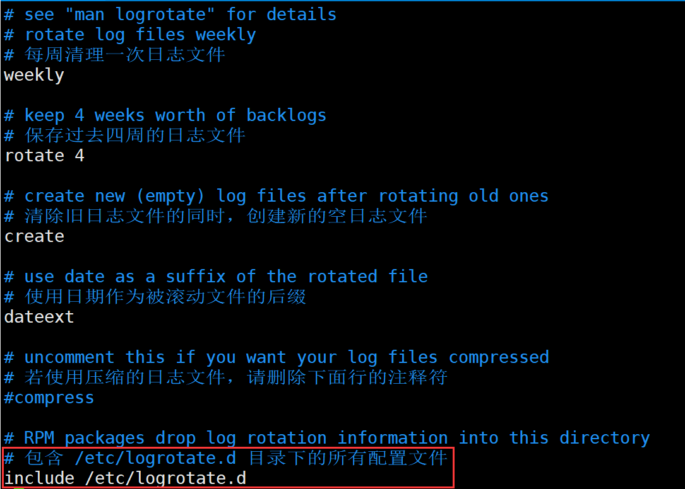
   
   单独的设置，对其他系统日志也可以在此配置。
   
   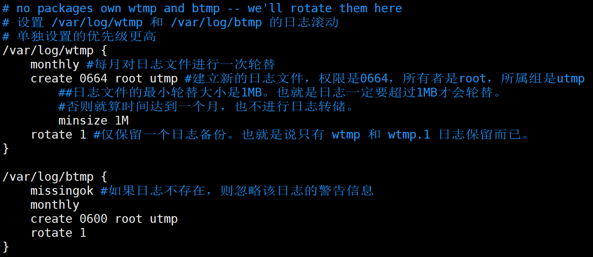
   
   所以，如果需要**把自己的日志加入日志轮替**，有以下两种方法
   
   + 第一种方法是直接在 **/etc/logrotate .conf** 配置文件中写入该日志的轮替策略
   
   + 第二种方法是在 **/etc/logrotate.d/** 目录中新建立该日志的轮替文件，在该轮替文件中写入正确的轮替策略，因为该目录中的文件都会被 **"include"** 到主配置文件中，所以也可以把日志加入轮替。
   
   + **推荐使用第二种方法**，因为系统中需要轮替的日志非常多，如果全都直接写入 **/etc/logrotate .conf** 配置文件，那么这个文件的可管理性就会非常差，不利于此文件的维护。
   
   + 查看**/etc/logrotate.d/** 配置轮替文件
   
     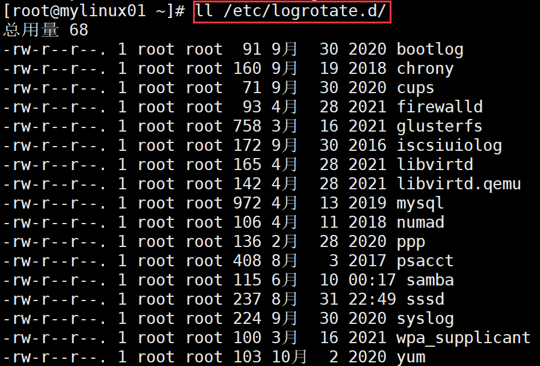
   
3. **日志轮替机制原理**

   在CentOS 7中，logrotate 是由 **crond** 运行的。在默认配置中，可以发现在 **/etc/cron.daily** 目录中有一个名为logrotate的文件

   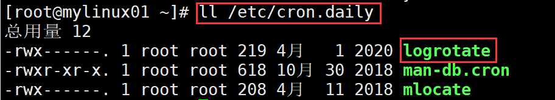

   该文件内容为：

   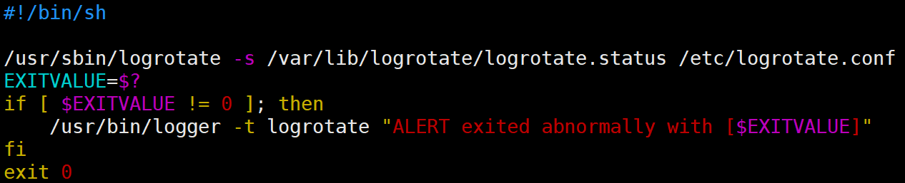

   由于该脚本在 **/etc/cron.daily** 目录下，**所以crond每天执行一次 logrotate**，执行时读取其配置文件 **/etc/logrotate. conf**。执行后判断 logrotate 命令**是否正确执行**，若发生错误**($? != 0)** 则将 logrotate 的执行错误代码使用 **logger 命令**记入系统日志。**logrotate **通过这个文件依赖定时任务执行。
   
4. **查看内存日志**

   ​	程序运行会产生日志，在Linux操作系统中可以使用 rsyslog 软件对系统日志进行采集和管理，而存放在内存中的日志是用**journalctl**查看，并且**内存日志在电脑关机之后，内存中的日志就会被清除**。其使用方法为：

   ```shell
   journalctl 选项： 查看所有日志，默认情况下只保留本次启动的日志
   -n <num>：显示尾部的最新10行日志，如果指定了数字则显示尾部指定行数的日志
   -f		：实时滚动显示最新日志
   -k		：查看内核日志（不显示应用日志）
   -b <-0>	：查看系统本次启动的日志
   -b -1	：查看上一次启动的日志。需更改设置，如上次系统崩溃，需要查看日志时，就要看上一次的启动日志。
   --since	：查看指定时间的日志，如果加上 <--until> 则查看的是指定的起始时间到结束时间的日志
   _PID	：查看指定进程的日志
   _UID	：查看指定用户的日志
   ```

***

## 十四、数据备份与恢复

#### 1. 备份基本介绍

1. **什么是备份**

   ​	备份就是把一个文件系统或其部分文件存储到另外的介质中，使得通过这些介质中的记录信息可以恢复原有的文件系统或其中的某些文件。备份数据的过程就是复制重要的数据到其他的介质之上，以保证在原始数据丢失的情况下可以恢复数据。一次备份可能是简单的cp命令，将一个文件复制到其他目录下，也可能是使用特定的程序将数据流写进一个特定的设备中的复杂过程。

2. **备份策略**

   一般可以采取**3种**可用的备份策略。

   + **完全(Full) 备份**
     每隔一段时间对系统进行一次完全的备份，这样在备份时间间隔内，一旦系统发生故障使得数据丢失时，就可以用上一次的备份数据恢复到上一次备份时的情况。
   + **增量(Incremental) 备份**
     首先进行一次完全备份，然后每隔一个较短时间进行次备份，但**仅备份在这个期间更改的内容**。这样一旦发生数据丢失， 首先恢复到前一个完全备份，然后按日期逐个恢复每天的备份，就能恢复到前一天的情况。这种备份方法比较经济。
   + **差分(Differential) 备份**
     差分备份也称累计备份。这种备份方法与增量备份相似，首先每月进行一次完全备份，然后备份从上次进行完全备份后更改的全部数据文件。一旦发生数据丢失，使用一个完全备份和一个差分备份就可以恢复到故障以前的状态。**差分备份只需两次恢复**，因此它的恢复工作相对简单。

   **增量备份和差分备份**都能以比较经济的方式对系统进行备份。如果系统数据更新不是太频繁，可以选用差分备份。如果系统数据更新太快，使每个备份周期后的几次差分备份的数据量相当大，这时候可以考虑增量备份或混用差分备份和增量备份的方式，或者缩短备份周期。以下为3种备份策略的比较：

   | 备 份 方 式 |     备 份 内 容      | 工 作 量 | 恢 复 步 骤 | 备 份 速 度 | 恢 复 速 度 |       优 缺 点       |
   | :---------: | :------------------: | :------: | :---------: | :---------: | :---------: | :------------------: |
   |  完全备份   |       全部内容       |    大    |  一次操作   |     慢      |    很快     |  占用空间大，恢复快  |
   |  增量备份   | 每次修改后的单个内容 |    小    |  多次操作   |    很快     |     中      | 占用空间小，恢复麻烦 |
   |  差分备份   | 每次修改后的所有内容 |    中    |  二次操作   |     快      |     快      | 占用空间较小，恢复快 |

3. **确定要备份的数据**

   Linux区别于其他大多数操作系统的一个方面是**操作系统和大多数应用程序一次同时被安装**，而Windows或者其他UNIX系统则是应用程序与操作系统分开安装，首先安装操作系统，然后才逐渐安装各个应用程序。对于这样的系统，备份整个系统才是必要的，这些操作系统在初次安装时需要花费大量的时间和精力。而对于Linux来说，初次或再次安装一个基本系统(包括绝大多数应用程序)是非常简单和快速的。

   系统中的大部分内容都是非常稳定的，而不稳定部分主要有以下几方面。
   
   + **/etc**：包含所有配置文件。
   + **/var**：包含系统守护进程(服务)所使用的信息，包括DNS配置、DHCP租期、邮件缓冲文件、默认HTTP服务器文件等。
   + **/srv**：包含本地服务文件。
   + **/usr/local**：包含那些相对系统来说 “本地化” 的内容。
   + **/root**：根用户的主目录。
   + **/opt**：是安装许多非系统文件的地方。
   + **/home**：包含所有普通用户的用户主目录。
   
   一般只要备份这几部分就可以了，其余的系统内容可以通过安装盘获得。由于系统数据并不经常发生改变，所以一般只有当系统内容发生变化时才进行备份。当然还可以进行更详细的筛选，如Apache的配置、postfix的配置、vsftpd 的配置、MySQL 的配置；网站数据、邮件数据、FTP 站点数据等。

#### 2. 使用dump完成备份

 1. **dump基本介绍**

    ​	Linux dump命令用于**备份文件系统**。dump为备份工具程序，可将目录或整个文件系统备份至指定的设备，或备份成一个大文件。
    
    ​	**dump命令支持分卷和增量备份**，它使用 **"备份级别"** 来实现增量备份，**支持 0～9 共 10 个备份级别**。其中，**0 级别指的就是完全备份，1～9 级别都是增量备份级别**。举个例子，当我们备份一份数据时，第一次备份应该使用 0 级别，会把所有数据完全备份一次；第二次备份就可以使用 1 级别了，它会和 0 级别进行比较，把 0 级别备份之后变化的数据进行备份；第三次备份使用 2 级别，2 级别会和 1 级别进行比较，把 1 级别备份之后变化的数据进行备份，以此类推。
    
    ​	需要注意的是，只有在备份**整个分区或整块硬盘**时，才能支持 1～9 的增量备份级别；**如果只是备份某个文件或不是分区的目录，则只能使用 0 级别进行完全备份**。
    
 2. **dump语法说明**

    dump 命令的基本格式为：**[dump 选项 备份之后的文件名 原文件或目录]**

    ```shell
    -level	：就是上述的 0～9 共 10 个备份级别
    -f		：指定备份之后的文件名
    -u	  	：备份成功之后，把备份时间、备份级别以及实施备份的文件系统等信息，都记录在 /etc/dumpdates 文件中
    -v	  	：显示备份过程中更多的输出信息
    -j	  	：调用 bzlib 库压缩备份文件，其实就是把备份文件压缩为 .bz2 格式，让文件更小，默认压缩等级是 2
    -W	  	：显示允许被 dump 的分区的备份等级及备份时间
    -w		：与 -W 类似，但仅显示需要备份的文件
    -T		：指定开始备份的时间和日期
    ```

 3. **应用案例**

    将 /boot 分区所有内容备份到 /test/boot.bak0.bz2 文件中，备份层级为 0。

    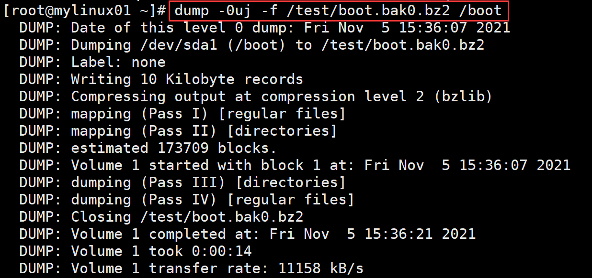

    查看备份后的结果。

    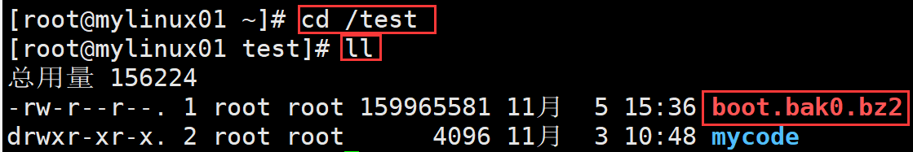

    **注意：**当备份为一个独立的文件系统(独立的分区)时，可以使用-u，如果只是备份目录下的文件时，不能使用-u。

    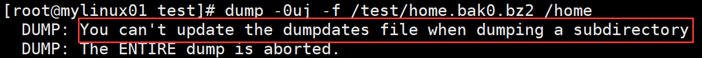

    在 /boot 目录下增加新文件，备份层级为 1 (只备份上次使用层次 0 备份后发生过改变的数据)，注意比较看看这次生成的备份文件boot1.bak有多大。

    新增一个testdump普通文件

    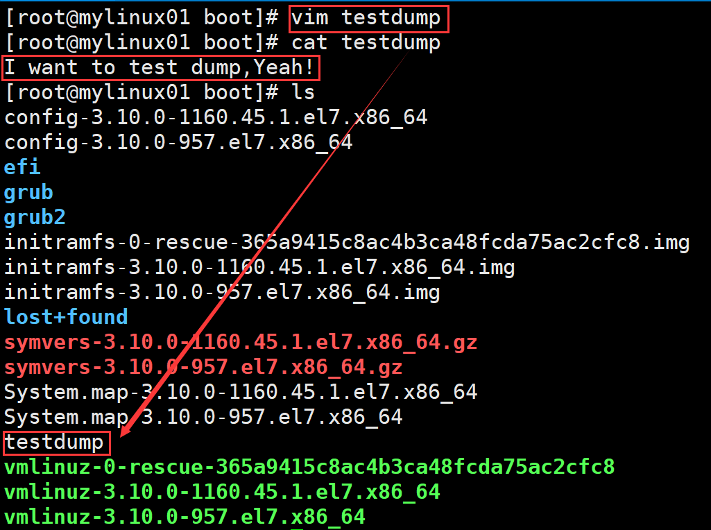

    将 /boot 分区更新的内容备份到 /test/boot.bak1.bz2 文件中，备份层级为 1。

    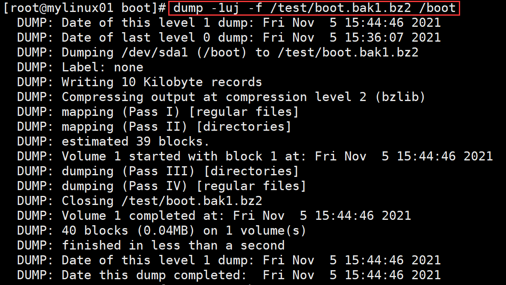

    查看备份结果，并比较大小。

    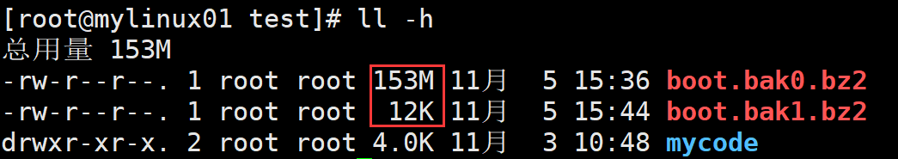

    显示需要备份的文件及其最后一次备份的层级，时间，日期。

    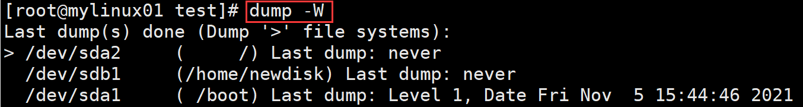

    查看备份时间文件。

    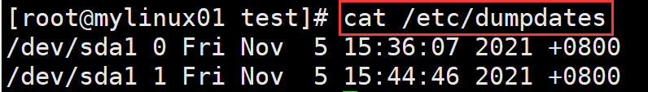

#### 3. 使用restore完成恢复

 1. **restore基本介绍**

    ​	Linux restore命令用来还原由dump操作所备份下来的文件或整个文件系统(一个分区)。restore 指令所进行的操作和dump指令相反，dump操作可用来备份文件，而restore操作则是写回这些已备份的文件。

 2. **restore语法说明**

    restore 命令的基本格式为：**[restore 模式选项 选项]**

    模式选项**有四种模式且不能混用，只能指定其一**

    ```shell
    模式选项：
    -C	：对比模式，比较备份数据和实际数据的变化
    -i	：进入交互模式手动指定需要恢复的文件，在进行还原操作时，restore指令将依次询问用户
    -t	：查看模式，查看备份文件中的数据
    -r	：还原模式，用于数据还原
    
    选项：
    -f	：从指定的文件中读取备份数据，进行还原操作
    ```

 3. **应用案例**

    使用restore的比较模式，比较原文件和备份文件的区别。

    将testdump文件改名为testrestore。

    

    使用 **[-C]** 进行比较。

    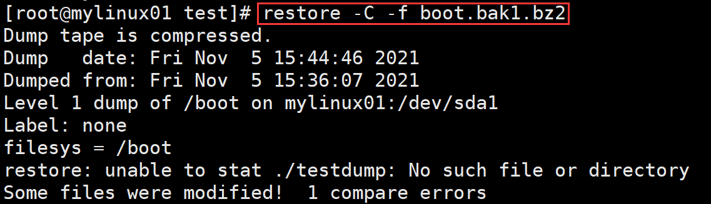

    将文件名改回之后，再次比较。

    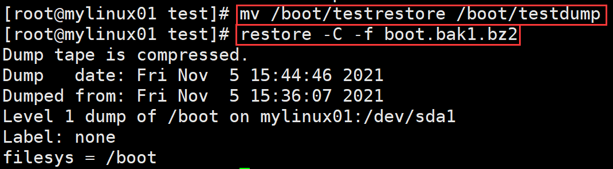

    修改了文件内容后进行比较。

    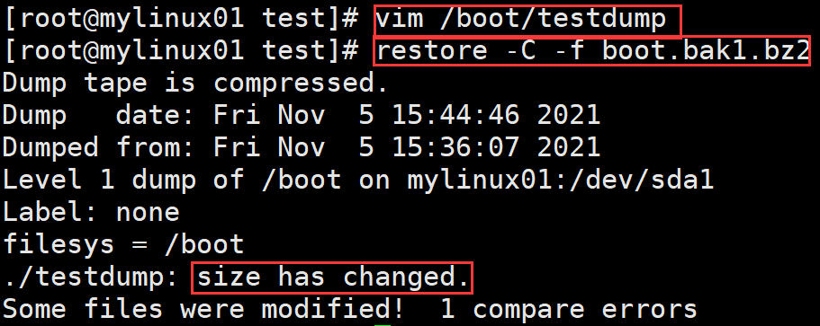

    使用restore的查看模式，看备份文件有哪些数据/文件。

    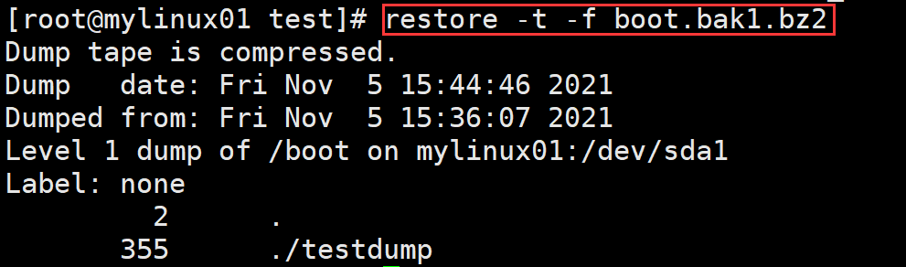

    使用restore还原模式，注意：若有增量备份， 则需要把增量备份文件也进行恢复，有几个增量 备份文件，就要恢复几个，**按顺序来恢复**即可。

    

    查看恢复结果。

    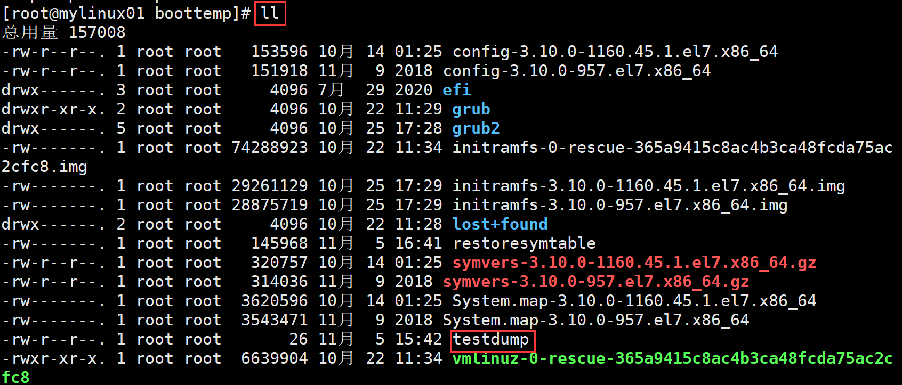

    若不按顺序，先恢复增量备份，则报错。

    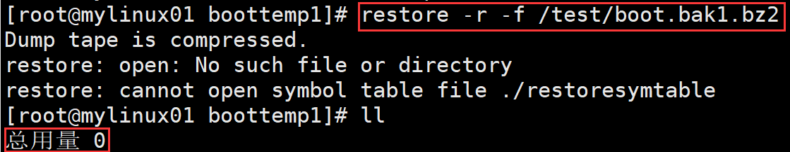

***

## 十五、网络配置与包管理

#### 1. Linux下的网络连接方式

在VM虚拟机中网络的连接方式，主要包括：**桥连接**、**NAT模式**、**仅主机模式**等。

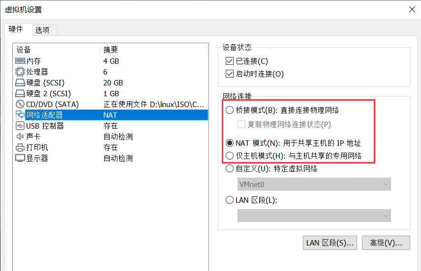

1. **NAT模式 (地址转换模式)**

   ​	在NAT模式中，主机网卡直接与虚拟NAT设备相连，然后虚拟NAT设备与虚拟DHCP服务器一起连接在虚拟交换机**VMnet8**上，这样就实现了虚拟机联网。而VMware Network Adapter VMnet8虚拟网卡主要是为了实现主机与虚拟机之间的通信。此种模式是**网络地址转换方式**，该模式下Linux可以访问外网，**不会造成IP地址冲突**，实际工作中推荐使用此种方式。

   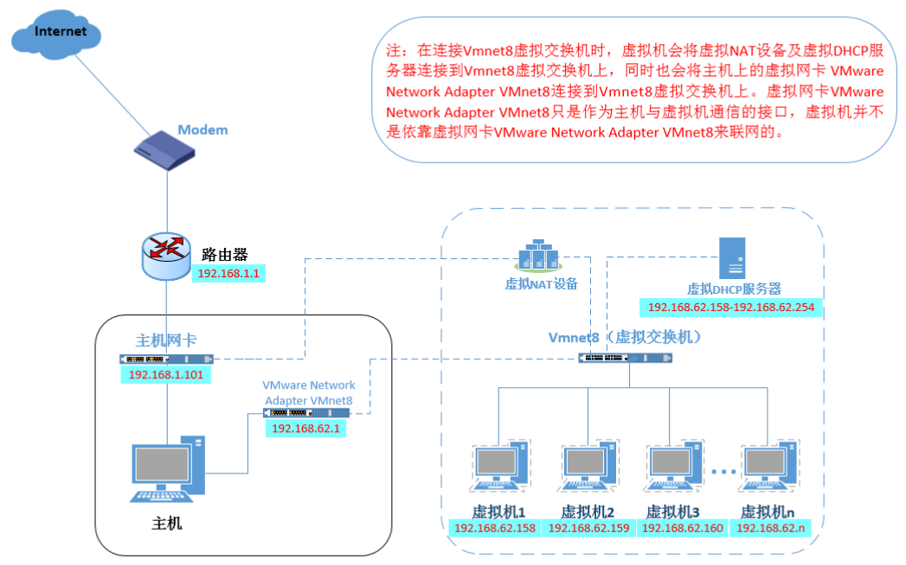

   ​	依靠物理主机的VMnet8网卡上网。虚拟机可以互Ping通，前提是**物理主机的VMnet8网卡的网关要与虚拟机一样**。如果不在同一个网关，会出现虚拟机能Ping通物理主机，但物理主机无法Ping通虚拟机的情况。
   
   物理主机（WINDOWS）IP信息，通过命令 **[ipconfig]** 查看。
   
   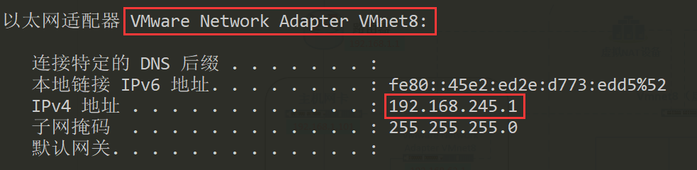
   
   虚拟机(Linux) IP信息，通过命令 **[ifconfig]** 查看。
   
   
   
   测试物理主机 **ping** 虚拟机，成功。
   
   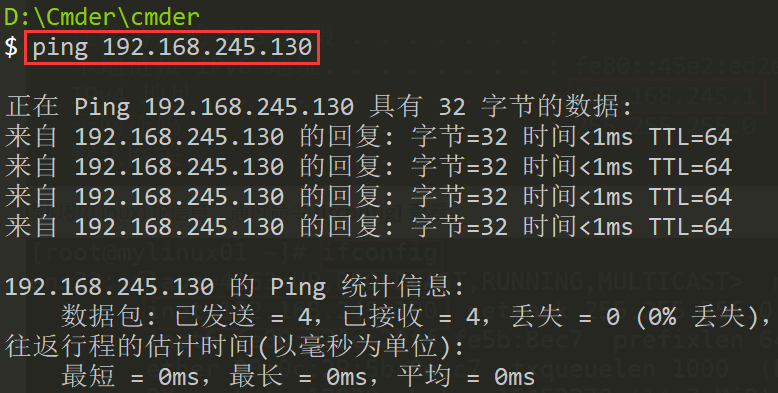
   
   测试虚拟机 **ping** 物理主机，成功。
   
   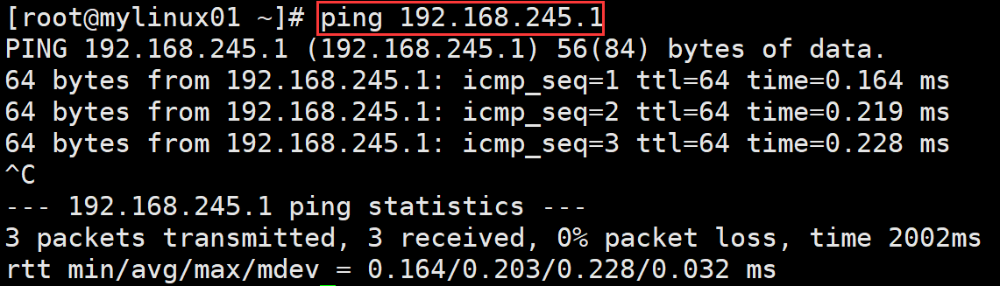
   
2. **桥接模式 (Bridged)**
   
   ​	桥接模式就是将**主机网卡与虚拟机虚拟的网卡利用虚拟网桥进行通信**。在桥接的作用下，类似于把物理主机虚拟为一个交换机，所有桥接设置的虚拟机连接到这个交换机的一个接口上，物理主机也同样插在这个交换机当中，所以所有桥接下的网卡与网卡都是交换模式的，相互可以访问而不干扰。在桥接模式下，虚拟机ip地址需要与主机在同一个网段，如果需要联网，**则网关与DNS需要与主机网卡一致**。
   
   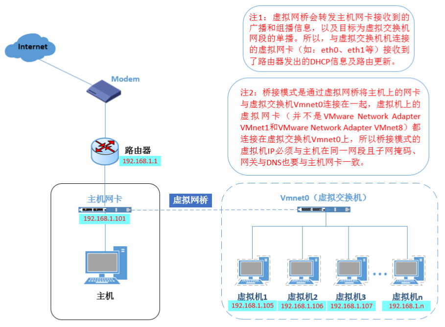
   
   使用此网络连接方式，虚拟机中的Linux是可以和其他的系统主机通讯的，因为Linux系统的IP和虚拟机所在物理机器IP在同一个IP地址段，并且是自动分配的，所以可能**会出现虚拟机IP地址和其他系统主机IP地址冲突** 。（局域网内主机数量越多，出现概率越大）
   
3. **仅主机模式 (Host-Only)**
   
   ​	仅主机模式其实就是NAT模式去除了虚拟NAT设备，然后使用VMware Network Adapter VMnet1虚拟网卡连接VMnet1虚拟交换机来与虚拟机通信的，Host-Only模式将虚拟机与外网隔开，使得虚拟机成为一个独立的系统，只与主机相互通讯。也就是说，当设置为Host-only上网时，虚拟机只能和主机进行通信，不可以上网，也不可以和其他机器进行通信，此时主机使用VMnet1与虚拟机通信。
   
   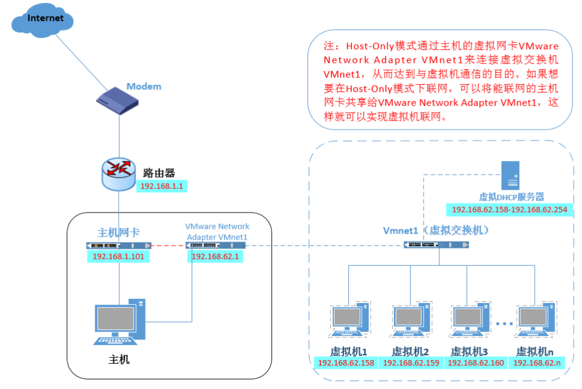

#### 2. Linux的网络配置

1. **Linux中配置IP地址的方法**

   + 图形界面配置IP地址（操作方式如Windows系统配置IP）
   + **ifconfig命令**临时配置IP地址（临时配置IP地址，即当重启计算机或重启网络服务后，配置将失效）
   + **setup工具**永久配置IP地址（setup工具是红帽专有图形化工具setup设置IP地址，使用setup命令设置完网络后需要使用service network restart重启网络，在 [管理守护进程](#4. 管理守护进程) 中有简单介绍）
   + 修改网络配置文件

2. **Linux网络配置文件**

   + **CentOS 中的 TCP/IP 配置文件**

     查看 **/etc/protocols** 文件可获知Linux支持的协议以及各个协议的协议号。
     查看 **/etc/services** 文件可获知Linux支持的网络服务及其端口号。

     |             配 置 文 件 名             |                         功 能                          |
     | :------------------------------------: | :----------------------------------------------------: |
     | /etc/sysconfig/network-scripts/ifcfg-* |                    网络接口配置文件                    |
     | /etc/sysconfig/network-scripts/route-* |                  网络接口路由配置文件                  |
     |               /etc/hosts               |            完成主机名映射为IP地址的解析功能            |
     |             /etc/networks              |            完成域名与网络地址(网络ID)的映射            |
     |             /etc/host.conf             |              配置域名服务客户端的控制文件              |
     |             /etc/hostname              |                   本地主机名配置文件                   |
     |            /etc/resolv.conf            | 配置域名服务客户端的配置文件，用于指定域名服务器的位置 |

   + **网络接口配置文件**

     所有的网络接口配置文件均存在 **/etc/sysconfig/network-scripts** 目录下。其中，网络接口配置文件及其常用参数说明为：

     |                    配 置                    |                            说 明                             |
     | :-----------------------------------------: | :----------------------------------------------------------: |
     |               TYPE="Ethernet"               |                       指定网络接口类型                       |
     |             BOOTPROTO="static"              |                    指定获取网络参数的方式                    |
     |               DEFROUTE="yes"                |                指定是否基于此接口设置默认路由                |
     |           IPV4_FAILURE_FATAL="no"           | 同时配置了IPv4 和IPv6时，若IPv4配置失败，<br/>则禁用该设备，即使IPv6正确 |
     |               IPV6INIT="yes"                |                     是否为此接口启用IPv6                     |
     |               DEVICE="ens33"                |                          指定设备名                          |
     | UUID="68258abe-ba75-4112-be56-45bb917bda3a" |                        指定设备的UUID                        |
     |                ONBOOT="yes"                 |                   指定是否在启动时启用设备                   |
     |           IPADDR=192.168.245.130            |                        指定静态IP地址                        |
     |            GATEWAY=192.168.245.2            |                        指定设备的网关                        |
     |             DNS1=192.168.245.2              |                         指定首选DNS                          |

   + **常用网络命令**

     **[ping]** 命令：可以使用Ping命令来测试网络的连通性。

     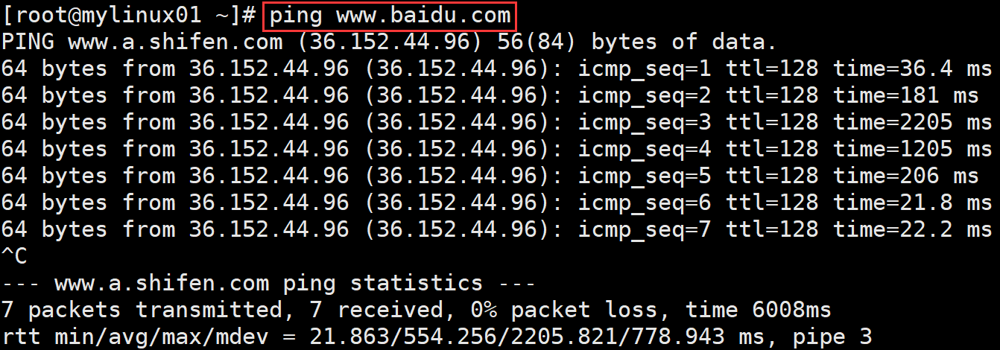

     **[ifconfig]** 命令：查看网络状态（能查看IP地址和子网掩码，但是不能查看网关和DNS地址），还可以临时设置某一网卡的IP地址和子网掩码。

     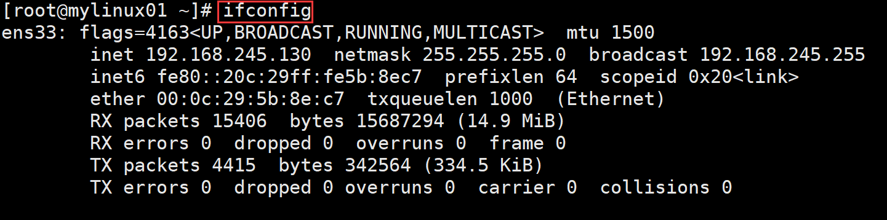

     **[wget]** 命令

     wget 是Linux下常用的下载和镜像工具，其命令格式为 **[wget 选项 UTL-list]**，常用选项如下：

     ```shell
     -h				显示wget的命令选项帮助
     -b				启动后立刻进入后台。如果没有通过-o指定结果文件，则将结果信息重定向到wget-log
     -t number		(--tries=number)设置重试的次数。最小可以为 0 或 inf (表示无限制);
     				在使用慢速或不稳定的网络下载时，该选项非常重要
     -c				(--continue)继续以前未能完成的下载任务
     -r				(--recursive)打开递归下载
     -l depth		(-level=depth)指定递归深度，默认深度为5层 
     --delete after	下载后将已经下载的本地文件删除(保留目录)
     -k				(--convert-links)链接转换。在下载完成后，转换文档中的链接，以便适于本地查看
     -m				镜像选项。此选项将打开递归、时间戳、无限递归深度以及保持FTP目录列表等，相当于使用-r -N -l inf-nr
     
     -p				(--page-requisites)这一选项用以确保所有用于显示被下载网页的元素都被下载。例如，图像、声音以及网页
     				中用到的CSS样式表。这个选项的应用解决了下载单一HTML文件时必要的站内元素与链接的站外元素不被下载的问题
     				
     -L				(--relative) 关联选项。只下载链接所关联的内容。如果只希望下载某特定网页，而不希望下载任何其他网页，				即便是在同一主机也是如此时，此参数格外有用
     -I list			(--include-directories=list)指定一组以逗号分割的目录列表用以下载，在这个列表中可以使用通配符
     ```

     **[ssh]** 命令

     ssh命令是使用 **SSH** 协议登录远程主机的客户端，其格式为：

     ```shell
     ssh 选项 [-l 登录名] [hostname | username@hostname] [command]
     ```

     常用选项如下：

     + -p &lt;port&gt; ：指定服务器端监听的端口，若不用这个选项则默认为**22号端口**。
     + -v ：冗余模式。打印关于运行情况的调试信息。在调试链接、认证和配置问题时非常有用。
     + -q ：安静模式。抑制所有的警告和提示信息。只有严重的错误才会被显示。

     用ubuntu用户登录centos

     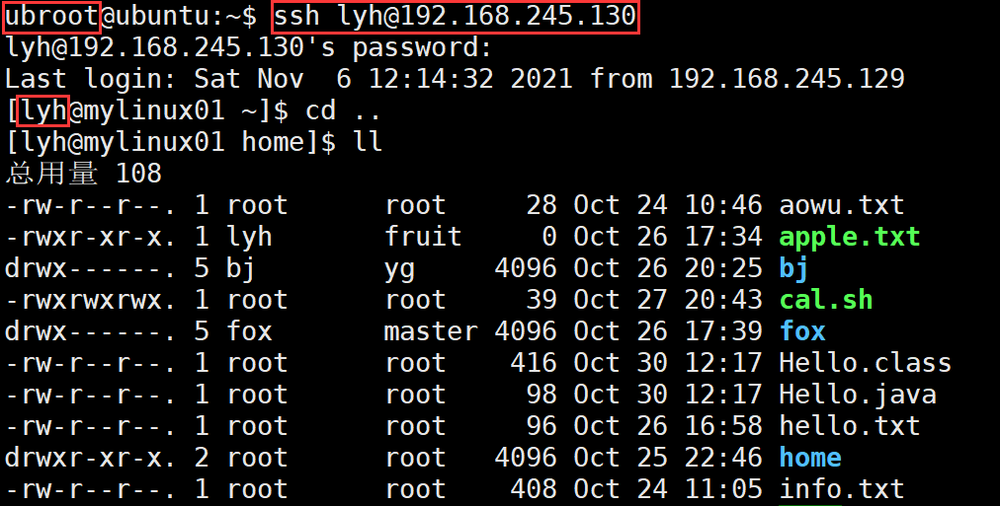

#### 3. RPM包管理

1. **什么是RPM**

   ​	RPM是一个开放的软件包管理系统，最初的全称是Red Hat Package Manager，它工作于RedHat Linux以及其他Linux系统，成为了Linux中公认的**软件包管理标准**。红帽子软件公司鼓励其他厂商来了解RPM并在自己的产品中使用它。RPM 的发布基于**GPL协议**。
   随着RPM在各种发行版本的广泛使用，如今RPM的全称是RPM Package Manager。RPM由RPM社区负责维护，使用RPM最大的好处在于可提供快速的安装，减少编译安装的侦错困扰。

2. **RPM的功能**

   RPM具有如下5大功能：
   
   + **安装**：将软件从包中解出来，并且安装到硬盘。
   + **卸载**：将软件从硬盘清除。
   + **升级**：替换软件的旧版本。
   + **查询**：查询软件包的信息。
   + **验证**：检验系统中的软件与包中软件的区别。
   
3. **RPM包的名称格式**

   RPM包的名称有其特有的格式，如某软件的RPM包名称由如下部分组成。

   ```shell
   name-version.type.npm
   ```

   其中：

   + **name**：为软件的名称。
   + **version**：为软件的版本号。
   + **type**：为包的类型。
     + **i[3456]86**：表示在Intel x86计算机平台上编译的。
     + **x86 64**：表示在64位的Intel x86计算机平台上编译。
     + **noarch**：表示已编译的代码与平台无关。
     + **src**：表示软件源代码
   + **rpm**：为文件扩展名

   例如：

   **bind-9.2.1-16.i386.rpm** 是bind (9.2.1-16) 的Intel 386平台编译版本包。

   **bind-9.2.1-16.x86_64.rpm** 是bind (9.2.1-16) 的64位Intel平台编译版本包。

   **bind-9.2.1-16.src.rpm** 是bind (9.2.1-16) 的源代码版本包。

   因此，看到一个RPM包的文件名之后就可以获得该软件包的大致信息了。

4. **RPM命令的使用**

   ​	在CentOS中升级和安装系统通常使用**yum命令**，因为它可以很好地解决包的依赖性问题，即自动安装/处理依赖的其他软件包。但是rpm命令在某些情况下还是用得上。比如，查询包信息，安装或卸载一个不在CentOS软件库中的rpm包等。

   rpm常见命令的用法：

   |                     命 令                      |                           说 明                            |
   | :--------------------------------------------: | :--------------------------------------------------------: |
   |        rpm -i &lt; .rpm file name &gt;         |                     安装指定的.rpm文件                     |
   |        rpm -U &lt; .rpm file name &gt;         |                 用指定的.rpm文件升级同名包                 |
   |         rpm -e &lt; package-name &gt;          |                      删除指定的软件包                      |
   |         rpm -q &lt; package-name &gt;          |              查询指定的软件包在系统中是否安装              |
   |                    rpm -qa                     |               查询系统中安装的所有RPM软件包                |
   |        rpm -qf &lt; /path/to/file &gt;         |               查询系统中指定文件所属的软件包               |
   |         rpm -qi &lt; package-name &gt;         |               查询一个已安装软件包的描述信息               |
   |         rpm -ql &lt; package-name &gt;         |             查询一个已安装软件包里历包含的文件             |
   |         rpm -qc &lt; package-name &gt;         |             查看一个已安装软件包的配置文件位置             |
   |         rpm -qd &lt; package-name &gt;         |             查看一个已安装软件包的文档安装位置             |
   |  rpm -q --whatrequires &lt; package-name &gt;  |           查询依赖于一个已安装软件包的所有RPM包            |
   |    rpm -q --requires &lt; package-name &gt;    |                查询个已安装软件包的依赖要求                |
   |    rpm -q --scripts &lt; package-name &gt;     |            查询一个已安装软件包的安装、删除脚本            |
   |   rpm -q --conflicts &lt; package-name &gt;    |            查询与一个已安装软件包相冲突的RPM包             |
   |   rpm -q --obsoletes &lt; package-name &gt;    |      查询一个已安装软件包安装时删除的被视为“废弃”的包      |
   |   rpm -q --changelog &lt; package-name &gt;    |               查询一个已安装软件包的变更日志               |
   |         rpm -V &lt; package-name &gt;          |                      校验指定的软件包                      |
   |        rpm -Vf &lt; /path/to/file &gt;         |                  校验包含指定文件的软件包                  |
   |        rpm -Vp &lt; .rpm file name &gt;        |                 校验指定的未安装的RPM文件                  |
   |                    rpm -Va                     |                   校验所有已安装的软件包                   |
   |                rpm --rebuilddb                 |       重建系统的RPM数据库，用于不能安装和查询的情况        |
   |        rpm --import &lt; key  file &gt;        |                 导入指定的RPM包的签名文件                  |
   | rpm -Kv --nosignature &lt; .rpm file name &gt; | 检查指定的RPM文件是否已损坏或被恶意篡改(验证包的MD5校验和) |
   |        rpm -K &lt; .rpm file name &gt;         |                 检查指定RPM文件的GnuPG签名                 |

   **提示**：

   + 在安装/升级时，还可以使用 **-vh参数**，其中 **v** 表示在安装过程中将显示较详细的信息； **h** 表示显示水平进度条。

   + 所有的 **<.rpm file name>** 既可以是本地文件，也可以是远程文件。除了可以对已安装的RPM包进行查询外，还可对未安装的RPM文件进行查询，格式如下：

     ```shell
     rpm -qp [ilcd] < .rpm file name >
     rpm -qp < --whatrequires > | < --requires > | < --scripts > | < --conflicts > | < --obsoletes > |
     		< --changelog >  < .rpm file name >
     ```

   + 校验软件包将检查软件包中的所有文件与系统中所安装的是否一致，包括校验码文件大小，存取权限和属主属性都将根据数据库进行校验。在用户安装了新程序以后怀疑某些文件遭到破坏时也可使用该操作。

5. **应用实例**

   查询所有所安装的rpm软件包。

   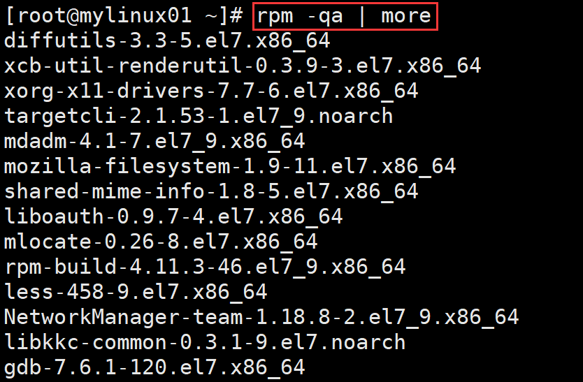

   查询软件包是否安装。

   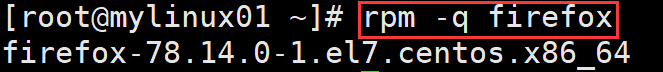

   查询软件包的信息。

   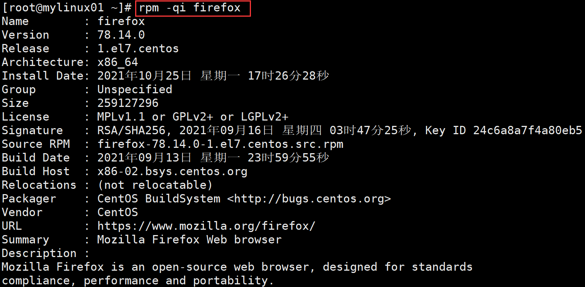

   查询软件包中的文件。

   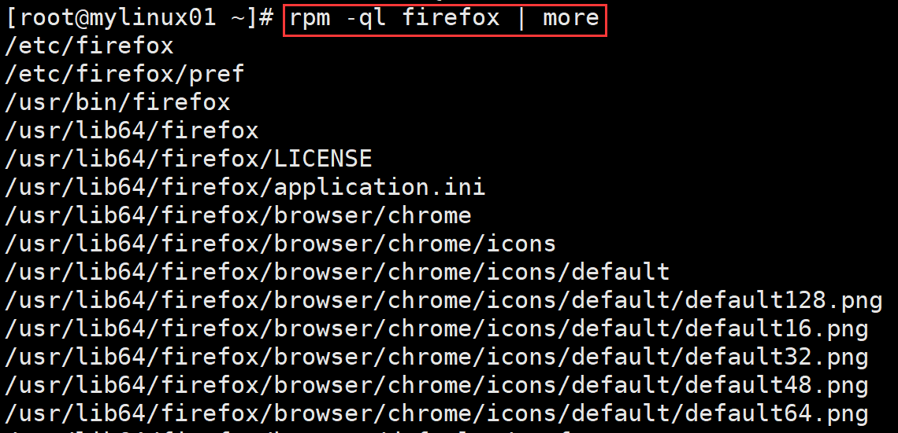

#### 4. YUM更新系统

1. **为什么使用YUM**
   	Linux系统维护中令管理员最头疼的就是软件包之间的依赖性了，往往是要安装A软件，但是编译的时候告诉你A软件安装之前需要B软件，而当安装Y软件的时候，又告诉你需要Z库了，好不容易安装好Z库，发现版本还有问题等。由于历史原因，RPM软件包管理系统对软件之间的依存关系没有内部定义，造成安装RPM软件时经常出现令人无法理解的软件依赖问题。
   	其实开源社区早就对这个问题尝试进行解决了，不同的发行版推出了各自的工具，比如Yellow Dog的**YUM** ( Yellow dog Updater, Modified)， Debian 的APT (Advanced Packaging Tool)等。开发这些工具的目的都是为了要**解决安装RPM时的依赖性问题**，而不是额外再建立一套安装模式。这些软件也被开源软件爱好者们逐渐移植到了其他发行版上。
   
2. **什么是YUM**

   ​	YUM是“Yllow dog Updater, Modifed" 的简称，最早是由Yellow dog发行版的开发者Terra Soft研发，用Python 写成，那时叫做YUP (Yellow dogUpdater)，后经杜克大学的Linux@Duke开发团队进行改进，遂有此名。
   ​	YUM的宗旨是自动化地升级，安装/移除RPM包，收集RPM包的相关信息，检查依赖性并自动提示用户解决。YUM使用方便，具有如下特点:

   + **自动解决包的依赖性问题**，能更方便地添加/删除/更新RPM包。
   + 便于管理大量系统的更新问题。
   + 可以同时配置多个仓库(repository)。
   + 简洁地配置文件(/etc/yum.conf)。
   + **保持与RPM数据库的一致性**。
   + 有比较详细的日志，可以查看何时升级安装了什么软件包等。

3. **YUM组件**

   + **yum命令**
     + 通过yum命令使用YUM提供的众多功能。
     + 由名为yum软件包提供(默认已安装)。
   + **YUM插件**
     + 由官方或第三方开发的YUM插件用于扩展YUM的功能。
     + 通常由名为 yum -< pluginname > 的软件包提供
   + **YUM仓库**
     + YUM 仓库(repository) 亦称 "更新源" 。
     + 一个YUM软件仓库就是一个包含了仓库数据的存放众多**RPM文件**的目录。
     + YUM 仓库必须包含一个名为 **repodata** 的子目录用于存放仓库数据，仓库数据包含所有RPM包的各种信息，包括描述、功能、提供的文件、依赖性等信息。
     + YUM客户通过访问YUM仓库数据进行分析并完成查询、安装、更新等操作。
     + YUM客户可以使用 **http://、ftp:// 或 file://(本地文件)协议** 访问YUM仓库。
     + YUM客户可以使用官方和第三方提供的众多YUM仓库更新系统。
     + createrepo、 yum-utils 等软件包(默认未安装)中提供了YUM仓库管理工具。
   + **YUM缓存**
     + YUM 客户运行时会从软件仓库下载YUM仓库文件和RPM包文件。
     + 下载的文件默认被缓存 在 **/var/cache/yum** 目录中。
     + 可以修改YUM的配置文件配置YUM的缓存行为。
   
4. **使用yum命令**

   1. **yum命令语法**

      yum是YUM系统的字符界面管理工具。语法为：**[yum 全局参数 命令 命令参数]** ，一些常用的全局参数为：

      ```shell
      -y：对yum命令的所有提问回答“是(yes)”。
      -C：只利用本地缓存，不从远程仓库下载文件。
      --enablerepo=REPO： 	临时启用指定的名为REPO的仓库。
      --disablerepo=REPO：	临时禁用指定的名为 REPO的仓库。
      -installlrootr=PATH：指定安装软件时的根目录，主要用于为chroot环境安装软件。
      ```

   2. **yum命令的常见用法**

      |                 命 令                 |                            功 能                             |
      | :-----------------------------------: | :----------------------------------------------------------: |
      |           yum check-update            |                    检查可更新的所有软件包                    |
      |              yum update               |                下载更新系统已安装的所有软件包                |
      |              yum upgrade              | 大规模的版本升级，与yum update不同的是，连旧的被淘汰的包也升级 |
      |    yum insatll &lt; packages &gt;     |                         安装新软件包                         |
      |     yum update &lt; packages &gt;     |                       更新指定的软件包                       |
      |     yum remove &lt; packages &gt;     |                       移除指定的软件包                       |
      |  yum localinstall &lt; rpmfile &gt;   | 安装本地的RPM包(与**rpm -i命令**的不同在于同时安装依赖的包)  |
      |   yum localupdate &lt; rpmfile &gt;   | 更新本地的RPM包(与**rpm -U命令**的不同在于同时安装依赖的包)  |
      | yum groupinstall &lt; groupnames &gt; |                   安装指定软件组中的软件包                   |
      | yum groupupdate &lt; groupnames &gt;  |                   更新指定软件组中的软件包                   |
      | yum groupremove &lt; groupnames &gt;  |                   卸载指定软件组中的软件包                   |
      |             yum grouplist             |              查看系统中已经安装的和可用的软件组              |
      |               yun list                |  列出资源库中所有可以安装或更新的rpm包，以及已经安装的rpm包  |
      |       yum list &lt; regex &gt;        | 列出资源库中与正则表达式匹配的<br/>可以安装或更新的rpm包，以及已经安装的rpm包 |
      |          yum list available           |               列出资源库中所有可以安装的rpm包                |
      |  yum list available &lt; regex &gt;   |       列出资源库中与正则表达式匹配的所有可以安装的pm包       |
      |           yum list updates            |               列出资源库中所有可以更新的rpm包                |
      |   yum list updates &lt; regex &gt;    |       列出资源库中与正则表达式匹配的所有可以更新的pm包       |
      |          yum list installed           |               列出资源库中所有已经安装的rpm包                |
      |  yum list installed &lt; regex &gt;   |      列出资源库中与正则表达式匹配的所有已经安装的rpm包       |
      |            yum list extras            |          列出已经安装的但是不包含在资源库中的rpm包           |
      |    yum list extras &lt; regex &gt;    | 列出与正则表达式匹配的已经安装的但是不包含在资源库中的rpm包  |
      |            yum list recent            |               列出最近被添加到资源库中的软件包               |
      |    yum list search &lt; regex &gt;    | 检测所有可用的软件的名称、描述、概述和已列出的维护者，<br/>查找与正则表达式匹面的值 |
      |   yum list provides &lt; regex &gt;   | 检测软件包中包含的文件以及软件提供的功能，查找与正则表达式匹配的值 |
      |           yum clean headers           |                    清除缓存中的rpm头文件                     |
      |          yum clean packages           |                     清除缓存中rpm包文件                      |
      |             yum clean all             |                清除缓存中的rpm头文件和包文件                 |
      |    yum deplist &lt; packages &gt;     |                     显示软件包的依赖信息                     |

   3. **应用实例**

      列出资源库中所有可以安装的rpm包。

      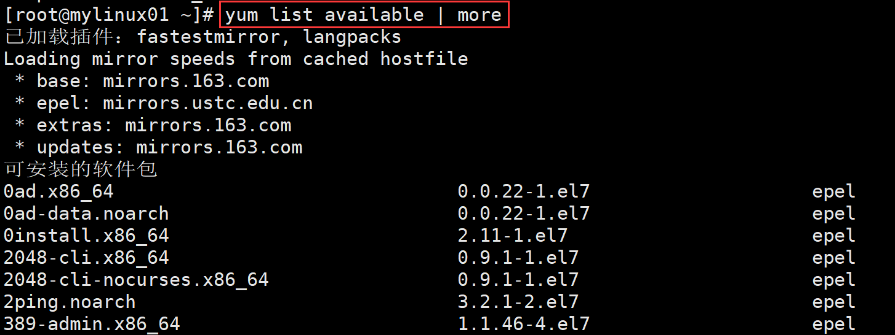

      列出资源库中所有已经安装的rpm包。

      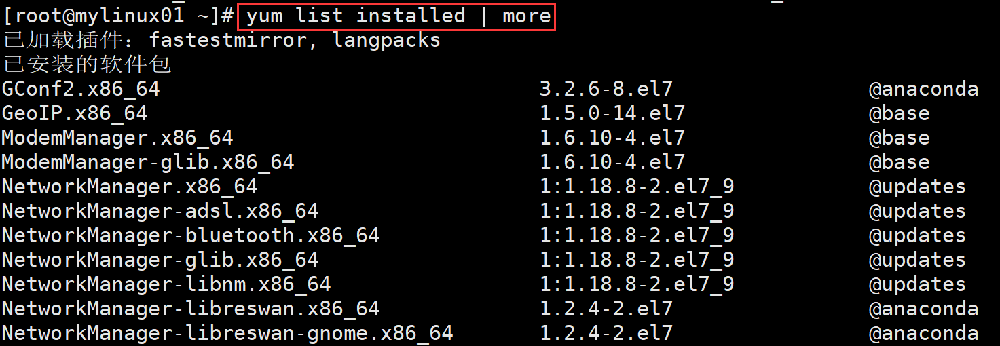

      列出最近被添加到资源库中的软件包。

      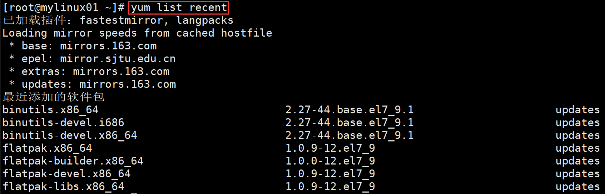

***

